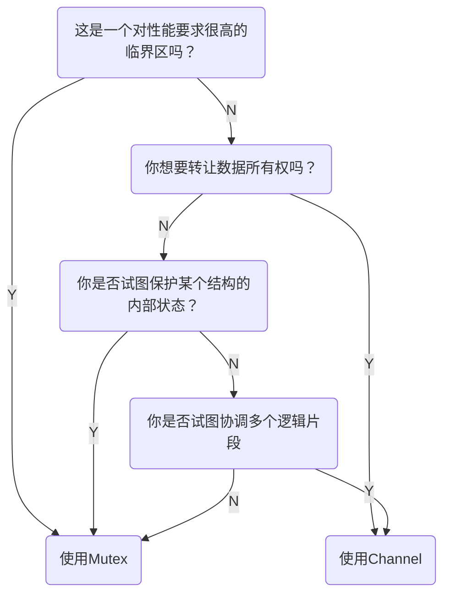

# Go 语言并发之道

Coffman 条件：

- 相互排斥：并发进程拥有资源的独占权
- 等待条件：并发进程拥有资源并等待其他资源
- 没有抢占：资源不能被其他进程抢占
- 循环等待：P1->P2->P3->P1

## Go 语言并发组件

Go 提供了 CSP 编程能力，但同时 sync 包也实现了 mutex，多数情况下，你应该选择 CSP.

> 使用通信来共享内存，而不是通过共享内存来通信

## Reference

- Concurrency in Go. Katherine Cox-Buday
