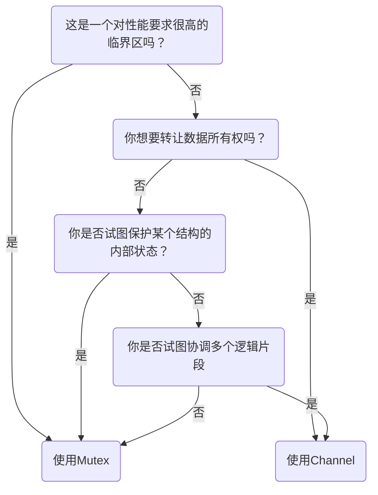

# Go 语言并发组件

> 使用通信来共享内存，而不是通过共享内存来通信

Go 提供了 CSP 编程能力，但同时 sync 包也实现了 mutex，多数情况下，你应该选择 CSP.



Coffman 条件被同时满足时，系统可能会死锁：

- 相互排斥：并发进程拥有资源的独占权
- 等待条件：并发进程拥有资源并等待其他资源
- 没有抢占：资源不能被其他进程抢占
- 循环等待：P1->P2->P3->P1

## Sync 包

使用锁时候，尽量限制它的范围，隐藏调用细节，另外记得使用 defer 释放锁：

```go
type Counter struct {
   m sync.mutex
   value int
}

func (c *Counter) Increment() {
   c.m.Lock()
   defer c.m.Unlock()
   c.value++
}
```

### WaitGroup

WaitGroup 是一个并发安全的计数器。

```go
var wg sync.WaitGroup
for i := 0; i <= 5; i++ {
    wg.Add(1)           // increment
    go func() {
        defer wg.Done() // decrement
        time.Sleep(1)
    }
}

wg.Wait()
```

### 互斥锁

```go
count := 0
var mutex sync.Mutex
func Increment() {
    mutex.Lock()
    defer lock.Unlock() // use defer
    count++
}
```

### 读写锁

```go
count := 0
var mutex sync.RWMutex

func Increment(count *int, locker sync.Locker){
    mutex.Lock()
    defer lock.Unlock()
    count++
}
Increment(&count, mutex)        // Writter

func Observer(count *int, locker sync.Locker)  {
    mutex.Lock()
    defer lock.Unlock()
    count++
}
Observer(&count, mutex.RLocker) // Reader
```

### Cond

Cond 是一个 goroutine 的集合点，等待或发布一个 event。

Cond 可以通过 Signal 或者 BoardCast 唤醒等待的 goroutine，调用时可以加锁，也可以不加锁

```go
func (c *Cond) Signal()
func (c *Cond) Broadcast()
```

一个典型的例子是使用 Cond 等待某个条件达成，如果没有 Cond：

```go
for conditonTrue() == false {
    time.Sleep(1*time.Millsecond)
}
```

使用 Cond：

```go
c := sync.NewCond(&sync.Mutex{})
c.L.Lock()      // lock before wait
for conditonTrue() == false {
    c.Wait()    // equal c.L.Unlock(); wait signal/boardcast; c.L.Lock()
}
c.L.Unlock()    // Unlock
```

### Once

Once 保证只执行一次：

```go
var count int
increment := func() {
    count++
}

var once sync.Once
var increments sync.WaitGroup
for i:=0; i<100; i++ {
    go func() {
        defer increments.Done()
        once.Do(increment)
    }
}

increments.wait()
fmt.Printf("Count is %d", count) // Count is 1
```

Once 只保证执行一次，并不关心执行什么：

```go
var count int
increment := func() { count++ }
decrement := func() { count-- }

var once sync.Once
once.Do(increment)
once.Do(decrement)

fmt.Printf("Count is %d", count) // Count is 1
```

Once 经常用于初始化，但是必须谨慎循环引用：

```go
var onceA, onceB sync.Once
var initB func()

initA := func() { onceB.Do(initB) } // wait onceB
initB  = func() { onceA.Do(initA) } // wait onceA -> wait onceB
onceA.Do(initA)
```

### Pool

> More Info: [深度解密 Go 语言之 sync.Pool](https://www.cnblogs.com/qcrao-2018/p/12736031.html)

```go
pool := &sync.Pool {
    New: func() interface{} {
        return struct{}{}
    }
}

instance := pool.Get() // creating new instance
pool.Put(instance)     // pool will reuse instance
```

Gin 中也使用 Pool 来预缓存创建 Context：

```go
// ServeHTTP conforms to the http.Handler interface.
func (engine *Engine) ServeHTTP(w http.ResponseWriter, req *http.Request) {
    c := engine.pool.Get().(*Context)
    c.writermem.reset(w)
    c.Request = req
    c.reset()

    engine.handleHTTPRequest(c)

    engine.pool.Put(c)
}
```

使用 Pool 时，记住以下几点：

- 实例化 sync.Pool 时，使用 New 方法创建成员变量，在调用时是线程安全的
- 当你使用 Pool 中 Get 的实例时，不要对接受对象的状态做出任何假设
- 用完 Pool 中 Get 的实例后，一定要 Put

## goroutine

goroutine 是 Go 语言提供的协程，每个 Go 语言程序启动时都至少有一个 main goroutine。goroutine 的独特之处在于它与语言的深度集成，goroutine 没有定义自己的暂停点或再运行点，而是自动在运行时形成 fork-join 的并发模型。在函数调用前加上 `go` 命令，就会启动一个 goroutine 来执行函数，go 语言会自动的帮你调度 goroutine：

```go
func main() {
    salutation := "Welcome"
    go func() {                 // Go! this function run with another goroutine
        salutation = "Hello"    // Closure, capture variable `salutation`
    }()                         // Must call anonymous function

    time.Sleep(1 * time.Second) // Continue run in main goroutine.
    fmt.Println(salutation)
}
```

fork-join 并发模型中，fork 指的是在任意节点，可以将子节点与父节点一起运行，join 则是指在将来某个时刻，这些并发的执行分支将会合并到一起。上一个例子创建了一个 fork，但是并没有形成 join。如果不加入 `time.Sleep`，新的 goroutine 大概率会在 main goroutine 之前结束。但是加入`time.Sleep`也没有引入 join-point，只是引入了一个竞争条件，依旧无法保证输出结果。为了创建一个 join-point，你必须要同步 main goroutine 和 anonymous goroutine，比如使用 `sync.WaitGroup`：

```go
func main() {
    var wg sync.WaitGroup
    salutation := "Welcome"
    wg.Add(1)
    go func() {
        defer wg.Done()
        salutation = "Hello"
    }()

    wg.Wait()               // Join-Point
    fmt.Println(salutation)
}
```

另外，注意闭包中捕获的变量，这一个例子中三个匿名函数捕获了同一个变量`salutation`：

```go
var wg sync.WaitGroup
for _, salutation := range []string{"hello", "greeting", "good day"} {
    wg.Add(1)
    go func() {
        defer wg.Done()
        fmt.Println(salutation)
    }()

    wg.Wait()
}

// good day
// good day
// good day
```

## Channel

Channel 是 Go 语言提供的强大的同步原语之一。就像河流一样，一个 Channel 充当着信息传送的管道，值可以沿着 Channel 传递，然后在下流读出。

```go
var stream := make(chan interface{})
close(stream)
integer, ok := stream   // ok == false, channel has been closed
```

Channel 默认是零缓存的，不过你也可以 `make(chan interface{}, 10)` 创建一个带缓存的 Channel。但是必须谨慎使用缓存，这常会是一个不完全的优化，将潜在的死锁偷渡到生产环境。

Channel 主要有 Read、Write、Close 三种操作：

| 操作 | Channel 状态       | 结果            |
| ---- | ------------------ | --------------- |
| Read | nil                | 阻塞            |
| Read | open and not empty | 输出值          |
| Read | open but empty     | 阻塞            |
| Read | closed             | <默认值>, false |
| Read | write only         | 编译错误        |

| 操作  | Channel 状态        | 结果     |
| ----- | ------------------- | -------- |
| Write | nil                 | 阻塞     |
| Write | open and not filled | 写入值   |
| Write | open but filled     | 阻塞     |
| Write | closed              | panic    |
| Write | read only           | 编译错误 |

| 操作  | Channel 状态       | 结果     |
| ----- | ------------------ | -------- |
| Close | nil                | panic    |
| Close | open and not empty | 写入值   |
| Close | open but empty     | 关闭     |
| Close | closed             | panic    |
| Close | read only          | 编译错误 |

可以发现表中存在不少坑，尤其是还有三个 panic！因此强烈建议使用 Channel 过程中明确 Channel 所有权，并保持 Chennel 所有权范围很小。

### for-select

## Reference

- Concurrency in Go. Katherine Cox-Buday
