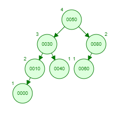

# 平衡二叉树

平衡二叉查找树，简称：平衡二叉树，由前苏联的数学家 Adelse-Velskil 和 Landis 在1962 年提出的高度平衡的二叉树，根据科学家的英文名也称为AVL 树。指的是所有节点平衡因子的绝对值不大于1的二叉树叫做平衡二叉树。

你可以通过 [AVL Tree Visualzation](https://www.cs.usfca.edu/~galles/visualization/AVLtree.html) 来模拟AVL树的各个操作。

> 平衡因子：左子树高减去右子树高

> 平衡二叉树并不一定是一个完全二叉树，例如高度为4且非叶子节点平衡因子均为1的AVL树
>
> 
>
> 由上图我们还可以发现，高度为4的AVL树最少有7个节点，最多有15个节点

## 插入

插入操作与二叉排序树相似，但插入后可能引起[失衡][#失衡]。

1. 通过排序规则选择合适的插入位置
2. 创建一新的叶子节点，插入该位置
3. 向上更新路径上每个节点的平衡因子，当平衡因子的绝对值大于1时引起失衡，先进行平衡操作
4. 重复步骤3，直到达到根节点

## 删除

插入操作与二叉排序树相似，但插入后可能引起[失衡][#失衡]。

1. 通过查找规则找到删除节点，找不到则结束，如果为只有一个节点的树的根节点，则删除根节点后结束
2. 找到删除节点在中序遍历中的前驱节点或后继节点（必为叶子节点）
3. 交换两节点，删除叶子节点
4. 向上更新路径上每个节点的平衡因子，当平衡因子的绝对值大于1时引起失衡，先进行平衡操作
5. 重复步骤4，直到达到根节点

## 查找

查找操作与二叉排序树相同，因为AVL树总是平衡的，所以耗费O(log *n*)时间。AVL树不会因查找过程而改变。

## 失衡

- **LL**：对失衡节点顺时针旋转
- **LR**：对失衡节点左孩子节点逆时针旋转，对失衡节点顺时针旋转
- **RR**：对失衡节点逆时针旋转
- **RL**：对失衡节点左孩子节点顺时针旋转，对失衡节点逆时针旋转

