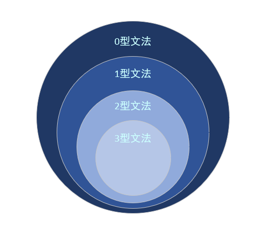
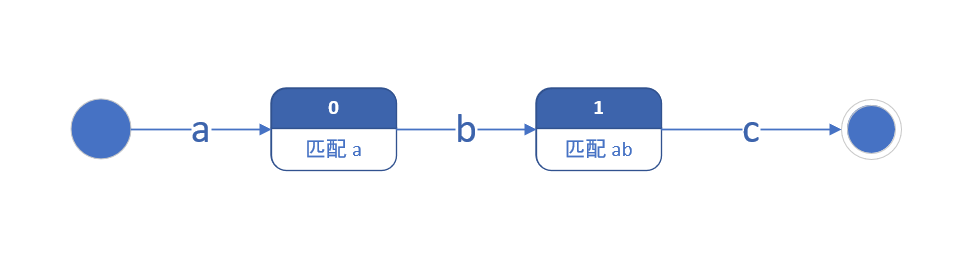
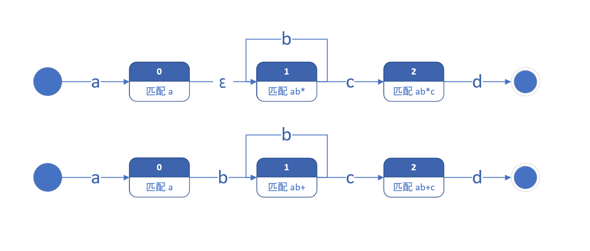
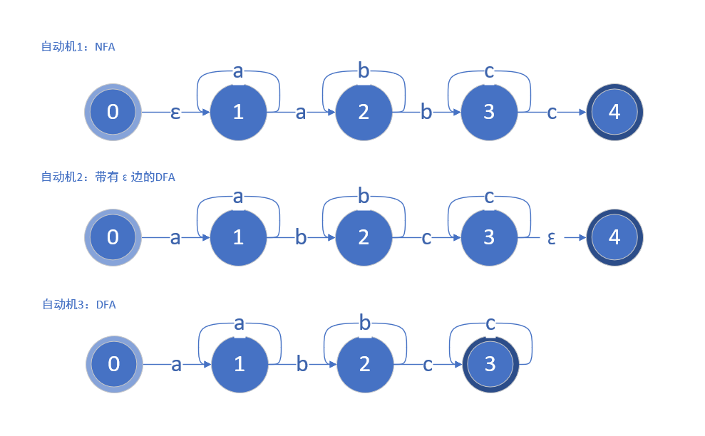
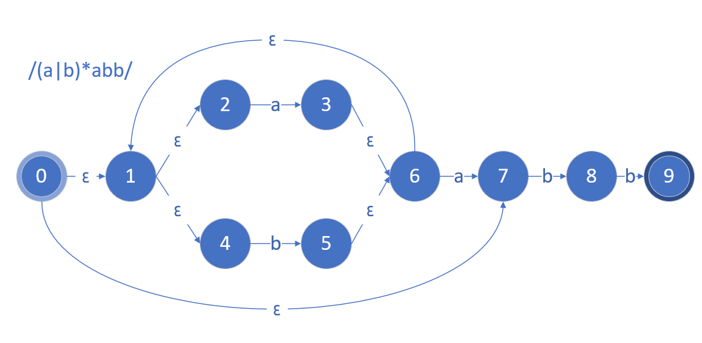
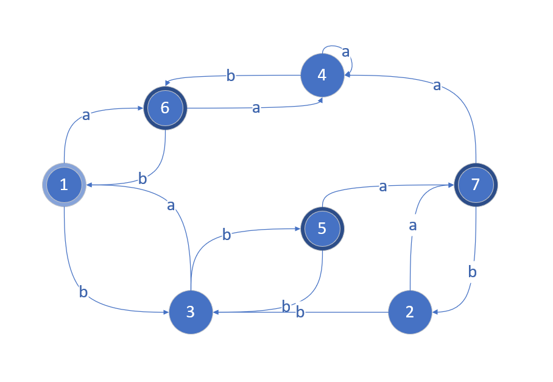
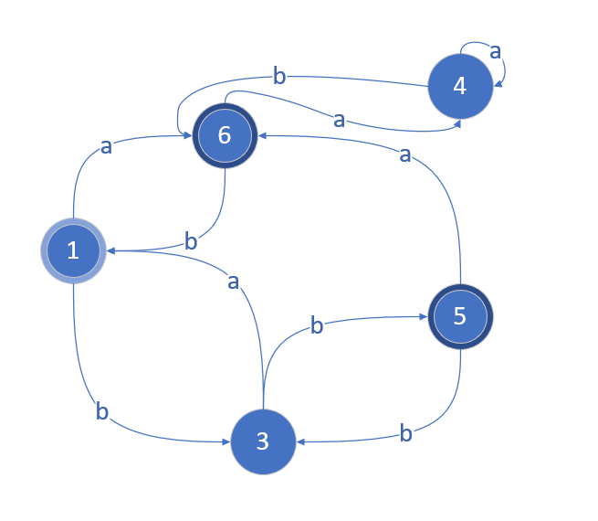

正规文法（Regular Grammar）指的是一种特殊的文法，其对上下文无关文法加以限制，由于限制较多，很难用于表示现有语法，但其常常被用于构建正则表达式（Regular Expression），用来匹配检索和替换某个模式的文本。

<!-- more -->

## 文法与分类

文法是用来描述一个语言句子集合的规则，文法 G 定义为四元组 $(V_N, V_T, P, S)$，其中 $V_N$ 为非终结符（或语法实体，或变量）；$V_T$ 为终结符集；$P$ 为规则 $(\alpha \rightarrow \beta)$ ；$S$ 称为开始符，是一个非终结符。

文法可以分为 4 种，分别为 0 型文法（无限制文法）、1 型文法（上下文相关文法，Context Sensitive）、2 型文法（上下文无关文法，Context Free）和 4 型文法（正规文法）。

上下文无关文法（CFG）的产生式是 $\alpha _1 A \alpha _2 \rightarrow \alpha _1 B \alpha _2$，即在指定的上下文 $\alpha _1, \alpha _2$ 中，可以由 $A \rightarrow B$；而上下文无关文法（CSG）产生式为 $A \rightarrow B$，应用产生式时不要求上下文，因此取名为上下文无关语法，显然，CSG 也属于 CFG；正规文法（RG）分为左线性文法和右线性文法，左线性文法为 $A \rightarrow a | aB$，右线性文法为 $A \rightarrow a | Ba$，四种文法依次在上一文法中加入规则形成。

> 上下文无关语法 $A \rightarrow B$ 中的 $B$ 并非指一个终结符，可能为一长串的实体或变量，例如 $A \rightarrow aAb$，该产生式属于上下文无关文法，但不属于正规文法。



##有穷自动机

有穷自动机作为一种识别装置，能准确的识别正规文法所定义的集合，主要分为确定的有穷自动机（DFA，Deterministic Finite Automata）和不确定的有穷自动机（NFA，Notdeterministic Finite Automata），其差别稍后介绍，首先介绍自动机的各种状态：

### 串联与并联

考虑一个简单的正则式：`abc`，只有字符串 `abc` 能够匹配，我们可以简单的串联构造出下列自动机：



一次需求变更后，我们需要匹配 `abc` 或 `adc`，此时可以用上或 `|` 语法：`ab|dc`，我们可以通过并联状态来解决这一问题：


### 重复匹配

正则表达式中常常需要重复匹配某一个字符串：

- 重复 0-1 次：`?`
- 重复 1 次以上：`+`
- 重复 0 次以上：`*`
- 重复 m 到 n 次：`{m, n}`

#### 空字符 ε

要重复 0 到 1 次，意味着我们需要一个状态来表示可以直接移动到下一状态，这就是空字符 ε，其表示可以直接由该路径移动到下一状态（当然不能移动回去），因此正则 `ab?c` 的自动机如下：


空字符还可以用于连接两个串。当我们拥有了匹配串 A 和 B，需要匹配 AB，我们也可以简单将其串联，然后通过一个空串连接即可：


同理，下列自动机可以匹配 `a(bc)?d`：


#### 正闭包与克林闭包

在正则表达式中，`+` 号表示匹配 1 次及以上，我们将其称为正闭包；正闭包与 ε 一起，构成了克林闭包，表示匹配 0 次及以上。



#### 重复 {m, n} 次

不难理解，重复最少 m 次，最多 n 次，需要有 n 个状态实现：


### NFA 与 DFA

尝试画下 `a+b+c+` 的自动机，我画的是这样的：



咦，怎么有三种画法？而且三种画法都是正确的！实际上，只要你乐意，你可以在状态中加上任意多个状态，然后通过空字符连接，不过它们只会给你带来麻烦。

回到上图，我们看见自动机 1 处于状态 1 时候，如果收到一个 a，次态有两种，因此其叫做不确定的有穷自动机（NFA，Notdeterministic Finite Automata）；再来看自动机 2，其每个状态的次态是确定的，但是其存在 ε 边，我们将其称为带有 ε 边的 DFA；最后看自动机 3，他的每个状态次态确定且不含 ε 边，叫做确定的有穷自动机（DFA，Deterministic Finite Automata）。从一个正则表达式构建一个 NFA 较为方便，但是在计算机中实现时，DFA 容易实现。

## 子集法：从 NFA 转换为 DFA

在有穷自动机的理论中，设 L 为一个确定的集合，则存在正规文法、NFA 和 DFA 表示这个集合，也就是说三者可以相互转换。在转换时，我们通常由正规文法构建 NFA，然后再转换为 DFA 实现，下面介绍一个从 NFA 转换为 DFA 的方法：子集法。

```c
// ε-closure(k) 表示由 k 节点开始经过任意条 ε 边能够到达的节点
// 将 ε-closure(0) 作为集合 C 中唯一子集，且未被标记
C = { ε-closure(0) };

while(C 中有未标记子集 T) {
  标记 T;
  for (每个可能的输入a) {
    U = ε-closure(Move(T, a));
    if (U 不在 C 中) {
       Push(C, U);
    }
  }
}
```

考虑下列 NFA，其实现极为复杂，我们可以通过子集法将其转换为 DFA：



| 步骤 | 工作子集 | 操作                                                                 | C                               | Unmarked         |
| ---- | :------: | -------------------------------------------------------------------- | ------------------------------- | ---------------- |
| 1    |    -     | $T_0 = \epsilon -closure(0) = \{0, 1, 2, 4, 7 \}$                    | $\{ T_0 \}$                     | $\{ T_0 \}$      |
| 2    |  $T_0$   | $T_1 = \epsilon -closure(Move(T_0, a)) = \{ 1, 2, 3, 4, 5, 7, 8 \}$  | $\{ T_0, T_1 \}$                | $\{ T_1 \}$      |
| 3    |  $T_0$   | $T_2 = \epsilon -closure(Move(T_0, b)) = \{ 1, 2, 4, 5, 6, 7 \}$     | $\{ T_0, T_1, T_2 \}$           | $\{ T_1, T_2 \}$ |
| 4    |  $T_1$   | $\epsilon -closure(Move(T_1, a)) = T_1$                              | $\{ T_0, T_1, T_2 \}$           | $\{ T_2 \}$      |
| 5    |  $T_1$   | $T_3 = \epsilon -closure(Move(T_1, b)) = \{ 1, 2, 4, 5, 6, 7, 9 \}$  | $\{ T_0, T_1, T_2, T_3 \}$      | $\{ T_2, T_3 \}$ |
| 6    |  $T_2$   | $\epsilon -closure(Move(T_2, a)) = T_1$                              | $\{ T_0, T_1, T_2, T_3 \}$      | $\{\ T_3 \}$     |
| 7    |  $T_2$   | $\epsilon -closure(Move(T_2, b)) = T_2$                              | $\{ T_0, T_1, T_2, T_3 \}$      | $\{\ T_3 \}$     |
| 8    |  $T_3$   | $\epsilon -closure(Move(T_3, a)) = T_1$                              | $\{ T_0, T_1, T_2, T_3 \}$      | $\{\ T_3 \}$     |
| 9    |  $T_3$   | $T_4 = \epsilon -closure(Move(T_3, b)) = \{ 1, 2, 4, 5, 6, 7, 10 \}$ | $\{ T_0, T_1, T_2, T_3, T_4 \}$ | $\{ T_4 \}$      |
| 10   |  $T_4$   | $\epsilon -closure(Move(T_4, a)) = T_1$                              | $\{ T_0, T_1, T_2, T_3, T_4 \}$ | $\{ \}$          |
| 11   |  $T_4$   | $\epsilon -closure(Move(T_4, b)) = T_2$                              | $\{ T_0, T_1, T_2, T_3, T_4 \}$ | $\{ \}$          |


## 分割法：化简有穷自动机

一个有穷状态的状态越少，实现越简单且高效，因此人们总是希望尽可能化简自动机。

化简一个自动机，首先应该删去其无用状态，即无法到达的状态。从开始结点出发，遍历有向图后无法到达的节点即为无用状态。除了无用节点，等价节点也可以删去，等价节点需要满足下列两个条件：

- 一致性条件：两个状态必须同时为可接受状态或不可接受状态
- 蔓延性条件：对于所有输入，两个状态必须装欢到等价的状态中

不满足上列条件两个状态是可区别的。分割法是一种将一个 DFA 的状态分割为不相交的子集的方法，使同一子集的任何两个状态都是不可区别的，而不同一子集的任何两个状态都是可区别的。考虑下列 DFA：



| 步骤 | 操作                                                                                               | 集合                                                      |
| ---- | -------------------------------------------------------------------------------------------------- | --------------------------------------------------------- |
| 1    | 将终态与非终态分别作为一个集合加入                                                                 | $P_0 = \{ \{ 1,2,3,4 \}, \{ 5,6,7 \} \}$                  |
| 2    | 对子集 $\{ 1,2,3,4 \}$ 中每个元素 $C$ 执行 $Move(C, a)$，发现 $\{ 1,2 \} \{ 3,4 \}$ 可区分         | $P_1 = \{ \{ 1,2 \} \{ 3,4 \} \{ 5,6,7 \} \}$             |
| 3    | 对子集 $\{ 1,2 \}$ 中每个元素 $C$ 执行 $Move(C, a); Move(C, b)$，发现 $\{ 1,2 \}$ 不可区分         | -                                                         |
| 4    | 对子集 $\{ 3,4 \}$ 中每个元素 $C$ 执行 $Move(C, a)$，发现 $\{ 3 \} \{ 4 \}$ 可区分，分割后不可再分 | $P_2 = \{ \{ 1,2 \} \{ 3 \} \{ 4 \} \{ 5,6,7 \} \}$       |
| 5    | 对子集 $\{ 5,6,7 \}$ 中每个元素 $C$ 执行 $Move(C, a)$，发现 $\{ 5 \} \{ 6,7 \}$ 可区分             | $P_3 = \{ \{ 1,2 \} \{ 3 \} \{ 4 \} \{ 5 \} \{ 6,7 \} \}$ |
| 6    | 对子集 $\{ 6,7 \}$ 中每个元素 $C$ 执行 $Move(C, a); Move(C, b)$，发现 $\{ 6,7 \}$ 不可区分         | -                                                         |



## Reference

- 《编译原理》 王生原 董渊 吕映芝 蒋维杜
