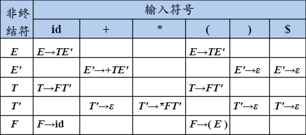

# 自顶向下的语法分析

语法分析是编译程序的核心功能，其作用是识别由词法分析给出的单词符号串是否是给定文法的句子。语法分析通常可以分为自顶向下的分析方法和自底向上的分析方法，自顶向下的方法虽然可以分为不确定和确定的两类，但是在编译器中基本只见得到确定分析方法。

## 不确定的自顶向下分析

不确定的自顶向下方法，就是带有回溯的分析方法，实际上也就是一种穷举的试探方法，效率低，代价高，因此极少使用。

### 回溯

回溯指的是回到之前的状态，从输入字符串角度考虑，需要不停的退回到之前的输入中，效率非常差，而且需要额外的代价存储之前的状态。回溯常常由以下问题导致：

#### 文法中具有相同左部的产生式的 $FIRST$ 集交集不为空

考虑下列文法：

$$
\begin{aligned}
S &\rightarrow xAy \\
A &\rightarrow ab|a
\end{aligned}
$$

其中非终结符 A 有两条产生式，且具有相同的 $FIRST$ 集 $\{ a \}$。若当前输入串为 `xay#`，当处于 $xAy$ 状态时，编译器无法确定选用哪一个产生式，只能进行一次尝试，如果失败，则回退到当前状态。

显而易见，回溯会导致编译器效率极低，因此，我们通常希望寻找一种线性时间的无回溯的算法。

#### 由于相同左部非终结符的右部存在能 ${\Rightarrow}^* \epsilon$ 的产生式，且该非终结符的 $FOLLOW$ 集中含有其他产生式右部

考虑下列文法及输入串 `ab#`：

$$
\begin{aligned}
S &\rightarrow aAS \\
S &\rightarrow b \\
A &\rightarrow bAS \\
A &\rightarrow \epsilon
\end{aligned}
$$

#### 由于文法左部含有左递归而引起回溯

考虑下列文法及输入串 `baa#`：

$$
\begin{aligned}
S &\rightarrow Sa \\
S &\rightarrow b
\end{aligned}
$$

## 等价变换

### 提取左公共因子

对于某些具有相同左公共因子的产生式，我们可以通过改写产生式来推迟决定产生式，例如下列文法：

$$
A \rightarrow \alpha \beta | \alpha \gamma
$$

可以通过等价变换提取左部公因子：

$$
A \rightarrow \alpha (\beta |\gamma)
$$

最后引入新非终结符：

$$
\begin{aligned}
A &\rightarrow aA' \\
A' &\rightarrow \beta |\gamma
\end{aligned}
$$

如果提取后还有左公因子，可以继续提取，直到无左公共因子。经过提取后的文法并不一定是左公共因子，因此不含左公共因子只是 LL(1) 文法的必要非充分条件。

值得注意的是，提取左公共因子后可能使某些产生式变成无用产生式，这种情况下必须对文法重新压缩（化简），例如下列文法提取左公共因子：

$$
\begin{aligned}
S &\rightarrow aSd  \\
S &\rightarrow Ac \\
A &\rightarrow aS \\
A &\rightarrow b  \\
\end{aligned}
$$

Put $A \rightarrow aS$ and $A \rightarrow b$ into $S \rightarrow Ac$:

$$
\begin{aligned}
S &\rightarrow aSd \\
S &\rightarrow aSc \\
S &\rightarrow bc \\
A &\rightarrow aS \\
A &\rightarrow b  \\
\end{aligned}
$$

Extracting common factors:

$$
\begin{aligned}
S &\rightarrow aSA' \\
S &\rightarrow bc \\
A' &\rightarrow d|c \\
A &\rightarrow aS \\
A &\rightarrow b  \\
\end{aligned}
$$

此时，A 已经变为不可到达的非终极符，后两条产生式也就变成了无效产生式。

除此之外，也存在某些文法不能在有限步内提取左公共因子的情况，例如下列情况，读者可以自行尝试：

$$
\begin{aligned}
S &\rightarrow Ap|Bq \\
S &\rightarrow aAp|d \\
B &\rightarrow aBq|e \\
\end{aligned}
$$

### 消除左递归

左递归分为直接左递归和间接左递归。直接左递归是指某个产生式有形如 $A \rightarrow A a$ 的形式，在最左推导中，我们总是重复选择该推导式，导致分析器陷入死循环。间接左递归指的是多个产生式串联形成左递归。

#### 消除直接左递归

对于产生式 $A \rightarrow Aa|\beta$，我们可以通过文法转换将其转换为两个产生式

$$
\begin{aligned}
A &\rightarrow \beta A' \\
A' &\rightarrow aA'|\epsilon
\end{aligned}
$$

事实上，我们将左递归转换成了右递归。消除直接左递归需要付出代价，即引入新的非终结符和 ε-产生式。

#### 消除间接左递归

消除间接左递归可以通过将产生式代入，形成直接左递归，然后消除直接左递归即可。

$$
\begin{align}
S &\rightarrow Aa|b \tag{1.1} \\
A &\rightarrow Ac|Sd|\epsilon \tag{1.2} \\
\\
S &\rightarrow Aa|b \tag{2.1} \\
A &\rightarrow Ac|Aad|bd|\epsilon \tag{2.2} & put (1.1) into (1.2) \\
\\
S &\rightarrow Aa|b \tag{3.1} \\
A &\rightarrow bdA' \tag{3.2} \\
A &\rightarrow cA'|adA'|\epsilon \tag{3.3} \\
\end{align}
$$

## FIRST 集、FOLLOW 集和 SELECT 集

### S\_文法

S\_文法，简单的确定性文法，Korenjak & Hopcroft，1966。

**特点：**

- 每个产生式的右部都以终结符开始
- 同一非终结符的各个候选式的首终结符都不同

**局限性：**

- 文法中不含有 ε-产生式

在 S\_文法中，由于每一产生式的可选集不相交，因此我们可以根据输入选择唯一的产生式，保证分析的确定性，但是该文法局限性较大。

### q\_文法

- 每个产生式的右部或为 ε，或以终结符开始
- 具有相同左部的产生式有不相交的可选集

因此，q\_文法不含右部以非终结符打头的产生式，也能保证分析的确定性，尽管 q\_文法放宽了 S\_文法的限制，但同样有较大局限性。

### 串首终结符集（FIRST 集）

串首第一个符号，并且是终结符，简称串首终结符。给定一个文法符号串 $\alpha$，$\alpha$ 的串首终结符为可以从 $\alpha$ 推导出的所有串首终结符的集合，记为 $FIRST(\alpha)$。如果 $a{\Rightarrow}^* \epsilon$，那么 $\epsilon$ 也在 $FIRST(\alpha)$ 中。

有了 FIRST 集定义后再来看 S\_文法，其实就是通过限制 FIRST 集不相交保证了文法的确定性，但这一条件是充分非必要条件，实际上还可以放宽。

#### 计算 FIRST 集

计算一个文法符号 $X$ 的 FIRST 集

```cpp
while(每个产生式){
    if (x → a && (a是终结符 || a == ε){
        first.push(a);
    } else if (X → Y_1Y_2...Y_n) {
        first.push(FIRST(Y_1Y_2...Y_n); // 将串的FIRST集加入X的FIRST集
    }
}
```

计算串 $X_1X_2\ldots X_n$ 的 FIRST 集

```cpp
frist = [];
i = 1;
while (i<n) {
    first.push(FIRST(X_i)-ε); // 将 X_i 的FIRST集中除了 ε 加入串的 FIRST 集
    if (!FIRST(X_i).contain(ε)) // 如果 X_i 的 FIRST 集中包含 ε，则检查 X_{i+1} 的 FIRST 集, 否则结束
        i++;
    else
        break;
}
if (i==n) // 如果 X_1, X_2, ... , X_n 的FIRST集中都包含ε，则将ε加入串的FIRST集中
    first.push(ε);
```

例如下列文法 G：

$$
\begin{aligned}
&E  &\rightarrow& TE' \\
&E' &\rightarrow& +TE'|\epsilon \\
&T  &\rightarrow& FT' \\
&T' &\rightarrow& *FT'|\epsilon \\
&F  &\rightarrow& (E)|id \\
\end{aligned}
$$

计算 FIRST 集过程：

$$
\begin{aligned}
&FIRST(E') &=& \{+,\epsilon\} \\
&FIRST(T') &= &\{*,\epsilon\} \\
&FIRST(F) &=& \{(,id\} \\
&FIRST(T) &=& FIRST(F) &= \{(,id\} \\
&FIRST(E) &=& FIRST(T) &= \{(,id\} \\
\end{aligned}
$$

### 非终结符的后继符号集（FOLLOW 集）

考虑下列文法：

$$
\begin{aligned}
&1.& S &\rightarrow aBC \\
&2.& B &\rightarrow bC \\
&3.& B &\rightarrow dB \\
&4.& B &\rightarrow \epsilon \\
&5.& C &\rightarrow a \\
&6.& C &\rightarrow c \\
&7.& D &\rightarrow e \\
\end{aligned}
$$

对于输入集`ade#`，有下列分析过程：

1. 输入`a`，选择产生式 1，得到`aBC`
2. 输入`d`，选择产生式 3，得到`adBC`
3. 输入`e`，选择产生式 4，得到`adC`，输入符`e`不变，左非终结符变为`C`
4. 输入`e`，没有匹配的产生式，报错

在上述分析过程中，我们发现，由于 ε-产生式的存在，导致第三轮的错误在第四轮才被发现。实际上在第三轮选中 ε-产生式时，空串后面已经无法跟着终结符`e`，为了提前发现这个错误，我们需要引入新的概念：FOLLOW 集。

当某非终结符 $A$ 与当前输入符 $a$ 不匹配时，若存在产生式 $A\rightarrow \epsilon $，则检查 a 是否可以出现在 A 的后面，来决定是否使用 ε 产生式；若不存在产生式 $A\rightarrow \epsilon $，则报错。我们将这个可能在某个句型中紧跟在 $A$ 后边的终结符 $a$ 的集合，记为 $FOLLOW(A)$ 。如果 $A$ 是某个句型的最右符号，则将结束符 "\$" 添加到 $FOLLOW(A)$ 中。

因此对于上述文法：

$$
\begin{aligned}
FOLLOW(S) &= \{\$\} \\
FOLLOW(B) &= \{a,c\} \\
FOLLOW(C) &= \{a,c,\$\} \\
\end{aligned}
$$

#### 计算 FOLLOW 集

考虑上面已经计算过的一个文法 G：

$$
\begin{aligned}
&E  &\rightarrow& TE' \\
&E' &\rightarrow& +TE'|\epsilon \\
&T  &\rightarrow& FT' \\
&T' &\rightarrow& *FT'|\epsilon \\
&F  &\rightarrow& (E)|id \\
\end{aligned}
$$

FIRST 集：

$$
\begin{aligned}
&FIRST(E') &=& \{+,\epsilon\} \\
&FIRST(T') &= &\{*,\epsilon\} \\
&FIRST(F) &=& \{(,id\} \\
&FIRST(T) &=& FIRST(F) &= \{(,id\} \\
&FIRST(E) &=& FIRST(T) &= \{(,id\} \\
\end{aligned}
$$

有如下 FOLLOW 集计算过程：

| 符号$A$ | $FOLLOW(A)$    | 操作                       | 理由                                               |
| ------- | -------------- | -------------------------- | -------------------------------------------------- |
| $E$     | $\{\$\}$       | $push(\$)$                 | $E$ 为文法开始符号，其本身就是一个句型             |
|         | $\{\$, )\}$    | $push(')')$                | 产生式 $F\rightarrow (E)$                          |
| $E'$    | $\{\$,)\}$     | $push(FOLLOW(E))$          | 产生式 $E\rightarrow TE'$                          |
| $T$     | $\{+\}$        | $push(FIRST(E')-\epsilon)$ | 产生式 $E\rightarrow TE'$                          |
|         | $\{+,),\$\}$   | $push(FOLLOW(E'))$         | 产生式$E\rightarrow TE'$、$E'\rightarrow \epsilon$ |
| $T'$    | $\{+,),\$\}$   | $push(FOLLOW(T))$          | 产生式$T'\rightarrow FT'$                          |
| $F$     | $\{*\}$        | $push(FIRST(T')-\epsilon)$ | 产生式$T\rightarrow FT'$                           |
|         | $\{*,+,),\$\}$ | $push(FOLLOW(T))$          | 产生式$T\rightarrow FT'$、$T'\rightarrow \epsilon$ |

注意在上述过程中，当一个 FOLLOW 集依赖的另一个 FOLLOW 集更新时，也要随之更新，因此在实现中，常常采用多轮扫描的方式，直到在一轮中没有任何集合更新才结束。

### 产生式的可选集（SELECT 集）

产生式 $A\rightarrow \beta$ 的可选集是指可以选用该产生式进行推导时，对应的输入符号的集合，记为 $SELECT(A\rightarrow \beta)$。例如：

$$
\begin{aligned}
&SELECT(A\rightarrow a\beta) &=& \{a\} \\
&SELECT(A\rightarrow \epsilon) &=& FOLLOW(A)
\end{aligned}
$$

#### 计算 SELECT 集

$$
\begin{aligned}
&\text{if }\epsilon \in FIRST(\alpha), &\text{then }& SELECT(A \rightarrow \alpha)=FIRST(A) \\
&\text{if }\epsilon \notin FIRST(\alpha), &\text{then }& SELECT(A \rightarrow \alpha)=(FIRST(A)-\{\epsilon\}) \cup FOLLOW(A)
\end{aligned}
$$

依然是上述文法 G：

$$
\begin{aligned}
&E  &\rightarrow& TE' \\
&E' &\rightarrow& +TE'|\epsilon \\
&T  &\rightarrow& FT' \\
&T' &\rightarrow& *FT'|\epsilon \\
&F  &\rightarrow& (E)|id \\
\end{aligned}
$$

FIRST 集：

$$
\begin{aligned}
&FIRST(E') &=& \{+,\epsilon\} \\
&FIRST(T') &= &\{*,\epsilon\} \\
&FIRST(F) &=& \{(,id\} \\
&FIRST(T) &=& FIRST(F) &= \{(,id\} \\
&FIRST(E) &=& FIRST(T) &= \{(,id\} \\
\end{aligned}
$$

FOLLOW 集：

$$
\begin{aligned}
&FOLLOW(E)  &=& \{\$,)\} \\
&FOLLOW(E') &=& \{\$\}   \\
&FOLLOW(T)  &=& \{+,\$\} \\
&FOLLOW(T') &=& \{+,\$\} \\
&FOLLOW(F)  &=& \{*,+,\$\} \\
\end{aligned}
$$

SELECT 集：

$$
\begin{aligned}
&SELECT(E \rightarrow TE') &&= FIRST(T) &&= \{(,id\} \\
&SELECT(E'\rightarrow +TE') &&= \{+\} \\
&SELECT(E'\rightarrow \epsilon) &&=FOLLOW(E') &&=\{\$,)\} \\
&SELECT(T \rightarrow FT') &&=FIRST(F) &&=\{(,id\} \\
&SELECT(T'\rightarrow *FT') &&=\{*\} \\
&SELECT(T'\rightarrow \epsilon) &&=FOLLOW(T') &&=\{+,),\$\} \\
&SELECT(F \rightarrow (E)) &&=\{(\}\\
&SELECT(F \rightarrow id) &&=\{id\} \\
\end{aligned}
$$

## LL(1) 文法

LL(1) 文法是一种实用的确定的自顶向下分析方法，其中第一个 L 指的是从左向右扫描输入，第二个 L 指的是产生最左推导，1 指的是每一步中只需要向前看一个输入符号来决定语法分析动作。

假设文法 G 是 LL(1) 的，当且仅当 G 的任意两个具有相同左部的产生式 $A \rightarrow\alpha|\beta$ ，有$SELECT(A \rightarrow \alpha) \cap SELTCT(A \rightarrow \beta)=\emptyset$，其中 $\alpha$ 和 $\beta$ 不能同时 ${\Rightarrow}^* \epsilon$。这些条件都是限制了文法中同一非终结符的各个产生式的可选集互不相交，因此可以为 LL(1)文法构造预测分析器。

#### 预测分析表

考虑上述文法 G，可以发现它是一个 LL(1) 文法，我们可以为根据 SELECT 构建预测分析表：



## References

- 王生原, 董渊, 张素琴, 吕映芝, 蒋维杜. 编译原理. 清华大学出版社
- 陈鄞, 单丽莉, 郭勇, 涂志莹. [编译原理](https://www.icourse163.org/learn/HIT-1002123007). 哈尔滨工业大学
- Zhen Wang. [S*型文法到 q*型文法再到 LL(1)型文法演进笔记](https://zhuanlan.zhihu.com/p/207178166)
