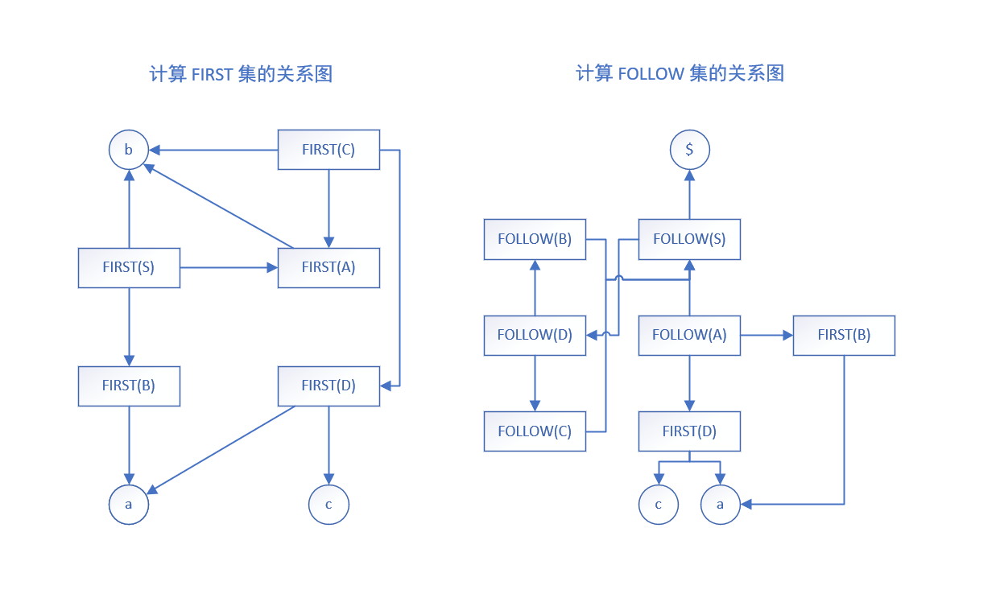

# LL(1)文法判别

在 LR 分析中，首先应该判断一个文法是否为 LL(1) 文法，对此可以给出一些必要条件：

- 含有左递归的文法绝对不是 LL(1) 文法

同样也可以给出一些充分条件：

- s\_文法和 q\_文法是 LL1

但是这些条件都无法在任意条件下判断一个 CFG 文法（上下文无关文法）是否是 LL(1) 的，还是要回到 LL(1) 文法定义：

> 假设文法 G 是 LL(1) 的，当且仅当 G 的任意两个具有相同左部的产生式 $A \rightarrow\alpha|\beta$ ，有$SELECT(A \rightarrow \alpha) \cap SELTCT(A \rightarrow \beta)=\emptyset$，其中 $\alpha$ 和 $\beta$ 不能同时 ${\Rightarrow}^* \epsilon$。

可以看出，要判别一个给定 Context Free Grammar G 是否为 LL(1) 文法的关键在于判断 SELECT 集是否相交，求解时可以分为几个步骤：

1. 求能够推出 ε 的非终结符
2. 计算每一个文法符号的 FIRST 集

3. 计算每个非终结符的 FOLLOW 集
4. 计算每个产生式的 SELECT 集

5. 计算相同左部的产生式的 SELECT 集是否相交，若不相交，则为 LL(1) 文法

## 判别非终结符是否能够推出 ε

判别一个终结符是否能够推出 ε，可以通过扫描产生式完成，需要使用一个长度等于非终结符个数的数组用于标记非终结符是否能够推出空串，具体步骤如下：

1. 将数组全部标记为”未定“
2. 扫描文法中所有产生式
   1. 删除右部有终结符的产生式，若使得某一左部非终结符所有产生式被删去，则将其标记为”否“
   2. 删除右部为 ε 的产生式，并将其标记为”是“
3. 扫描产生式右部每一个符号
   1. 若扫描到非终结符已经被标记为”是“，删去该终结符，若这使得删去所有右侧符号，则将左部非终结符标记为”是“
   2. 若扫描到非终结符已经被标记为”否“，删去该产生式，若这使得删去左侧非终结符的所有产生式，则将其标记为”否“
4. 重复步骤3，直到扫描完一遍文法且数组没有发生变化为止

## 计算文法符号的 FIRST 集

在[自顶向下的语法分析](../08/top-down-grammar-parsing.md)中，我们已经介绍过通过定义求 FIRST 集，但是描述较乱，我们对齐重新整理。

### 定义法求 FIRST 集

对每一文法符号 $X \in V$ 计算 ${\rm FIRST}(A)$：

1. 若 $X \in V_T$，则 ${\rm FIRST}(X)=\{X\}$
2. 若 $X \in V_N$，且有产生式 $X\rightarrow a \ldots,a\in V_T$，则 $a \in {\rm FIRST}(X)$
3. 若 $X\in V_N$，且有产生式 $X \rightarrow \epsilon$，则 $\epsilon \in {\rm FIRST}(X)$
4. 若 $X, Y_1,Y_2,\ldots,Y_n \in V_N$，且有产生式 $X \rightarrow Y_1Y_2\ldots Y_n$，当 $Y_1,Y_2,\ldots,Y_{i-1}{\Rightarrow}^{*}\epsilon$ 时，则 ${\rm FIRST}(Y_1)-\{\epsilon\},{\rm FIRST}(Y_2)-\{\epsilon\},\ldots,{\rm FIRST}(Y_{i-1})-\{\epsilon\},{\rm FIRST}(Y_i)\in {\rm FIRST}(X)$，

5. 若 $X, Y_1,Y_2,\ldots,Y_n \in V_N$，且有产生式 $X \rightarrow Y_1Y_2\ldots Y_n$，当 $Y_1,Y_2,\ldots,Y_n {\Rightarrow}^{*} \epsilon$，则 ${\rm FIRST}(X)={\rm FIRST}(Y_1) \cup {\rm FIRST}(Y_2) \cup \ldots \cup {\rm FIRST}(Y_n) \cup \{\epsilon\}$

重复步骤2~5，直到每一个文法符号的 FIRST 集不再增大为止。

### 关系图法求 FIRST 集

定义法需要反复扫描产生式，究其根源是因为求某一终结符 $X$ 的 ${\rm FIRST}(X)$ 可能依赖于另外一个终结符 $Y$ 的 ${\rm FIRST}(Y)$，如果我们将这种依赖关系以有向图的形式画出，则可以轻松得到 FIRST 集。

1. 每个文法符号对应图中一个结点，终结符结点用符号本身标记，非终结符 $A$ 结点用 ${\rm FIRST}(A)$ 标记
2. 若文法中有产生式 $A \rightarrow \alpha X \beta, \alpha {\Rightarrow}^{*}\epsilon$，则将结点 $A$ 连一条箭弧到结点 $X$
3. 凡是从 ${\rm FIRST}(A)$ 结点有路径到达的非终结符结点都为 ${\rm FIRST}(A)$ 的成员
4. 若有 $A {\Rightarrow}^{*} \epsilon$，则 $\epsilon\in {\rm FIRST}(A)$

## 计算 FOLLOW 集

FOLLOW 集的计算方法都依赖于 FIRST 集，因此需要先求出 FIRST 集

### 定义法求 FOLLOW 集

同样对定义法求 FOLLOW 集进行归纳：

1. 若 $S$ 为文法开始符号，则 $\$\in {\rm FOLLOW}(S)$

2. 若有产生式 $A\rightarrow \alpha B\beta$，则 ${\rm FIRST}(\beta)-\{\epsilon\}\in {\rm FOLLOW(B)}$
3. 若有产生式 $A\rightarrow\alpha B$，则 ${\rm FOLLOW}(B)\in{\rm FOLLOW}(A)$
4. 重复步骤2~3，直到每一个文法符号的FOLLOW集不再增大

### 关系图法求 FOLLOW 集

不难发现，FOLLOW 集可能依赖于 FIRST 集和 FOLLOW 集，因此我们也可以通过描述关系图来计算 FOLLOW 集

1. 每个文法符号和 \$ 对应图中一个结点，终结符或 \$ 结点用符号本身标记，非终结符 $A$ 结点用 ${\rm FOLLOW}(A)$ 或 ${\rm FIRST}(A)$ 标记
2. 从开始符号 $S$ 的 ${\rm FOLLOW}(S)$ 结点连一条箭弧到 \$ 结点
3. 如有产生式 $A \rightarrow \alpha B\beta X, \beta {\Rightarrow}^{*}\epsilon$，则从 FOLLOW(B) 结点连一条箭弧到 FIRST(X) 结点
4. 如有产生式 $A\rightarrow \alpha B \beta, \beta {\Rightarrow}^{*}\epsilon$，则从 FOLLOW(B) 结点连一条箭弧到 FOLLOW(A) 结点
5. 对每一个 FIRST(A) 结点，如有产生式 $A\rightarrow \alpha X \beta,\alpha {\Rightarrow}^{*}\epsilon$，则从 FIRST(A)​ 结点连一条箭弧到 ​FIRST(X) 结点
6. 凡是从 FOLLOW(A) 结点有路径可以到达的终结符或 \$ 号的结点，其标记的符号为 FOLLOW(A) 的成员

## 求 SELECT 集

由关系式求出 SELECT 集：
$$
\begin{aligned}
&\text{if }\epsilon \in FIRST(\alpha), &\text{then }& SELECT(A \rightarrow \alpha)=FIRST(A) \\
&\text{if }\epsilon \notin FIRST(\alpha), &\text{then }& SELECT(A \rightarrow \alpha)=(FIRST(A)-\{\epsilon\}) \cup FOLLOW(A)
\end{aligned}
$$

## Example

判断下列文法G是否为 LL(1) 文法：
$$
\begin{align}
S &\rightarrow AB       \\
S &\rightarrow bC       \\
A &\rightarrow \epsilon \\
A &\rightarrow b        \\
B &\rightarrow \epsilon \\
B &\rightarrow AD       \\
C &\rightarrow AD       \\
C &\rightarrow b        \\
D &\rightarrow aS       \\
D &\rightarrow c        \\
\end{align}
$$
关系图如下：

计算结果如下：

| 非终结符 | 是否 ${\Rightarrow}^{*}\epsilon$ | FIRST 集 | FOLLOW 集 |
| :------: | :------------------------------: | :------- | --------- |
|    S     |                是                | {a,b,ε}  | {\$}      |
|    A     |                是                | {b,ε}    | {a,c,\$}  |
|    B     |                是                | {a,ε}    | {\$}      |
|    C     |                否                | {a,b,c}  | {\$}      |
|    D     |                否                | {a,c}    | {\$}      |

计算 SELECT 集如下：
$$
\begin{align}
SELECT &(S \rightarrow AB       )&= &\{ a,b,\$ \} \\
SELECT &(S \rightarrow bC       )&= &\{ b \}      \\
SELECT &(A \rightarrow \epsilon )&= &\{ a,c,\$ \} \\
SELECT &(A \rightarrow b        )&= &\{ b \}      \\
SELECT &(B \rightarrow \epsilon )&= &\{ \$ \}     \\
SELECT &(B \rightarrow AD       )&= &\{ a \}      \\
SELECT &(C \rightarrow AD       )&= &\{ a,b,c \}  \\
SELECT &(C \rightarrow b        )&= &\{ b \}      \\
SELECT &(D \rightarrow aS       )&= &\{ a \}      \\
SELECT &(D \rightarrow c        )&= &\{ c \}      \\
\end{align}
$$
比较每个终结符产生式的 SELECT 集：
$$
\begin{align}
&SELECT(S \rightarrow AB)        &\cap &SELECT(S \rightarrow bC) &= &\{b \}  \\
&SELECT(A \rightarrow \epsilon ) &\cap &SELECT(A \rightarrow b)  &= &\emptyset \\
&SELECT(B \rightarrow \epsilon ) &\cap &SELECT(B \rightarrow AD) &= &\emptyset \\
&SELECT(C \rightarrow AD)        &\cap &SELECT(C \rightarrow b)  &= &\{ b \}   \\
&SELECT(D \rightarrow aS)        &\cap &SELECT(D \rightarrow c)  &= &\emptyset \\
\end{align}
$$

比较SELCE集，发现非终结符 S 和 C 的各个产生式的 SELECT 集存在相交，因此该文法不为 LL(1) 文法。

## References

- 王生原, 董渊, 张素琴, 吕映芝, 蒋维杜. 编译原理. 清华大学出版社
