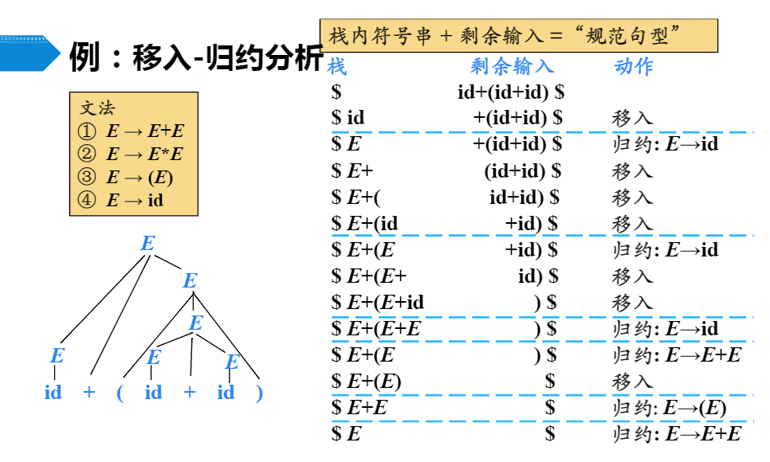

# 自底向上的语法分析

自底向上的语法分析采用最左归约方式，也就是反向构造最右推导，其具体实现有优先分析和LR分析。优先分析中又有简单优先分析和算符优先分析。简单优先分析的分析过程准确、规范，但是效率低，没有实用价值，而算符优先分析虽然分析速度快，但是不是规范归约，仅有一定应用，本文主要介绍LR分析。

## 移入-归约分析（Shift-Reduce Parsing）

实现自底向上分析最常用的技术是移入-归约分析

最左规约

句柄：当前句型的最左直接短语

在分析过程中，句柄是逐步形成，移进状态、待约状态、规约状态



## 优先分析

### 简单优先分析

### 算符优先分析

## LR 分析法

LR(k)文法是最大的、可以构造出相应移入-规约语法分析器的文法类，L表示从左到右扫描，R表示反向构造出一个最右推导序列，k表示向前看k个输入符号，k=0 或 1 具有实践意义，省略 k 时表示 k=1

#### LR 分析表

符号栈、状态栈，ACTION 函数，GOTO 函数

```

```

### LR(0) 分析

**可归前缀**：可归前缀指的是在规范句型中可以采用归约动作的前缀，一旦出现可归前缀，可以立刻采取归约动作。

**活前缀**：在规范句型中形成可归前缀之前（包括可归前缀）的所有前缀都称为可归前缀，即它们依然可能形成可归前缀（活着的）

有了活前缀的概念后，不难理解在 LR 归约过程中，符号栈中应该始终是一个活前缀，否则则表示存在错误。因此，在归约过程中，我们需要识别当前符号栈中是否为一个活前缀，下面介绍三种方法，分别通过定义、自动机、项目集来构造一个活前缀的自动机

#### 识别活前缀：形式定义求正则表达法

#### 识别活前缀：有限自动机构造法

#### 识别活前缀：项目集规范族构造法

核

##### 项目集闭包

如果项目等待的是一个非终结符，那么就可能存在等价项目。我们将一组等价状态称为项目集闭包

若有项目集 $I$ 且 $A \rightarrow \alpha \cdot B \beta \in I$，则 $B \rightarrow \gamma \in I$ 

#### 从活前缀NFA构造分析表

#### 冲突

上下文无关文法CFG不总是LR(0)文法，在项目集

##### 移进-归约冲突

移进项目核和归约项目同时存在，形如：
$$
\begin{aligned}
A &\rightarrow \alpha \cdot a\beta \\
B &\rightarrow \gamma \cdot        \\
\end{aligned}
$$

当到达该状态且下一个输入符号为`a`时，无法确定是移进还是归约，因为 LR(0) 分析时不向前查看输入符号的。

##### 归约-归约冲突

归约项目和归约项目也可能同时存在，形如：
$$
A \rightarrow \beta \cdot  \\
B \rightarrow \gamma \cdot \\
$$
此时无论下一个输入符号时什么，都无法确定归约采用哪个产生式，我们将同时存在两个以上归约中项目的状态的称为归约-归约冲突

### SLR分析

由于多数实用程序的文法无法满足 LR(0) 文法的条件，于是前辈们设计出了简单LR(1)分析法（Simple LR parser）。SLR分析的基本思想是在对存在冲突的项目集中，向前看一个输入符号，通过检查当前符号的 FOLLOW 集来决定选用产生式，解决冲突。

SLR 分析可以解决部分冲突，但是无法解决 FOLLOW 集相交的冲突。

### LR(1)分析

在特定位置，A的后继符号集合是 FOLLOW 集的子集，

规范LR(1)项目 $A\rightarrow \alpha \cdot \beta,a$，其中 a 称为展望符

LR(1)分析法对搜索符的计算方法比较确切，对文法放宽了要求，但由于他的构造对某些同心集的分裂使得状态急剧增长，从而导致存储容量的急剧增加。

### LALR分析

为了克服LR(0)分析法状态太多的缺点，可以采用对LR(1)项目集规范族合并同心集的方法，如果合并同心集后不产生新的冲突，则称为 LALR(1) 分析。

两个项目仅有展望符不同，则称为**同心项目集**，寻找具有相同核心的LR(1)项目集，并将这些项目集合并为一个项目集，然后根据合并后得到的构造语法分析表。

LALR分析法在形式上与LR(1)相同，大小在LR(0)/SLR相当，在分析能力上：LR(0)<SLR < LALR < LR(1)

#### 归约-归约冲突

#### 推迟错误的发现

LALR分析法可能会作多余的归约动作，但绝不会作错误的移进操作

## 二义性文法的LR分析

二义性文法都不是 LR 文法。

二义性文法可以通过规定优先关系和结合性处理，可能构造出无冲突的 LR 分析表，且分析速度相较于无二义性文法的 LR 分析速度要快一些。

## References

- 王生原, 董渊, 张素琴, 吕映芝, 蒋维杜. 编译原理. 清华大学出版社
