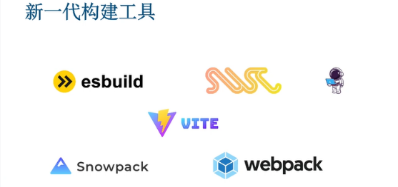
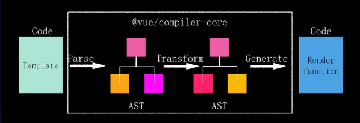
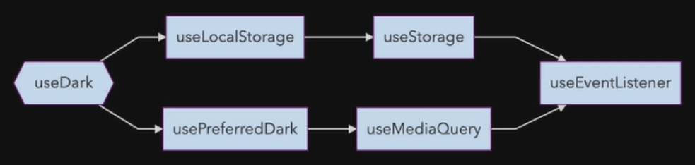
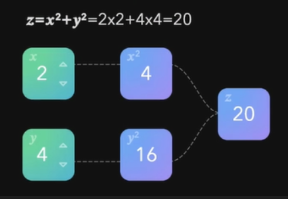
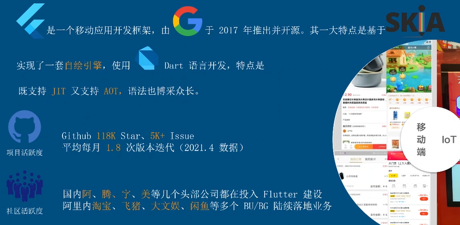
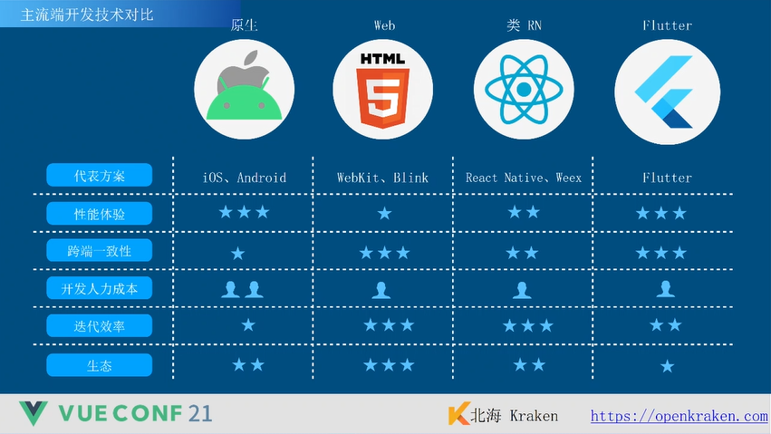

# Vue Conf 21

## Vite

### 为什么更快？

Vite 快速的核心原因时改变了原有的 Bundler-Based Dev Server，而采用 ESM-Based Dev Server 方案。Bundle-Base 的方案中，**Full Bundler** 决定了开发服务器的每次启动都十分低效，需要从入口文件解析整个依赖树并将其打包。而全新的 ESM-Based 开发服务器只需要做每个文件的 **Transform**，文件依赖解析则交由 ESM 完成，如此一来，开发服务器真的就只需要监听一个端口那么简单！

> 其实可能还有依赖预构建，当然这也是为了更快

### SSR 目标

- Dev Bundless
- Node 环境下加载 ESM
  - 兼容 Node 低版本
  - 兼容生态环境
- 支持 HMR+Plugin

## 编译优化思路

```ts
return {
  c() {
    /* create  */
  },
  m() {
    /* mount   */
  },
  p() {
    /* patch   */
  },
  d() {
    /* destory */
  },
}

// @vue/reactive
return {
  c() {
    /* create  */
  },
  m() {
    /* mount   */
  },
  d() {
    /* destory */
  },
}
```

## Element3

- Headless/Styled
- webGL -> 材质

## 新一代构建工具

> 别让构建流程成为技术包袱



### Type First

Type First, 类型优先 -> TypeScript

- 类型提示
- 智能补全
- 省下写文档的时间
- 方便重构

### 将类型检查放到编译外

- esbuild: 单纯的 TypeScript 词法扩展并不会让编译变慢
- 把 tsc 作为 lint 的一部分

### Be Explicit

- 用 define\* 的帮助函数：类型补全

- 不要省略文件名：类型

### Module By Default

- 拥抱 ES Module

- 重新看待 Externals，在 ESM 时代，简单的 Externals 并不好用

  - alias
  - import maps

- `__filename` / `__dirname` / `require.resolve` => `import.meta.url`

- `process.env` => `import.meta.env`

  - 来自 Node.js，环境并不存在
  - 浏览器端的 `process.env` 并不是环境，而是配置
  - `NODE_ENV`有各种约定俗称的用法

- JSON modules => 标准只有 default import

### 构建工具的兼容难题

浏览器兼容 & 技术债务

- IE 11 => Retail
- Dynamic Import
- Node.js Polyfills & Shims

## 减少 Node 依赖

抹平差距

- Define：简单的字符串替换
- Mock / Sham：无实际功能的模拟，如 fs
- Shim / Polyfill：模拟完整功能，如 path

用 globalThis 代替 global/window

## JSX



利用 Babel 赋予的编译能力，实现模板与 JSX 跨语言联动，以用户的需求为抓手，摸索出一套适用于 Vue 的 JSX 方法论，打造 Vue 生态闭环，利用 TypeScript 的类型提示，为更习惯于 JSX 的开发者赋能。

### 什么是“真正的”JSX

JSX 最早由 Facebook 起草，用于 React，但不是 tc39 的规范，因此浏览器不会直接实现。JSX 需要由编译器和框架来"赋能"，以下列代码为例：

```jsx
<h1>Hello, world!</h1>
```

经过编译后（通过 Babel, ts 等工具转换 AST）：

```ts
import { createVNode as _createVNode } from "vue"
_createVNode("h1", null, "Hello, world!")
```

### 缺点

1. **额外的运行时**：JSX 无法判断 slot 或 children，只能在运行时判断

2. **信息不足**：JSX 语法自由的代价就是难以实现静态分析，编译信息较少，Vue3 引入的`PatchFlags`无法完全做到，导致 JSX 编译后的 `Render Function` 性能差一些

## Composition API

> PPT: <https://talks.antfu.me/2021/vueconf-china>

### 为什么要组合式？

- 对象式变量来源不明确

- Type 补全复杂

### 什么是组合式？

- 可复用逻辑的组合，其中每个函数都可以独立使用

- 专注点分离



### Reactive

不同于 React，Vue 的 `Setup()` 只会在组件建立时执行一次，在此期间会建立起数据与逻辑之间的连结。

- 建立输入 → 输出的连结
- 输出会根据输入的改变而改变（就像你的 Excel 一样 :tada:）



### Best practices

- 优先使用 `ref` 而不是 `reactive`

  - 显示调用，类型检查

  - 相比 Reactive 局限更少：`reactive `有类型，无法解构……

- Ref 自动解包

  - `watch` 直接接收 Ref ，回调中会自动解包

  - Ref 在模板中自动解包

  - 使用 `reactive` 解包嵌套 `ref`，用来代替 `toRef`

- `unref` API

  - `unref(a) => isRef(a) ? a.value : a`

  - 接收 Ref 作为函数参数 `(a, b) => unref(a) + unref(b)`

- `type MaybeRef<T> = Ref<T> | T `

- 重复使用 ref，`ref `会自动解包的！

  - `newRef = isRef(foo) ? foo : ref(foo)`和`newRef = ref(foo)` 一样的

- 副作用自动清除

  - 组件内的 `watch` 和 `computed` 会在销毁时自动清除

  - Vue 3.2: `effectScope`

- 类型安全的 `Provide`/`Inject`：`InjectionKey<T>`

- 状态共享

  - 直接用 Composition API 把状态抽离

  - 使用 `provide`/`inject` 来共享应用层面的状态

- 小技巧：`useVModel`

```ts
export function useVModel(props, name) {
  const emit = getCurrentInstance.emit
  return computed({
    get() {
      return props[name]
    },
    set(v) {
      emit(`update${name}`, v)
    },
  })
}
```

- Vue Demi: 一套代码，同时适用 Vue 2 和 Vue 3

## Vue 的 Flutter 实践

- 移动端技术栈演变：WebView -> Hybrid -> RN -> Flutter




