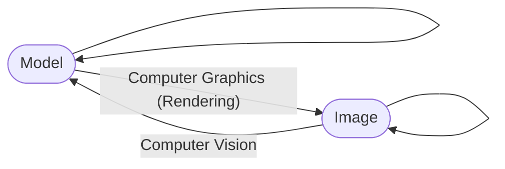

# GAMES101

## Links

- [Rasterization（光栅化）](../../11/13/games101-rasterization.md)
- [Geometry（几何）](../../11/18/games101-geometry.md)
- [Ray Tracing（光线追踪）](../../11/30/games101-ray-tracing.md)
- [Material（材质）](../../12/14/games101-material.md)
- [Light Transport（相机、光场、颜色）](../../12/16/games101-light-transport.md)
- [Animation/Simulation（动画与仿真）](../../12/18/games101-animation-simulation.md)
- [Assignment（作业）](https://github.com/yzx9/games101)

## Why we learning CG?

- What is Computer Graphics?
  - Simulation
  - Graphical User Interface
  - Typography
  - ...
- Why study Computer Graphics?

  - Fundamental Intellectual Challenges
  - Technical Challenges

> Trade off between real time and offline

- What different between Computer Graphics and Computer Vision?

- Dependencies
  - Basic mathematics
    - Linear algebra, calculus, statistics
  - Basic physics
  - Optics, Mechanics
  - Misc
    - Signal processing
    - Numerical analysis
  - And a bit aesthetics
