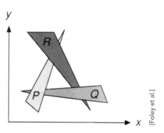

## GAMES101

# Rasterization（光栅化）

光栅化是通过将顶点数据组成的场景渲染得到一张图片的方法。

- **Raster**: Raster == screen in German, so rasterize == drawing onto the screen
- **Fov**：可视角度，可以分为 fovX 和 fovY，两者可以通过宽高比转换
- **Screen**: An array of pixels, and size of array is resolution
- **Pixel**: short for "picture element"

## Transformation

对于一个场景，我们需要对其做 MVP 变换：

### Transform

#### 2D Linear Transformation

2D 线性变换可以通过下列公式表示：

$$
\begin{pmatrix} x' \\ y' \end{pmatrix}
= M
\begin{pmatrix} x \\ y \end{pmatrix}
$$

##### Scale Matrix

$$
M = S_{xy}(s_x, s_y) = \begin{pmatrix} s_x & 0 \\ 0 & s_y \end{pmatrix}
$$

- Reflection about y-axis: $S_{xy}(-1,  1)$

##### Shear Matrix

$$
M = S_{xy}(a) = \begin{pmatrix} 1 & a \\ 0 & 1 \end{pmatrix}
$$

不难发现，变换前后 y 轴位置没有变化，x 轴变化与 y 相关，因此可得出关系 $\begin{pmatrix} x' \\ y'\end{pmatrix} = \begin{pmatrix} x+ay \\ y \end{pmatrix} = \begin{pmatrix} 1 & a \\ 0 & 1 \end{pmatrix} \begin{pmatrix} x \\ y\end{pmatrix} = S_a \begin{pmatrix} x \\ y\end{pmatrix}$。

##### Rotation Matrix

$$
M = R_{xy}(\theta) = \begin{pmatrix} \cos\theta & -\sin\theta \\ \sin\theta & \cos\theta \end{pmatrix}
$$

设 $R(\alpha)= \begin{pmatrix} A & B \\ C & D \end{pmatrix}$，将 $(x_1, y_1)^T=(1,0),(x'_1,y'_1)^T=(\cos\theta_1, \sin\theta_1)^T$ 和 $(x_2, y_2)^T=(0,1),(x'_2,y'_2)^T=(\cos\theta_1, \sin\theta_1)^T$，可以解得 $R(\theta)$

- 旋转矩阵都是正交矩阵：$R_{-\theta} = R_\theta^{-1} = R_\theta^{T}$

#### Homogenous Coordinates（齐次坐标）

> 齐次坐标也可以理解为增加维度使平移操作在高维空间中为线性操作

Translation is **NOT** linear transform! So we add an third coordinates:

- 2D Point: $(x, y, w)^T$ , when $w \not = 0$
- 2D Vector: $(x, y, 0)^T$, when $w = 0$

Then, valid operation if w-coordinate of result is 0 or 1(1 is the norm):

- vector + vector = vector
- point - point = vector
- point + vector = point
- point + point = midpoint

Then:

$$
\begin{pmatrix} x' \\ y' \end{pmatrix}
= M
\begin{pmatrix} x \\ y \end{pmatrix}
$$

##### Translation Matrix

$$
T_{(t_x, t_y)} = \begin{pmatrix}
1 & 0 & t_x \\ 0 & 1 & t_y \\ 0 & 0 & 1
\end{pmatrix}
$$

> 平移无法用线性变换表示，是因为向量具有**平移不变性**。

> 在模型变换中，$T_{(t_x, t_y)}$ 最后一行总是 $(0,0,1)$（2D）或$(0,0,0,1)$（3D）

##### Affine transformation（仿射变换 ）

Affine transformation = linear map + translation.

引入齐次坐标后，2D 仿射变换均可用一个 3 阶的变换矩阵 $M_{3\times 3}$ 表示。

仿射变换是可逆的，且逆变换也是仿射变换，也就是说变换$M$的逆变换即为$M^{-1}$。

$$
\begin{pmatrix}x' \\ y' \\ 1 \end{pmatrix}
=
\begin{pmatrix}a & c & t_x \\ c & d & t_y \\ 0 & 0 & 1 \end{pmatrix}\begin{pmatrix}x \\ y \\ 1 \end{pmatrix}
$$

##### Composite transformation

- 复杂变换可以分解为一系列简单变换：$M = M_1M_2\dots M_n$
- 变换有顺序关系：$M_1 M_2 = -M_2 M_1$
- 一系列变换矩阵从右侧应用到左侧：$A_n(\dots A_2(A_1(x)))=A_n\dots A_2 A_1 (x, y, 1)^T$

###### How to rotate around a given point c:

Matrix representation: $T(c)\cdot R(\alpha) \cdot T(-c)$

1. Translate center to origin;
2. Rotate;
3. Translate back.

#### 3D Transformation

Use homogenous coordinates:

$$
S_{(s_x, s_y, s_z)}=
\begin{pmatrix}
a & b & c & t_x \\
d & e & f & t_y \\
g & h & i & t_z \\
0 & 0 & 0 & 1 \\
\end{pmatrix}
$$

##### 3D Rotate Matrix:

$$
R_{xyz}(\alpha, \beta, \gamma)=R_x(\alpha)R_y(\beta)R_z(\gamma)
$$

其中：

$$
R_x(\alpha) =
\begin{pmatrix}
1 & 0 & 0 & 0 \\
0 & \cos\alpha & -\sin\alpha & 0 \\
0 & \sin\alpha & \cos\alpha & 0 \\
0 & 0 & 0 & 1 \\
\end{pmatrix} \\

R_y(\beta) =
\begin{pmatrix}
\cos\beta & 0 & \sin\beta & 0 \\
0 & 1 & 0 & 0 \\
-\sin\beta & 0 & \cos\beta & 0 \\
0 & 0 & 0 & 1 \\
\end{pmatrix} \\

R_z(\gamma) =
\begin{pmatrix}
\cos\gamma & -\sin\gamma & 0 & 0 \\
\sin\gamma &  \cos\gamma & 0 & 0 \\
0 & 0 & 1 & 0 \\
0 & 0 & 0 & 1 \\
\end{pmatrix}
$$

注意，其中 $R_y(\beta)$ 顺序与其他两个不同，因为 $xyz$ 三轴间存在顺序。

三维旋转也可以使用罗德里格旋转公式（Rodrigues' rotation formula）描述，其表示一个向量绕旋转轴旋转给定角度以后得到的新向量：

$$
R(\vec n, \alpha) = \cos\alpha \cdot \bold I + (1-\cos\alpha) \cdot \vec n \cdot \vec n^T + \sin\alpha \cdot \bold N \\
N  = \begin{pmatrix}
0 & -n_z & n_y \\
n_z & 0 & -n_x \\
-n_y & n_x & 0
\end{pmatrix}
$$

### Model/View transformation（模型视图变换）

一个相机(Camera)的位置由三个向量决定：Position $\vec e$，Look-at $\vec g$, Up direction $\vec t$，标准相机位：The origin, up at Y, look at -Z，通常我们将一个相机移动至标准位：

$$
\begin{aligned}
M_{view} &= R_{view}T_{view} \\ \\

T_{view} &= \begin{pmatrix}
1 & 0 & 0 & -x_e \\
0 & 1 & 0 & -y_e \\
0 & 0 & 1 & -z_e\\
0 & 0 & 0 & 1 \\
\end{pmatrix} \\ \\

R_{view} &= (R_{view}^{-1})^{-1} \overset{\text{正交性}}{=} (R_{view}^{-1})^T = \begin{pmatrix}
x_{\hat g \times \hat t} & y_{\hat g \times \hat t} & z_{\hat g \times \hat t} & 0 \\
x_t & y_t & z_t & 0 \\
x_{-g} & y_{-g} & z_{-g} & 0\\
0 & 0 & 0 & 1 \\
\end{pmatrix}
\end{aligned}
$$

不难发现，在视图变换（移动相机）中将相机移动到标准位，等价于移动模型，因此在实际应用中往往将模型变换和视图变换一起执行。

### Projection transformation（投影变换）

投影变换是将一个可视范围内的场景变换到一个 canonical cube（正则、标准立方体，中心在原点、边长为 2），主要有正交投影和透视投影：

### 

#### Orthographic projection

正交投影最简单的实现是抛弃 Z 轴。

标准实现：将一个空间 cuboid（立方体）映射到一个 canonical cube。

> 右手坐标系中，z 越小越远；左手坐标系中更符合常理，z 越大越远

#### Perspective projection

透视投影的裁剪空间是一个 Frustum（锥台），我们需要将其投影为一个 canonical cube。我们可以先为将裁剪空间转换为 cuboid，然后做正交投影变换，即：$M_{persp} = M_{ortho}M_{persp \rightarrow ortho}$。。：

We can find the relationship between transformed points and the origin points:

So the "squish"(perspective to orthographic) projection does this:

$$
M_{persp \rightarrow ortho} (x, y, z, 1)^T = (nx, ny, ?, z)^T \\
M_{persp \rightarrow ortho} = \begin{pmatrix}
n & 0 & 0 & 0 \\
0 & n & 0 & 0 \\
? & ? & ? & ? \\
0 & 0 & 1 & 0 \\
\end{pmatrix}
$$

> 注意：此处应注意齐次坐标定义：$(1,0,0,1)^T = (n, 0, 0, n)^T$ 。

又有近截面面上的点投影前后不变，远截面的点 z 轴投影前后不变且中心点坐标不变，可以解得:

$$
M_{persp \rightarrow ortho} = \begin{pmatrix}
n & 0 & 0 & 0 \\
0 & n & 0 & 0 \\
0 & 0 & n+f & -nf \\
0 & 0 & 1 & 0 \\
\end{pmatrix}
$$

> 自行验证：锥台除远近截面上的其余点 z 轴坐标都有变化

#### Viewport transform

MVP 变换后我们得到了一个正方体（canonical cube）的裁剪空间，为了方便光栅化，我们需要将其变换为屏幕大小的长方体（cuboid）的屏幕空间，这一步被称为视口变换：

$$
M_{viewport} = \begin{pmatrix}
\frac{width}{2} & 0 & 0 & \frac{width}{2} \\
0 & \frac{height}{2} & 0 & \frac{height}{2} \\
0 & 0 & 1 & 0 \\
0 & 0 & 0 & 1 \\
\end{pmatrix}
$$

## Sampling

我们可以通过采样的方式来判断像素中心与三角形的位置关系，得到一个值域为 $\{0, 1\}$ 的 $inside$ 函数。

> 采样对象应该为像素中心：$inside(tri, x+0.5,y+0.5)$

### inside

通过向量叉乘得到的向量的正负性，我们可以判断两个向量在所在平面的左右位置关系。例如 $\vec A = (0,1,0)^T, \vec B = (1,0,0)^T, \vec{A} \times \vec{B} = (0,0,1)^T$，可得 $\vec B$ 在 $\vec A$ 的左侧。

在三角形 $\triangle ABC$中，要**判断平面上一个点$P$是否在三角形内部**，可以判断 $\overrightarrow{AP}$ 与 $\overrightarrow{AB}$、$\overrightarrow{BP}$ 与 $\overrightarrow{BC}$ 、 $\overrightarrow{CP}$ 与 $\overrightarrow{CA}$ 三组向量间的方向性，如果左右位置关系相同，即点在三角形内（逆时针时左侧，顺时针时右侧）。该结论还可以推广到凸多边形内。

> 叉乘结果为 0 是一个 **Corner Case（边角案例）**，应自行决定其行为

实际上，通过三角形三个角的坐标围成的 **Axis-Aligned Bounding Box （AABB，轴对齐包围盒）** 外的像素显然不会在三角形内，因此我们可以通过包围盒裁掉其他像素。更进一步的，我们可以找到每一行最左侧/最右侧第一个可见的像素，从而裁掉更多像素。

### Rasterization on Real Displays

显示中的光栅化采样的尺度可能不止像素级别，例如 LCD 屏，实际上每个像素都是由多个单色的发光点决定，例如 Bayer Pattern；在彩色打印中，像素是由一块空间内喷涂的颜料的多少决定，且与屏幕不同，颜料越多越黑。

## Aliasing

仅仅使用 $inside$ 函数采样得到的图像边缘有很明显的 jaggies（锯齿），信号处理中将其称为 aliasing（频率混叠），摩尔纹同样是由于采样不足导致的问题。

> **Sampling Artifacts**: Error/Mistakes/Inaccuracies in Computer Graphic

An simple **Antialiasing** way: Blurring(Per-Filter) Before Sampling

### Convention Theorem

Filtering (Frequency Domain) = Convolution (Spatial Domain)

所以，我们用一个 Box-Filter 去卷积图像，等价于对图片应用一个低通滤波器。

> 《数字图像处理》
>
> - 高通滤波 $\simeq$ 边缘提取
>
> - 低通滤波 $\simeq$ 模糊处理
>
> - 带通滤波 $\simeq$ 特定边缘提取
>
> > 现在常使用机器学习做图像处理

### Reduce Aliasing Error

回看锯齿现象，本质上是因为采样率（分辨率）过低，导致频谱搬移密集，频域上出现混叠。

#### 增加采样率

锯齿的根本问题是采样率不足，无法满足采样定理导致。任何反走样技术都是无法还原原图片，其根本解决办法是需要增加采样率，也就是增加图片分辨率。

#### Antialiasing Sampling

锯齿 = 采样率不足导致频率混叠
抗锯齿 = 添加低通滤波避免混叠

##### Multi-sample anti-aliasing (MSAA)

最简单的低通滤波是一像素的 Box-Filter，也就是计算三角形在像素的大小。说来容易做起来难，三角形面积并不好计算。我们在实际使用中常常使用一个近似的超采样算法：将一个像素划分为多个小的采样点，采样点趋向于无穷时，采样结果趋向于面积。

No free lunch. MSAA 抗锯齿的同时也带来了额外的计算。在实际使用中，我们通常选择较小的超采样点，比如 2\*2 或 4\*4。同时，我们可以通过优化采样点的分布来减少数量，甚至在相邻点中复用。

> 也可以理解为再对 4 个超采样点做一次采样

##### Fast Approximate anti-aliasing (FXAA)

FXAA 并不通过增加采样率来解决问题，而是在走样图片基础上处理。如果直接在图片上进行模糊，只能得到一张模糊的走样图片，并不能达到抗锯齿效果。FXAA 通过图像层面查找边界，都边界进行特殊处理，来抑制走样。

##### Temporal anti-aliasing (TAA)

TAA 同样通过超采样实现，不过 TAA 不在当前帧引入额外操作，而是使用上一帧的像素点作为超采样点。TAA 需要对高速运动物体额外处理。

##### Deep Learning Super Sampling (DLSS)

Super resolution / Super sampling

用深度学习来猜测缺失的像素。

## Shader

### Depth Testing

着色前首先需要进行深度测试，来确定点是否点是否被覆盖，如果被覆盖则直接抛弃而无需着色。

#### Painter's Algorithm

首先我们可以考虑一种 Painter's Algorithm（油画家算法）：油画家总是先画远景，然后在其上画近景。画家算法需要对每个三角形执行 $O(nlogn)$ 的排序算法，而且并不总是可以成功，例如下图：

因此，以三角形为单位考虑深度是不可行的，我们需要更进一步以像素为单位考虑深度。

#### Depth-Buffer (Z-Buffer)

在渲染过程中，我们可以维护一个逐像素的深度缓存。在绘制每一个三角形时，对每一个像素检查深度，如果小于 z-buffer 中的深度则通过测试并更新 z-buffer，否则抛弃该像素。

- 也可以对每一个采样点维护一个深度缓存，即视口变换前
- Z-Buffer 无法处理透明物体，需要特殊处理

### Blinn-Phong Reflection Model

在 Shading 中我们不考虑 Shadow，也就是只考虑单独的点与光源，忽略物体间的遮挡关系。

Blinn-Fong Reflection Model 是一种常用的反射模型，其模拟了一种类似于塑料的材质。模型中的光照由环境光照（$L_a$）、漫反射（$L_d$）和镜面反射（$L_s$）三部分组成：

$$
L = L_a + L_d + L_s
$$

其中：

$$
\begin{aligned}
L_a &= k_a I \\
L_d &= k_d (I/r^2) max(0, \vec n \cdot \vec l) \\
L_s &= k_s (I/r^2)max(0, \vec n \cdot \vec h)^p
\end{aligned}
$$

**环境光照**（Ambient）是由于光线在场景内经过多次反射照亮了整个场景，使得没有光线直射的物体表面也有一定亮度。由于不可能去追踪每一次反射，我们通过给环境一个固定的光照亮度来模拟这一行为。公式中 $I$ 表示光源强度（intensity），$k_a$ 表示环境的环境光照系数。

**漫反射**（Diffuse Reflection）用于形成物体因为光源形成的明暗变化，漫反射光强弱与光源距离和入射角有关，而与观测角度无关。公式中，$k_d$是反射系数，$I/r^2$ 项表示距离的影响，$max(0, \vec n \cdot \vec l)$ 表示入射角影响，其中 $\vec l$ 为入射角，且负数在物理上无意义。假设一个点光源均匀扩散，那么某一时刻照亮的球面上的能量与表面积相同，也就是公式中$I/r^2$ 项。在实际场景中，我们看见的物体颜色主要由漫反射组成，因此漫反射系数很大程度决定了物体本身的颜色。

**镜面反射**用于模拟高光（Specular）的形成，光线入射后以相同角度形成反射，在较小的夹角范围内可以看见较强的高光。公式中前几项与漫反射相同，$\vec h$ 表示半程向量，而最后的指数 $p$ 是为了控制高光的角度，向量乘积形成的余弦项并不符合我们常见的高光亮度曲线，我们希望一个更小的高光可视角度，因此我们将其做指数变换，使函数变化更加剧烈，在实际的使用中 $p$ 常常选取 128 及更大。Blinn-Phong 模型中的镜面方式还通过点的法线与半程（单位）向量的位置关系来简化计算，在 Phong 模型中使用到反射角与观测角的接近程度来计算高光，但反射角难以计算，而两个单位向量的半程向量只需要两向量简单相加再单位化就可以得到，能否看见高光可以转换为由半程向量与点的法线向量的接近程度判断。

### Shading Frequencies

着色频率还取决于模型的复杂度，根据着色点的不同可以分为：Flat Shading（逐三角形着色）、Gouraud Shading（逐顶点着色）和 Phong Shading（逐像素着色）。

Flat Shading 将三角形中一点着色，并认为整个三角形为同一颜色；Gouraud Shading 计算三角形三个顶点颜色，三角形内部颜色通过插值方式得到；Phone Shading 则从像素出发，对每个像素点着色。三种方法并不一定哪个更好，可以简单假设三角形远小于单像素时，Flat Shading 的效果并不比 Phone Shading 差，而且计算速度更快。

## Texture

纹理通常采用 UV 坐标轴表示，并规定 UV 坐标处于(0,1)之间。

为了将一个三维模型上的纹理映射到二维图像，需要将纹理展开(unwrap)。

为了节约空间，我们经常会将同一个纹理可以复用，如何使纹理无缝衔接也就成为了一个问题，这个问题被称为 Tield，常用方法有 Wang tield 等。

### 纹理缩放

纹理往往比其实际尺寸不同，需要对其缩放。实际上，缩小的问题往往比放大问题大，放大可以通过插值算法解决，而缩小会导致走样问题（例如摩尔纹）。

纹理放大的一些简单方法：

- Nearest 插值
- 双线性（Bilinear）插值
- Bicubic 插值

> 质量更高的同时往往代价也更高

纹理缩小可以理解为采样不足导致的问题，那么就与前文走样相同，因此也可以通过超采样等方式解决，但是代价过高。实际上纹理缩小还可以认为是一个 Range Query，我们希望查询一个像素在纹理上对应的一片区域中的平均值。

> **Range Query**: A range query is a common [database](https://en.wikipedia.org/wiki/Database) operation that retrieves all [records](<https://en.wikipedia.org/wiki/Row_(database)>) where some [value](<https://en.wikipedia.org/wiki/Variable_(mathematics)>) is between an upper and lower boundary.

#### Bilinear

双线性（Bilinear）插值，取周围四个像素，首先将横轴上两边各两个点通过线性方式映射得到两个点，然后再对竖轴进行同样操作

#### Mipmap

Mipmap allowing (fast, approximate, square) range queries. "Mip" comes from the Latin "multum in parvo", meaning a multitude in a small space.

一副图像的 Mipmap 是一组分辨率逐渐降低的图像集合，因此也被称为图像金字塔（**Image Pyramid**）。

假设第零层边长为 $L$，每层边长缩小到原来的一半，那么一共可以生成 $\log_2 L$层，第 D 层的边长为 $L_d = 2^{-n}L$，全部图像像素和为 $\sum L_i^2 = \frac{4}{3} L^2$，也就是金字塔所有图像加起来只增加了 $\frac{1}{3}$ 的存储空间（不考虑文件存储的额外代价），预计算后得到的一组图片带来的存储压力并不大。

在应用 Mipmap 时，首先将一个点及其周围点从 Screen Space 映射到 Texture Space 上，从而得到一个四边形，然后取一个近似的正方形（因为 mipmap 只有正方形！），然后在某一层上找到一个对应大小的像素。

不过为了近似效果准一些，我们通常不去凑一个与某一层像素对应大小相同的正方形，而是找一个正方形，它可能位于 $D$ 层和 $D+1$ 层中间，我们将中心点其投影到两层中间，通过双线性插值得到两个颜色，然后再在层与层中间通过线性插值得到最终颜色，这种方法被称为 Trilinear interpolation（三线性插值）。

Mipmap 相比超采样计算量大量减少，但是仍然存在问题，例如 Overblur。Overblur 是因为一个屏幕空间的像素在投影过程中得到的是一个四边形，而我们用正方形去近似它，在特殊情况下差异较大（例如图中斜着的四边形）。Mipmap 还有改进方法，例如 Anisotropic Filter（各向异性过滤）将正方形改为矩形（长度变形+宽度变形，最终开销为 3 倍），对于结果有优化效果，但仍无法完全解决这一问题。还有更高级方法，如 EWA filtering。

### Applications of Texture

纹理上记录了一组数据，因此不仅仅可以作为贴图使用，也可以用来做其他事情。

#### Environment Map

纹理可以用来低成本的模拟一个环境光，来形成镜面反射。

通常情况下，我们假设在场景中有一个全反射的球，这个球表面的图像就是一个**Spherical Map**。不过存储 Spherical Map 时我们需要将其拉伸成一个矩形（就像世界地图那样！），会导致贴图扭曲。我们可以换一个思路来存储，我们在这个球体外包裹一个正方体，然后在球心处设置一个点光源，将球投影到正方体上，因此只需要存储正方体六个面，也就是**Cube Map**。映射到正方体和映射回球形都会带入额外的开销，不过为了效果是值得的！

#### Bump Map

纹理还可以用来在平滑的表面上引入凹凸不平的效果，而不需要修改几何模型，引入大量三角形来描述复杂的不光滑的几何体。**凹凸贴图**（Bump Map）可以通过定义相对高度在平滑表面上修改**法线**来影响着色结果。

假设原有法线为 $\vec n(p)=(0,0,1)$，现在有两个方向上高度的偏导：

$$
\frac{dp}{du} = c_1 \cdot [h(u+1) - h(u)] \\
\frac{dp}{dv} = c_2 \cdot [h(v+1) - h(v)] \\
$$

所以最终法线为：

$$
\vec n = (-\frac{dp}{du}, -\frac{dp}{dv}, 1)
$$

这个方法只需要将世界坐标系线性变换到一个局部坐标系（法线为 z 轴单位向量），计算得到新法线后在逆映射回去就得到了世界坐标系下的新法线。

#### Displacemen Map

位移贴图(Displacemen Map)用来产生更高级的凹凸感。

凹凸贴图通过改变法线来改变渲染结果，但是实际几何模型并没有变化，因此在诸如边缘、阴影等地方会露馅。而位移贴图与凹凸贴图实际上是同一张贴图，但是它通过实际改变顶点位置来影响渲染结果。

凹凸贴图要求模型足够细致，三角形密度需要大于贴图密度，可以通过 DirectX API 的 Dynamic Resource 等方案解决这一问题

#### And More

纹理甚至没必要是一个二维模型！例如用来描述三维空间中的颜色分布，不过这样描述起来太累了，我们通常用一个**函数**来描述这样的变化，通常是一个噪声函数。

纹理还可以模拟**环境光遮蔽**（Ambient occlusion)，在生成一 个模型时，我们可以**预计算**得到模型对只身的一些阴影（遮蔽），并存为一个纹理。

今天的纹理概念已经被泛化，被用来存储 GPU 所需的任何信息。

## Shadow

光栅化中的着色不考虑全局信息，只考虑物体、摄像机之间的关系，而忽略其中的遮盖关系，因此在光栅化中生成阴影是十分困难的。

### Shadow Mapping

Shadow Mapping 是通过摄像机看得到，而光线无法到达。

点光源

1. 假设点光源处有一个摄像机，生成一幅包含深度信息的图（Z-Buffer）；
2. 从摄像机处出发，将看到的图像重新投影到第一步的深度图中；
3. 比较深度信息，检查其是否有光线到达，生成 Shadow Map。

问题：

- 只适用**硬阴影**
  - 改进后的 Shadow Map 也可以模拟软阴影
  - 硬阴影的边缘十分生硬，而软阴影边界存在过渡
  - 现实光源不是一个理想的点光源，而是具有一定大小
- 实际深度和计算深度比较大小时由于**浮点数精度**会出现问题
- Shadow Map **分辨率**（也就是游戏中的阴影效果！）
