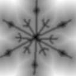
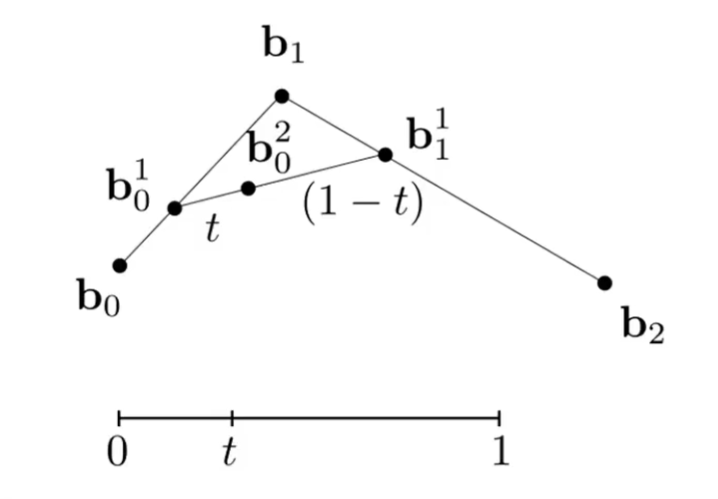
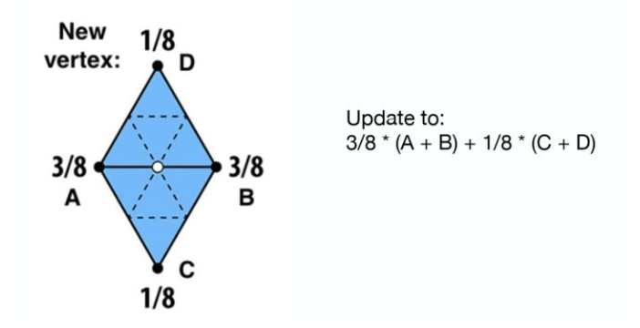
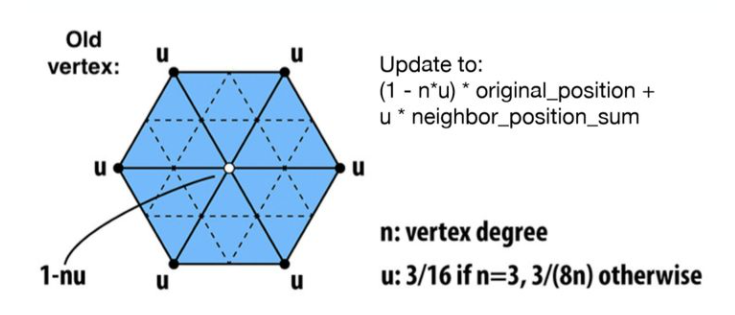

## GAMES101

# Curves and Meshes（几何）

现实生活中的几何往往非常复杂，我们必须思考两个问题：

- 如何存储
- 如何渲染

## Curve

关于一个几何形，我们可以通过显式或隐式的方法描述它。选择描述方法并不绝对，取决于实际。

### 隐式描述

隐式描述的方法通常是一组约束 $f(p) = 0$，这种方法容易判断一个点是否在面上，不易判断面上有哪些点。

- Algebraic Surfaces（代数曲面，通常是一个隐函数）
- Constructive Solid Geometry (CSG)

  - Combine implicit geometry via Boolean operations

- Signed Distance Function（SDF，符号距离函数）

- Level Set Methods (水平集)

  - 水平集和 SDF 思想一样，不过它用一个矩阵存储一系列点上的函数值，通过这个点集我们就可以拟合任何一条 $f(x)=y$ 的曲线

- Fractals（分形）

#### Signed Distance Function

CSG 通过 Boolean 操作可以得到复杂的几何体，但是并不好描述一个变化的东西，例如两个水滴在碰撞过程中，边界上会出现融合。

SDF 是描述空间中一个点到几何表面的最短距离的一个函数，如果点在几何内部，则距离为负数（so its signed）。输入一个点，我们可以得到距离它最近的表面的距离，改变输入的点，我们就得到了这个图形（一个 varying）。

Blending 两个 SDF，就是在 Benlding 两个物体的边界，例如 $\max(SDF_1,SDF_2)$ 得到的是两个物体的交集，$\min(SDF_1,SDF_2)$ 得到的是两个物体的并集，$tSDF_1 + (1-t)SDF_2$ 就可以得到两个物体的变化过程（不是线性移动的！）。

例如下列雪花图形：

生成其 SDF 并以贴图形式存储：

上述贴图中我们将图像距离映射为灰度值，并将原来的 0 映射为 0.5 作为边界值。在解析这张图片时，我们只需要再对这张图片找 $f(x)=0.5$ ，就可以得到雪花。而如果找 $f(x)=0.7$，得到就是一个放大的雪花。

##### More Info

- [Inigo Quilez :: fractals, computer graphics, mathematics, shaders, demoscene and more (iquilezles.org)](https://www.iquilezles.org/www/articles/distfunctions2d/distfunctions2d.htm)
- [Coding Adventure: Ray Marching - YouTube](https://www.youtube.com/watch?v=Cp5WWtMoeKg)
- [2D 基本图形的 Sign Distance Function (SDF)详解\_T-Jhon 的博客](https://blog.csdn.net/qq_41368247/article/details/106194092)

### 显式描述

显式描述的方法通常记录了一个集合。容易判断面上有哪些点，但不易判断一个点是否在面上。

- Point Cloud（点云）
  - 理论上可以表示任何几何体（只要足够密）
  - 通常三维扫描得到的都是点云，许多研究致力于将其转换为三角形
- 通过一组三角形
- 通过一个平面与映射关系 $f: \R^2 \rightarrow \R^3$这
  - 这样的方式也是非常容易找到平面上每个点
- Bezier Curve（贝塞尔曲线）

#### Bezier Curve

以三个点 $b_0, b_1, b_2$ 构成的二阶贝塞尔曲线为例，找 $b_0 b_1$ 的 $t$ 分点 $b_0^1$，再找 $b_1 b_2$ 的 $(1-t)$ 分点 $b_1^1$，连接 $b_0^1 b_1^1$ 找其 $t$ 分点 $b_0^2$，这一点在贝塞尔曲线上，改变 $t$，即可得到这条曲线。

贝塞尔曲线上每个点的坐标：

$$
\begin{aligned}
b_0^1(t) &= (1-t) b_0 + t b_1 \\
b_1^1(t) &= (1-t) b_1 + t b_2 \\
b_0^2(t) &= (1-t) b_0^1 + t b_2^1 = (1-t)^2 b_0 + 2t(1-t) b_1 + t^2 b_2 \\
& \vdots \\
b^n(t) &= \sum_{i=0}^{n} b_i B_i^n(t)
= \sum_{i=0}^{n} b_i \begin{pmatrix}n\\i\end{pmatrix} t^i (1-t)^{n-i} \\
\end{aligned}
$$

贝塞尔曲线具有一些性质：

- 第一个和最后一个控制点也是贝塞尔曲线的起点和终点；
- 起点切点方向为 $b_0 b_1$，终点切线方向为 $b_{n-1} b_n$；
- 对贝塞尔曲线做仿射变换，等价于对每个控制点做仿射变换；
  - 投影不行。
- 贝塞尔曲线一定在其控制点形成的凸包上或凸包内。
  - 凸包：包围所有点的最小的凸多边形。

##### Picewise Bezier Curves

高阶贝塞尔曲线会导致中间控制点对曲线影响较小，曲线过于平滑。因此人们通常不使用高阶贝塞尔曲线，而是使用分段贝塞尔曲线（Picewise Bezier Curves），更常用的是分段三阶贝塞尔曲线（Piecewise cubic Bezier）。

如何保证两个线段链接光滑

- 第一段终点和第二段起点相同：$C^0$ continuity，$a_n = b_0$
- 第一段终点和第二段起点相同，相同切线方向相同且距离相等：$C^1$ continuity，$a_n = b_0 = \frac{1}{2}(a_{n-1} + b_1)$

##### Bezier Surface

通过 $4\times 4$ 的控制点阵列，我们可以得到一个贝塞尔曲面。

## Surface

- Mesh subdivision：将一个模型的面分成更多面，提升模型精确度，提高渲染效果；
- Mesh simplification：将一个模型的多个面合成一个面，降低模型精确度，供特殊场景使用；
- Mesh regularization：曲面规则化，使三角形网格尽量成为均匀的正三角形（避免过尖、过大）。

### Mesh Subdivision

#### Loop Subdivision(Triangle Mesh)

Loop Subdivision 可以将三角形网格模型细分，可以分为细分和调整两个阶段，重复这样的过程，就可以将模型细分（越来越平滑、趋于一个圆）

1. 细分：将每个三角形细分为四个三角形；
2. 调整：根据顶点附近的原顶点，加权计算每个新顶点的位置；
   - 对于新顶点，假设其位于三角形 $\triangle ABC$ 和 $\triangle ABD$ 的公共边 $AB$ 上，那么更新后位置为 $\frac{3}{8}(A+B)+\frac{1}{8}*(C+D)$；
     - 
   - 对于旧顶点，其必定为多个三角形的公共顶点，则其新位置为这些顶点的加权平均，因此度越高的点，其自身位置对新位置的重要性越低；
     - 假设一个三角形边长为 $n$，我们称其为度(degree)为 $n$；
     - 

#### Catmull-Clark Subdivision(General Mesh)

Loop Subdivision 只适用于三角形网格，而 Catmull-Clark Subdivision 则使用于任何网格，其同样分为细分和调整两个阶段

对于每个面，我们可以取其每条边中点与面内一个点（如重心）连接成边，我们将这种操作称为一次细分。通过一次细分，每个非四边形面会增加一个奇异点和多个四边形，模型经过一次细分后只存在四边形。

> 我们将度不为 4 的点称为**奇异点**

Catmull-Clark Subdivision 调整阶段较为复杂，本文不做描述。

### Mesh Simplification

- Edge Collapsing：将一个边坍塌为一个点。坍塌后的边会导致存在 Quadric Error Metrics（二次度量误差）
