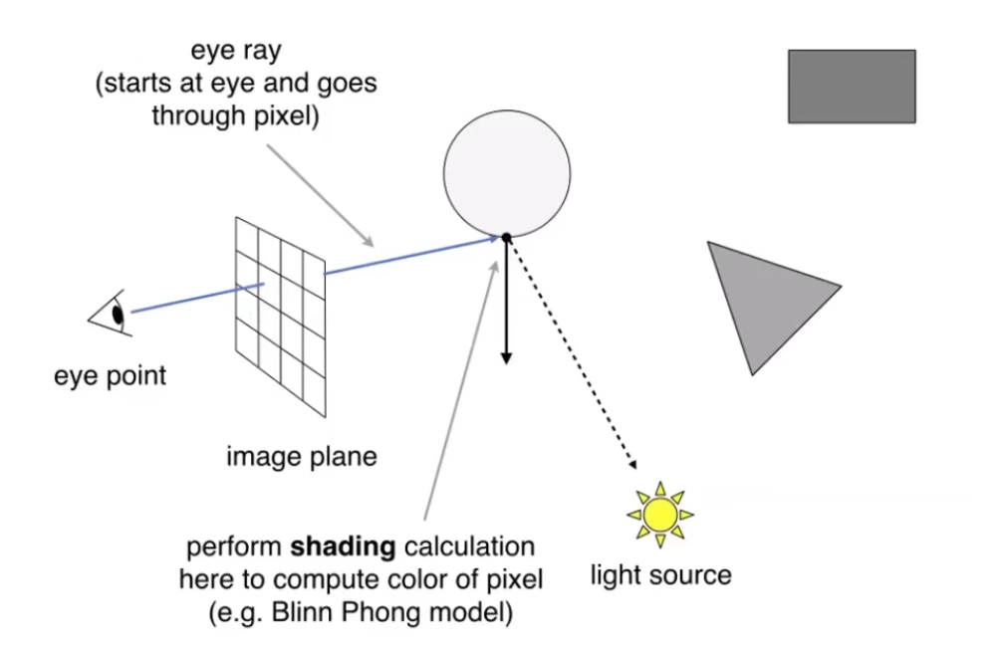
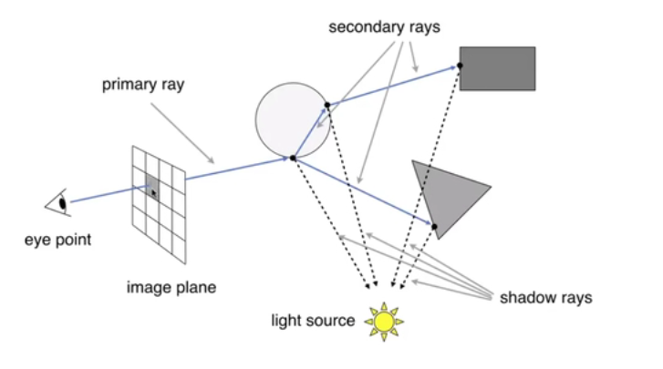
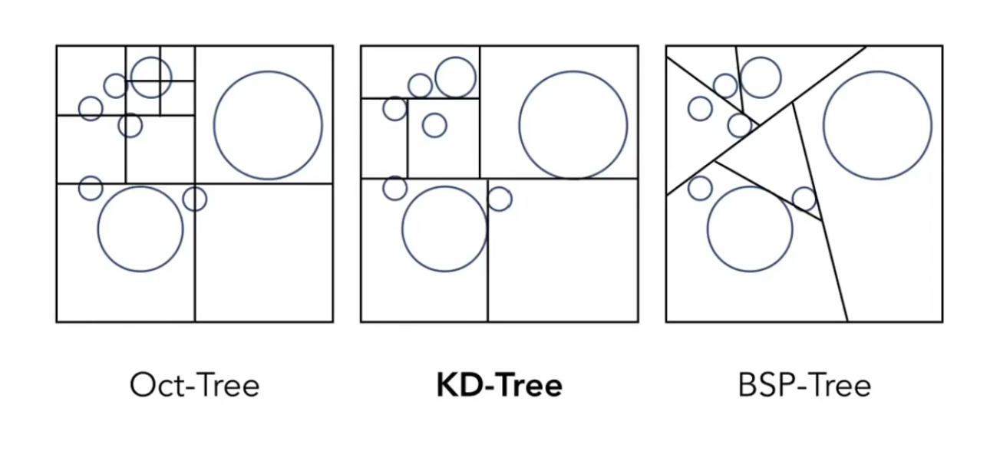
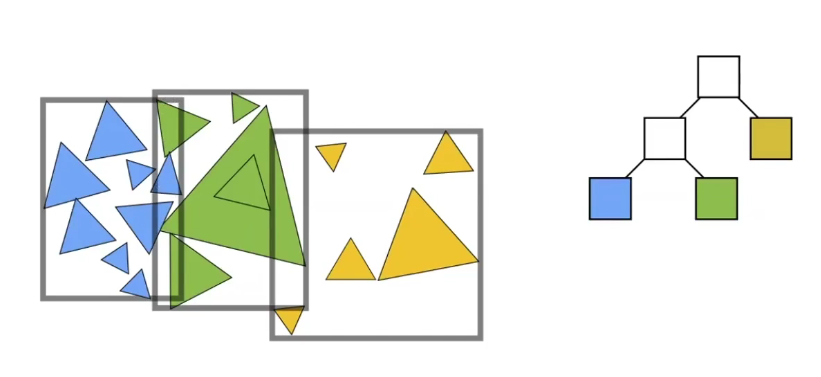
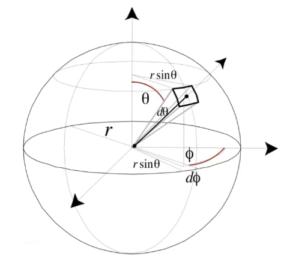
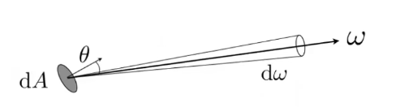
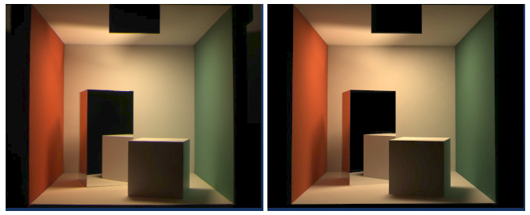
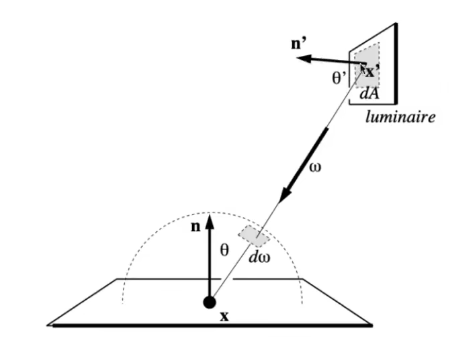
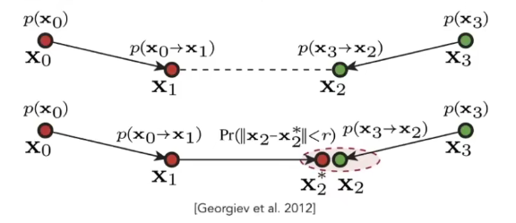

## GAMES101

# Ray Tracing（光线追踪）

光栅化将物体分开着色，利用各种 Trade Off 的方案，最终将场景渲染成一张图片。光栅化（Ray Tracing）非常快速，但渲染结果并不是非常理想，它有一些一直无法很好解决的问题，例如：

- Soft shadows（软阴影）
- Glossy reflection（有一定放射，但不是全光滑的材质）
- Indirect illumination（间接光照，光线经过多次反射到达）

而光线追踪则模拟真实物理场景，带给我们超高的渲染质量，不过它也不是用来完全取代光栅化的，譬如它最大的缺点就是慢，通常情况下都是用于离线渲染，不过现在也有 Real-Time Ray Tracing。

通常现在的光线追踪都需要基于几个假设：

- 光沿直线传播（though this is wrong)
- 两条光线不会互相干扰，即使它们交叉（though this is still wrong）
- 光路具有可逆性

同时，我们为了计算方便，通常还假设：

- 眼睛和光源都为点

## Whitted-Style Ray Tracing

Whitted-Style 光线追踪是一种递归（Recursive）的 Ray Tracing 的计算方法，由 T.Whitted 在 1979 年提出。其基础的光线投射流程：

- Eye ray：从眼睛到像素，然后延长与物体相交
  - 此时取最近的交点，自然而然解决了深度测试
- Shadow ray：从 Eye ray 与物体上的交点连到光源，判断是否有其他遮挡，如有遮挡，则位于阴影



由这样一个光路，我们就可以对这一像素点着色。在 Whitted-Style Ray Tracing 中，Eye ray 到达物体后，会发生反射和折射，根据不同的能量射出新的光线，这些着色的加权和就是这个像素的颜色。



### Ray-Surface Intersection

表示一条光线：$r(t)=\vec o+t\vec d$，其中 $\vec o$ 为光源位置，$\vec d$ 为光线方向向量。

对于一个隐式描述的表面 $f(p)=0$，我们可以由交点在两个函数上 $f(p)=r(\vec o+t\vec d)=0$，通过数值计算方法求得一个实的、正的 $t$，即求得交点。

对于一个显式描述的表面（假设为三角形网格），最直接的方法是判断每一个三角形和这条光线求交点。

#### Moller Trumbore Algorithm

判断每一个三角形和这条光线求交点，最简单的方法是我们先求光线与三角形所在面交点，再判断交点是否在三角形内。

> **简单多边形与点的位置关系**：
>
> 射线法：从点处发出一条射线（不与顶点相交），与图形交点个数为奇数则点在图形内；射线法可以推广至三维。
>
> > 简单多边形：边不自交的多边形（没有洞）

这一办法实际上可以通过重心坐标加速求值，该方法称为 Moller Trumbore Algorithm：

$$
\vec o + t \vec d = (1-b_1-b_2)\vec p_0 + b_1 \vec p_1 + b_2 \vec p_2
$$

求解得到：

$$
\begin{pmatrix} t \\ b_1 \\ b_2 \end{pmatrix}
= \frac{1}{\vec S_1 \cdot \vec E_1}
\begin{pmatrix}
  \vec S_2 \cdot \vec E_2 \\
  \vec S_1 \cdot \vec S \\
  \vec S_2 \cdot \vec D \\
\end{pmatrix}
$$

where：

$$
\begin{aligned}
\vec{E_1} &= \vec{P_1} - \vec{P_0} \\
\vec{E_2} &= \vec{P_2} - \vec{P_0} \\
\vec{S} &= \vec{O} - \vec{P_0} \\
\vec{S_1} &= \vec{D} \times \vec{E_2} \\
\vec{S_2} &= \vec{S} \times \vec{E_1} \\
\end{aligned}
$$

求出 $b_1, b_2$ 后判断 $t>0, b_1>0, b_2>0, b_1+b_2< 1$ 即得到结果，该方法花费为 1 次除法、27 次乘法和 17 次加法。

### Acceleration

实际应用中，在大场景中根本不可能逐三角形判断，人们希望通过预处理建立一些加速结构来加速求交过程。我们通常使用一个包围盒先将物体包裹，如果一根光线连包围盒都无法碰到，自然无法碰到物体。我们通常使用一个 **Axis-Aligned Bounding Box**（AABB，轴对齐包围盒）。

AABB 可以被视为三对轴对齐的平面，使用轴对齐是为了简化运算。只有当光线进入三对面后，才进入 AABB 内；当光线离开任何一对面后，光线就离开了 AABB；如果进入时间小于 0，说明光源在 AABB 内。

- For each pair, calculate the $t_{min}$ and $t_{max}$
- For the AABB, $t_{enter}=\max(t_{min}), t_{exit}=\min(t_{max})$
- In summary, ray and AABB intersect iff: $t_{enter} < t_{exit}$ and $t_{exit} >= 0$

我们可以从通过 Spatial Partitions 或 Object Partitions 建立一个场景中的 AABB。

#### Spatial Partitions

一个朴素的思想是将场景均匀切分为一些小盒子，然后标记出其中有物体的盒子。对场景进行均匀的盒子分割效果并不理想，在空间中物体中分布不均匀情况下，均匀分隔带来了许多全空的盒子。Oct-Tree、KD-Tree 和 BSP-Tree 是改进后的加速结构。

**Oct-Tree** （八叉树）是指将三维空间在将空间分为八份，不难发现 $n$ 维度空间下需要 $2^n$ 叉树。Oct-Tree 在存储上并不方便，于是人们将每个维度的分割独立存储（比如先分 x 轴，再分 y 轴，最后分 z 轴），将其存储为一个二叉树，称为 **KD-Tree**。更进一步的，我们选择任意一个超平面（而不是一个轴对齐的面）分隔空间，称其为 **BSP-Tree**，不过 BSP-Tree 并不好建立。



在 KD-Tree 中，我们可以设计这样的结构存储：

```c++
struct KdTreeNode {
    int splitAxis;		// 也可以将轴隐式的存在深度中，例如 deep%3
    int splitPosition;  // 并不一定是对半划分
    std::vector<KdTreeNode> children;

    // Leaf nodes store, no objects are sotred in internal nodes
    std::vector<Object> objects;
}
```

KD-Tree 确实带来了加速效果，但是存在一些问题：

- 如何判断一个三角形和 AABB 的交点是困难的
- 一个物体可能位于多个 AABB 内

#### Object Partitions

为了解决空间划分的问题，我们还可以从物体出发建立一个树形的 AABB，常用方法有 **Bounding Volume Hierarchy (BVH)**。BVH 递归的将一堆物体分成两堆，形成两个包围盒，形成一棵树。BVH 解决了一个物体在多个 AABB 内出现的问题，但是 BVH 得到的 AABB 可能在空间中重叠。



- 为方便存储，每次划分时我们可以只选择一个轴划分；
- 选择最长的轴，得到的 AABB 可能趋于正方形；
- 选择中间的物体，可以使树趋于平衡；
  - 快速选择算法：$O(n)$ 时间内查找第 $k$ 个数。
- 和 KD-Tree 一样，BVH 中物体只存储在叶子节点中

## Basic Radiometry（辐射度量学）

Whitted 风格光线追踪中，我们使用了一些不正确的物理量，例如光源的强度、物体的反射、折射及能量损失等等，并且有一些错误的假设：

1. 物体是镜面反射，但是对于一些 Glossy 的表面，反射效果并不是一条光线（个人理解：几何面不够精细导致与物理表现不相同）；
2. 不考虑漫反射；

在假设和简化下，Whitted-style RT 的结果并不真实，辐射度量学就是为了解决这些问题，使得渲染结果更加真实。辐射度量学中依然假设光线沿直线传播，而不具备波动性。

- Energy：物理上通常使用焦耳；
- Power(Flux)：功率指的是一定时间内的能量 $\Phi \equiv \frac{dQ}{dt}$，通常为单位时间；
  - 本文中能量一词指的都是 Power，而非 Energy。

### 名词解释

#### Solid Angle

立体角（Solid angle）是以观测点为球心，构造一个单位球面；任意物体投影到该单位球面上的投影面积，即为该物体相对于该观测点的立体角，通常使用 $\omega$ 表示。因此，立体角是单位球面上的一块面积，这和“平面角是单位圆上的一段弧长”类似。



在球坐标系 $(r, \phi, \theta)$ 中，任意球面的极小面积为：

$$
\begin{aligned}
\rm{d}A
&= (r \rm{d}\theta)(r \sin \theta \rm{d} \phi) \\
&= r^2 \sin\theta \rm{d}\theta \rm{d}\phi
\end{aligned}
$$

而单位立体角（Unit solid angle）定义为一块区域垂直投影到单位圆上的面积，对于球面投影到单位圆上：

$$
\rm{d}\omega = \frac{\rm{d}A}{r^2} = \sin\theta \rm{d}\theta \rm{d}\phi
$$

#### Intensity

Intensity 指的是**每立体角**上的能量，其描述了光源的强度，物理上使用流明（luman）为单位。如果一个点光源均匀向外辐射能量，则其任意方向上的 Intensity 为：

$$
\Phi = \int_{s^2} I \rm{d} \omega = 4\pi I \Rightarrow I = \frac{\Phi}{4\pi}
$$

#### Irradiance

Irradiance 指的是**每单位投影面积**上的能量，其物理意义是在这一面积上存在的一个物体能够接收到多少能量。Irradiance 通常使用 $E$ 表示，并且只计算垂直分量：

$$
E = \frac{\Phi}{A} cos \theta
$$

Irradiance 与投影面积相关，而 Intensity 则指的是单位角上的能量，因此在一个点光源向四周均匀扩散，扩散过程中 Intensity 没有变化，但是 Irradiance 在衰减。

#### Radiance

Radiance 指的是**每单位立体角、每单位面积**上的能量，其物理意义是一个点向/从某一方向辐射/接受的能量。



Radiance 使用 $L$ 表示：

$$
L(p,\omega)=\frac{I(p,\omega)}{\rm{d}A\cos\theta}
$$

Radicance 是 Intensity 和 Irradiance 的组合，因此也可以表示为 Radiance 是每单位投影面积上的 Intensity，或是每单位立体角上的 Irradiance。对某一个点上 Radiance 的所有单位角积分，就得到了 Irradiance：

$$
\begin{aligned}
\rm{d} E(p, \omega) &= L_i \cos\theta \rm{d}\omega \\
E(p) &= \int_{H^2} L_i \cos\theta \rm{d}\omega
\end{aligned}
$$

### Light Transport

双向反射分布函数（**Bidrectional Reflectance Distribution Function**, BRDF） 描述了从一个方向的 Radicance 作用到物体表面，然后如何辐射出去的方程，也就是一个反射方程：

$$
f_r(\omega_i \rightarrow \omega_r)
= \frac{\rm{d} L_r(\omega_r)}{\rm{d} E_i(\omega_i)}
= \frac{\rm{d} L_r(\omega_r)}{L_i (\omega_i)\cos\theta_i \rm{d}\omega_i}
$$

对于一个镜面，光线会全部沿着反射 角方向辐射出去；对于一个漫反射，光线会在所有方向均匀反射。因此 BRDF 其实也定义了一种材质。

要计算辐射出去的 Irradiance，可以将面积分：

$$
L_r(p, \omega)
= \int_{H^2} f_r(p, \omega_i \to \omega_r) L_i(p, \omega_i)\cos\theta_i \rm{d} \omega_i
$$

在实际使用中，我们还需要考虑物体本身发光的情况，由此我们可以推出渲染方程（**Rendering Equation**）：

$$
L_o(p, \omega_o) = L_e(p,\omega_o) +
\int_{\Omega+}L_i(p,\omega_i)f_r(p,\omega_i,\omega_o)(n \cdot \omega_i) \rm{d}\omega_i
$$

公式中假设所有方向都朝外，因此公式中不含负号；BRDF 的积分域为正半球。

在渲染方程中，实际上只有入射的光线信息 $L_i(p,\omega_i)$ 是未知的，因此我们渲染方程可以简化为：

$$
L = E + KL
$$

其中，$L$ 为物体发光，而 $K$ 是一个表示反射的积分算子。为了解这个渲染方程，我们通过数学变换：

$$
\begin{aligned}
& &
L &= E + KL \\
&\Rightarrow &
IL - KL &= E \\
&\Rightarrow &
L &= (I-K)^{-1} E \\
&\Rightarrow &
L &= (I+K+K^2+\cdots)E \\
&&&= E + KE + K^2 E + \cdots
\end{aligned}
$$

这样的表示形式直观的的表示了辐射量为能量产生项、直接光照项、间接光照项的和，我们将公式中除第一项外其他项的和称为全局光照（Global Illumination）。

要解这样一个积分，直接计算并不容易，我们通常使用蒙特·卡罗积分方法近似计算。蒙特·卡罗积分（Monte Carlo Integration）是积分的数值计算方法，通过对函数随机采样，对采样值除以其 PDF（probability density function，概率密度函数）：

$$
\begin{aligned}
\int f(x) \rm{d}x = \frac{1}{N} \sum_{i=1}{N}\frac{f(X_i)}{p(X_i)}
&& X_i \sim p(x)
\end{aligned}
$$

蒙特·卡罗积分是一个近似方法，采样越多，计算结果也就约近似于其和。

## Global Illumination

由蒙特·卡罗积分，使用均匀采样，我们可以得到一个计算全局的递归算法：

```c++
def shade(p, wo):
    Randomly choose N directions wi~pdf
    Lo = 0.0
    for each wi:
    	Trace a ray r(p, wi)
    	if ray r hit the light
    		Lo += (1/N) * L_i * f_r * cosine / pdf(wi)
    	else if ray hit an object at q
    		Lo += (1/N) * shade(q, -wi) * f_r * cosine / pdf(wi)
	return Lo
```

这一方法可以产生一个 unbias 的全局光照，但是会导致 ① 计算量爆炸，呈指数增长；② 递归计算，提前终止一定导致失真。

> [Cornell Box Comparison](http://www.graphics.cornell.edu/online/box/compare.html)
>
> 

### Path Tracing

对于问题 ①，不难发现，只有 N=1 的时候才不会指数爆炸，因此算法可以简化为：

```python
def shade(p, wo):
    Randomly choose 1 directions wi~pdf
    Trace a ray r(p, wi)
    if ray r hit the light:
    	return (1/N) * L_i * f_r * cosine / pdf(wi)
    else if ray hit an object at q:
    	return (1/N) * shade(q, -wi) * f_r * cosine / pdf(wi)
	return 0.0
```

这种 N=1 的情况我们称其为 **Path-Tracing**，其实际上是找到了一条摄像机到光源的路径。

### Russian Roulette

对于问题 ②，我们可以使用俄罗斯轮盘赌（Russian Roulette，PR），即每次折射时加上概率测试，以 p 的概率继续辐射。即算法前加上一个概率：

```python
def shade(p, wo):
    Manually specify a probability P_RR
    Randomly select ksi in a uniform dist. in [0, 1]
    if (ksi > P_RR) return 0.0

	...
```

在高 SPP（Sample per pixel）的路径追踪下，我们依然可以获得一张高质量的图。

> In RTX:
>
> 1SPP path tracing =
>
> 1 rasterzation (primary) +
>
> 1 ray (primary visibility) +
>
> 1 ray (secondary bounce) +
>
> 1 ray (secondary vis.)

### Sampling the light

如果“盲目的”在半球均匀采样，光线很可能没有击中物体，从而导致无用的路径。蒙特·卡罗积分要求在积分域上采样，我们可以修改渲染方程，使其定义域为光源。不过这一方法只适用于直接光照，我们可以直接将多边形光源投影为一个单位立体角：



因此间接光源的渲染方程为：

$$
\begin{aligned}
L_o(x, \omega_0)
&= \int_{\Omega+} L_i(x, \omega_i)f_r(x, \omega_i, \omega_o) \cos\theta \rm{d}\omega_i \\
&= \int_A L_i(x, \omega_i)f_r(x, \omega_i, \omega_o) \frac{\cos\theta \cos\theta'}{\lVert x'-x \rVert^2} \rm{d}A \\
\end{aligned}
$$

由蒙特卡洛方法可以得到下列算法，注意此时在间接光照中需要避开光源：

```python
def shade(p, wo):
    # Contribution from the light source
    L_dir = 0.0
    Uniformly sample the light at x' (pdf_light = 1/A)
    Shoot a ray from p to x'
    if the ray is not blocked in the middle:
    	L_dir = L_i * f_r * cos θ * cos θ' / distence(x' - p)^2 / pdf_light

    # Contribution from other reflectors
    L_indir = 0.0
    Test Russian Roulette with Probability P_RR
    Uniformly sample the hemisphere toward wi (pdf_hemi = 1/2pi)
    Trace a ray r(p, wi)
    if ray r hit a non-emitting object at q
    	L_indir = shade(q, -wi) * f_r * cos θ / pdf_hemi / P_RR

    return L_dir + L_indir
```

Path Tracing 算法中光源需要特殊处理：

- Eye Ray 直接看见光源时需要特殊处理；
- 点光源需要特殊处理，最简单的方法就是使用一个很小的多边形光源代替点光源。

### And More

- 如何采样？
  - 重要性采样
- low discrepancy sequences
- multiple imp. sampling
- Is the radiance of a pixel the color of pixel?
  - gamma correction
  - curves
  - color space

## Advanced Light Transport（高级光线传播）

### Bidirectional Path Tracing (BDPT)

双向路径追踪（Bidirectional Path Tracing）是一种无偏（unbias）光线追踪方法。从光源发射一根光线到交点 1，然后再从观测点发射一条光线并弹射到交点 2，然后将两个交点连接，计算蒙特卡洛积分。

优点：适合聚焦的光源，向某个特定方向打光，大部分场景依赖于简介光照照亮；

缺点：对直射光较多的场景意义不大，计算速度比 Path Tracing 慢。

### Metropolis Light Transport (MLT)

Metropolis Light Transport 是一种无偏光线追踪方法。使用马尔卡夫链采样，通过一条路径生成相似的路径。

优点：适合追踪复杂的光路；

缺点：难以估计收敛时长，且每个像素单独计算，收敛时间不同。

### Photon Mapping

光子映射（Photon Mapping）分为光子追踪（photon tracing）和光子收集（photon collection）两个阶段，光子追踪从光源发射光子，经过反射/折射后到达漫反射表面；光子收集则从相机出发，同样寻找路径直到到达漫反射表面，然后进行 local density estimation，找到其最近 N 个光子求面积，就能够得到密度。

光子映射是一种有偏（biased）的光线追踪方法，因为在 local density estimation 中：

$$
\frac{\rm{d}N}{\rm{d}A} \ne \frac{\triangle N}{\triangle A}
$$

当发射的光子数量趋向于无穷时，光子映射的结果趋向于无偏，因此光子映射是有偏但一致（Consistency）的。

### Vertex Connection and Merging (VCM)

VCM（Vertex Connection and Merging）的核心思想是融合双向路径追踪和光子映射。双向路径追踪中，存在一些从光源发射的光线集中的面上的点，和同一个面上从相机发射的光线击中的点，二者位于同一个面上但是无法一次折射到达，VCM 认为他们可以通过一定方式贡献值。



### Instant Radiosity (IR)

实时辐射度算法（Instant Radiosity, IR）也可以被称为很多光源（many light）算法，它认为折射光的点就是一个新的光源（Virtual Point Light, VPL）。IR 算法在狭窄缝隙处会由于精度问题出错，且无法应用于 Glossy 材质。

> Minecraft 光追版中随机选取一部分上一帧中反射的点作为光源，是否是一种时间上的 IR 算法呢？
