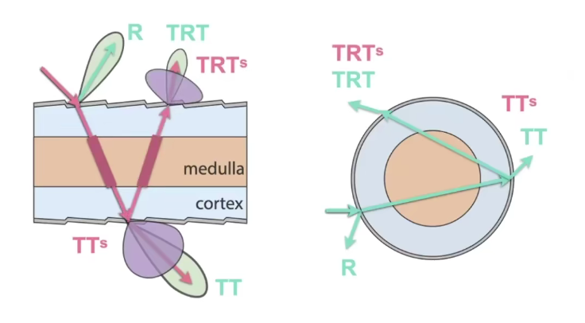

## GAMES101

# Materials（材质）

- 分层
- 散射
- 次表面散射

## Basic

### Diffuse Material

对于一个向半球均匀漫反射的材质，我们假设物体不发光也不吸收光，入射光为常量，

$$
\begin{aligned}
L_0(\omega_0)
&= \int_{H^2}f_r L_i(\omega_i) \cos\theta_i \rm{d} \omega_i
&&\cdots \text{The Rendering Equation} \\
&= f_r L_i \int_{H^2} \cos\theta_i \rm{d}\omega_i
&&\cdots \text{假设入射光为常量} \\
&= \pi f_r L_i
\end{aligned}
$$

又由假设有入射光等于出射光，我们定义反射率（albedo）为 $\rho$，则不吸收光线的漫反射的 BRDF 可以定义为：

$$
f_r = \frac{\rho}{\pi} = c
$$

### Glossy Material

在抛光金属的表面，反射没有镜面光滑，但又不全是漫反射，部分能量被吸收，部分能量被反射出去，我们将其称为 Glossy。

### Specular Reflection

对于一个镜面反射，已知其入射角和法线，求出射角，我们可以使用平行四边形法则得到下列关系式（如左图）：

$$
\begin{aligned}
&& \omega_i + \omega_o &= 2 \cos\theta \vec n = 2(\omega_i \cdot \vec n) \vec n \\
& \Rightarrow & \omega_o &= -\omega_i + 2(\omega_i \cdot \vec n)\vec n
\end{aligned}
$$

我们也可以从上往下看，建立一个局部坐标系（如右图），将与法线的偏差角记为 $\theta$，从上往下看从某一平面（如过 X 轴的垂直面）到旋转角度记为 $\phi$，不难发现，他们存在关系：

$$
\begin{aligned}
\theta_i &= \theta_0 \\
\phi_0 &= (\phi_i + \pi) \mod 2\pi
\end{aligned}
$$

### Specular Refraction

对于折射，从物理原理上我们可以计算得到 $\theta_t$：

$$
\eta_i \sin\theta_i = \eta_t \sin\theta_t
$$

其中左右两侧分别为两个介质的折射率 $\eta$，同时从上往下看，折射的 $\theta_i = \theta_t$ 依然成立，因此我们也可以计算折射光线。描述折射的函数显然不能称为 BRDF（反射），我们可以将其 BTDF（折射），或者将二者统称为 BSDF（散射）。

反射率可以使用菲涅尔项计算，计算公式十分复杂。

#### Total reflection（全反射）

$$
\begin{aligned}
\cos \theta_t
&= \sqrt{1-\sin^2\theta_t} \\
&= \sqrt{1-\left(\frac{n_i}{n_t}\right)^2\sin^2\theta_t} \\
&= \sqrt{1-\left(\frac{n_i}{n_t}\right)^2(1-\cos^2\theta_t)} \\
\end{aligned}
$$

显然，在某些条件下有 $1-\left(\frac{n_i}{n_t}\right)^2(1-\cos^2\theta_t) < 0$，此时会产生全反射现象。

## Microfacet Material

Microfacet Material（微表面模型）是目前常用的 Physical-Based Rendering Model，它认为物体表面是粗糙的，但是只要距离远时，我们看不见具体细节，只能看见表面材质，即近看是几何，远看是材质。

微表面模型将表面分为微小的镜面，他们具有不同的法线，那么宏观上的 BRDF，其实就是由微表面上法线分布决定的，公式表示为：

$$
f(\vec i, \vec o) = \frac{F(\vec i, \vec h)G(\vec i, \vec o, \vec h)D(\vec h)}{4(\vec n,\vec i)(\vec n,\vec o)}
$$

公式中，$\vec i$为入射光，指向观测者；$\vec o$ 为出射光，指向光源；$F(\vec i, \vec o)$ 为菲涅尔项（Fresnel term），描述物体反射率；$G(\vec i, \vec o, \vec h)$ 是几何遮蔽项（Shadow-masking term），用于弥补物体自身几何遮蔽导致的偏差；$D(\vec h)$ 是材质表面法线分布项。

[菲涅耳项](https://zh.wikipedia.org/wiki/菲涅耳方程)是一组描述光在均一平面界面中的反射和折射的方程，因为计算复杂，我们通常使用其 Schlick's 近似项来估计：

$$
\begin{aligned}
R(\theta) &= R_0 + (1-R_0)(1-\cos\theta)^5 \\
R_0 &= \left(\frac{n_1-n_2}{n_1+n_2}\right)^2 \\
\end{aligned}
$$

## Properties of BRDFs

- Non-negativity
- Linearity
- Reciprocity Principle（可逆性）
- Energy Conservation：$\int BRDF \le 1$

### Isotropic/Anisotropic Materials

在微表面模型中，基于法线分布方向，我们可以将其分为 Isotropic Materials（各向同性材质）和 Anisotropic Materials（各向异性材质）。经过打磨后的金属表面带有明显的方向性，是典型的各向异性材质。可以通过旋转判断是否是各向异性的：

$$
f_r(\theta_i, \phi_i; \theta_r, \phi_r) \ne f_r(\theta_i, \theta_r, \phi_r - \phi_i)
$$

各向同性的材质的 BRDF 是一个三维函数。

### Measure BRDF

为什么要测量 BRDF：

- 菲涅尔项非常复杂，近似项不准；
- 推广到更多材质。

加速方法：

- 各向同性，四维 $\rightarrow$ 三维；
- 可逆性，减去一半；
- 深度学习。

## Advanced Apperance Modeling

### Participating Media（散射介质）

现实中存在很多散射介质，最常见的就是雾。光线在散射介质中可以向不同方向发散，同样也会收到各个方向的光线，我们可以用一个类似 BRDF 的函数描述这样的分布。

在散射介质中无法应用渲染方程，因为渲染方程只描述了光线在物体表面的作用，但是我们依然可以用类似的思想计算光线在体积中的作用过程。

### Hair Apperance

#### Kajiya-Kay Model

Kajiya-Kay Model 认为头发是一个圆柱体，光线打到头发上后直接反射后形成一个圆锥状反射区域。

#### Marschner Model

Marschner Model 认为头发是一个玻璃圆柱体，光线打到头发上一部分产生反射光 R，大部分会进入头发内，打到另一侧产生折射光 TT，还有一部分被反射回来并折射出去产生二次折射光（TRT）。

#### Double Cylinder Model — Lobes

实际上，Marschner Model 依然存在问题，毛发实际上是由三层组成，最内层髓质会产生类似散射介质的效果，显然不是简单玻璃柱模型。因此有人提出了双层玻璃柱模型：

光线可能没有打到髓质，也就是三次光线，而打到髓质则会产生五次光线。

### Granular Material

颗粒材质（Granular Material），使用颗粒来模拟复杂表面。

### Translucent Material

Translucent Material 指的是一种光线会在其中发生散射的材质，例如玉石、牛奶、水母。我们将这种现象称为次表面散射（Subsurface Scattering）指的是在表面下发生了散射，可以用 BSRDF 描述。BSRDF 可以认为是 BRDF 的延申，它规定了表面从一个点进入，另一个点出来的过程。

BSRDF 难以计算，人们寻求近似计算方法，例如 Dipole Approximation 中，认为表面下存在一个光源模拟 BSSRDF。

### Cloth

织物的表面是由线（yarn）编制而成，线（yarn）都是由多股（ply）缠绕形成，而每股又是一根根纤维（fiber）卷成。

- 将织物作为一个表面使用 BRDF 描述；
- 织物表面非常不光滑，几乎无法认为是一个表面，我们可以将其拆为非常小的体积块，当成散射介质渲染；
- 回到最初始的物理形态，我们可以将每股线单独渲染其形状。

### Detailed Appearance

渲染结果往往过于完美，反而不真实。常用方法是采用噪声做法线贴图，但是其并不那么真实。在物理世界中，我们会看见白光反射后形成了各色的点，也就是涉及到了波长上的变化，也就是说我们需要一个波动光学的波动方程描述这一变化。

### Procedural Appearance

一块木头的纹理变化，要存下来成本太大，但是聪明的人们找到了与之相识的噪声函数，输入坐标(x,y,z)，就可以得到纹理。同样的，我们还可以找到各种噪声函数，比如木头、铁锈、地形。这样的噪声函数还有一个巨大的好处，那就是我们还可以得到内部的纹理，比如把一块木头切开，他的纹理与外表依然是连着的！
