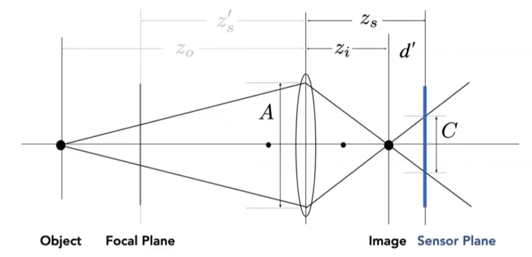
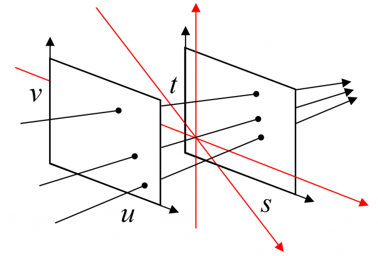

## GAMES101

# Light Transport

## Cameras

现在用的相机都是小孔/透镜 + 传感器结构，因为传感器只能收集 Irradiance 信息，如果我们不对光线加以限制，那么得到的图像几乎是一种噪声图像，因此我们通过小孔成像原理限制光的入射方向。

下图展示了无小孔的噪声成像（左）和小孔成像（右）。

### Filed of View (FoV)

视场（FOV）指的是能够看到的角度，通常可以分为水平 FOV 和垂直 FOV，垂直 FOV 与传感器大小与透镜组有关：

$$
\rm{FOV} = 2 \arctan\left(\frac{h}{2f} \right)
$$

其中，$h$ 指的是传感器高度，$f$ 指的是焦距。为了统一，人们通常使用 35mm-format （36\*24mm）大小的传感器来计算 FOV。

### Exposure

曝光（Exposure），曝光由曝光时间和曝光度决定：

$$
Exposure = Time \times Irradiance
$$

这些概念在相机中都有相同的结构，曝光时间可以由快门（Shutter）控制，曝光度则可以由光圈（Aperture）控制。除此之外，在相机中还有感光度（ISO gain）会影响曝光，。

#### ISO Gain

感光度（ISO gain）通过影响传感器灵敏度等因素影响曝光，可以简单理解为将曝光乘以一个增益数。调整 ISO 最明显的问题是会导致噪声也被同时放大。

#### F-Number

光圈大小（F-Number）通过控制单位时间进入传感器的光强度来控制曝光，F-Number 定义为焦距/光圈直径。F-Number 越大，光圈越小；F-Number 越小，景深越大。

##### Pinhole Photograph

小孔成像原理可以制作针孔相机，也可以认为是一个光圈非常小的相机。针孔相机无法获取深度信息，也就是无法产生景深效果（depth of field）。

#### Shutter

快门（Shutter）是传感器控制光的进入与否的结构。快门时间长，会导致运动模糊，原因是快门打开的一段时间内物体发生了运动。

##### Rolling Shutter

在机械快门上，快门从开始打开到完全打开也需要一段时间，这段时间在高速运动的物体上会导致物体扭曲，比如螺旋桨会出现扭曲现象。

### Lenses

物理学告诉我们：

$$
\frac{1}{f} = \frac{1}{z_i} + \frac{1}{z_o}
$$

其中，$f$ 为焦距，$z_i$ 为相距，$z_o$ 为物距。现代相机通常使用镜片组，目的是可以通过不同组合调整镜片组的焦距。

#### Circle of Confusion

Circle of Confusion（CoC）指的是在焦平面外的物体经过透镜在相距上成像，但是传感器距离大于物距，因此物体在传感器处由一个点散成了一个圆形，如下图所示。

不难发现，越远的物体相距越小，也就是形成了一个更大的圆，也就是我们所说的景深效果。通过几何关系，我们可以找出计算 CoC 大小：

$$
\begin{aligned}
\frac{C}{A} &= \frac{d'}{z_i}
&&= \frac{\lvert z_s - z_i \rvert}{z_i} \\

C &= A\frac{\lvert z_s - z_i \rvert}{z_i}
&&= \frac{f}{N} \frac{\lvert z_s - z_i \rvert}{z_i}
\end{aligned}
$$

### Ray Tracing for Defocus Blur (Thin Lens)

理解棱镜上光线的传播方式后，我们就可以利用透镜公式来实现带有景深效果的光线追踪效果。首先我们需要定义传感器尺寸、透镜尺寸（我们假设是一个薄透镜），因此我们可以利用透镜公式找到点 $x''$ 在焦平面上对应的点 $X'''$，那么从 $x'$ 发射向 $x''$ 的光经过薄透镜折射后就是 $x''$ 发射向 $x'''$ 的光，我们利用这个光线做成像，得到的就是带有深度信息的光线追踪效果。

在实际使用中，我们认为一段距离内的物体成像都可以认为是清晰的，这段深度就是景深（Depth of field），其关系可以通过下图所示各参数计算：

## Light Fields

介绍光场前，我们先定义一个七维的全光函数（The Plenoptic Function）来描述世界：

$$
P(\theta, \phi, \lambda, t, V_X, V_Y, V_Z)
$$

函数中前两个参数 $\theta, \phi$ 描述观测方向（球面坐标系），第三个参数 $\lambda$ 描述波长（颜色），第四个参数 $t$ 描述时间，最后三个参数为观测位置 $V_X, V_Y, V_Z$。实际上前四个参数就描述了一部电影，后三个参数允许我们改变观测位置，这个七维的函数实际上描述了整个世界在视觉上的观测结果。全光函数的示意图如下。

七维函数难以记录，美国斯坦福大学的 Marc Levoy 将全光函数简化降维，提出（u,v,s,t）4D 光场模型，只包含了二维的位置和二维的方向。光场由 uv 和 st 两个平行平面组成，两个平面上所有像素是全连接的，固定 uv 看向 st，会看到物体从一个角度的观测结果；而固定 st 看向 uv，看到的是这一个点上的各个方向的光线（Radiance）。下图为光场的示意图，不难发现，光场无法完备的记录所有光线信息，例如平行于两个平面的光线就无法被光场记录到，但是这样的光线也无法进入眼睛，所以我们通常认为它的简化是合理的。

光场相机可以由一组相机阵列组成（就像苍蝇的复眼），那么相机阵列的长宽决定了光场相机的角度分辨率，相机本身分辨率决定了光场相机的视点分辨率。不过相机阵列是昂贵的，我们可以将相机的每个像素换成一个微透镜，将来自不同方向的光线分开射向后移的感光元件，如下图所示。

光场相机拍摄得到图像就是下图这样的一组阵列，这样的光场相机（e.g. Lytro）记录了光场的所有信息，因此它允许我们先拍照后对焦，当然它也带来了昂贵的拍摄/存储成本。

## Physical Basis of Color

物理学告诉我们，颜色是由不同波长的光组合产生，我们通常关心的是 400~700nm 的可见光谱。颜色并不是波的物理特性，而是人的一种感知，人对光在不同波长上的谱功率（SPD）的感知，就是我们看见的颜色。

计算机使用的显示系统通常是加色系统（Additive Color），通过定义三种颜色不同的匹配函数来显示颜色，这其实也对应了人眼的 S/M/L 三种感光细胞，也就是只能感知三种颜色，这还意味着我们看见的每种颜色可以对应不同的光谱（同色异谱）。

为了对颜色编码，人们定义了许多不同的色域，如 sRGB、Adobe RGB、NTSC，也有许多不同的颜色空间，如 RGB、HSL、LAB。

不同人的人眼中 SML 三种感光细胞的分布并不一致，不仅如此，人眼对颜色的感知也是相对的，下图中 A、B 点颜色是一致的。

## References

- GAMES101, 闫令奇, 2020.

- Mars 说光场, Mars Cao, 2018.
