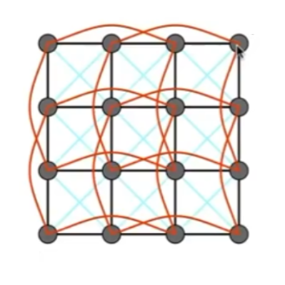
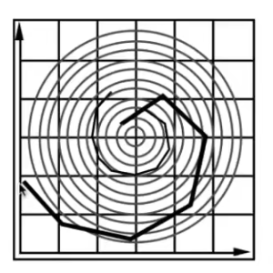
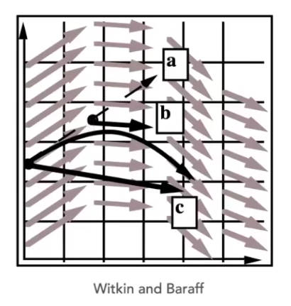

## GAMES101

# Animation and Simulation（动画/仿真）

所谓动画就是一组连续的画面，当达到足够帧数后，由于人眼暂留现象就可以看见动画。不同显示设备对帧数也有不同的要求，如电影 24Hz、显示器 30Hz、VR/AR 90Hz。

下文中，我们使用 $x$ 表示距离，$\dot x$ 表示速度 $v$，$\ddot x$ 表示加速度 $a$。

## Kinematics

地球上的动物大多都依赖于关节来带动四肢的旋转等动作，因此提到动画与仿真，离不开的就是研究关节是如何运动的。运动学（Kinematics）研究的就是这样的一件事情，特别的，在图形学中，我们还把它分为正运动学和逆运动学两块。

正运动学（Forward Kinematics）关心的是我们如何通过关节的运动求解每个点的位置，例如一个人大臂抬起 30 度，小臂抬起 45 度后，求解他的手心位置。正运动学通常会使用三种不同的关节，分别为 Pin（钉住的关节，只能在一个平面内旋转）、Ball（球状的关节，可以绕着球旋转）和 Prismatic Joint（就像一个液压管！允许一定的伸缩）。

逆运动学（Inverse Kinematics）则是帮助艺术家的创作。正运动学需要精确的数学模型来确定一个运动，但是这并不符合艺术家们的思考过程，他们希望拖着手心从这儿到那儿，自然的得到了大臂小臂每个时刻的位置。这事儿说起来简单，算起来可不简单，逆运动学就是要求解这么一个可能有多个解、也可能无解的方程组。

Rigging 是指业界给物体通过给物体添加控制点来生成动画的方式，就像用线操控一个木偶一样。艺术家们通过拉动控制点的方式形成关键帧（Key frame），剩下的点通过逆运动学计算得到，最终组成一个动画。

大量的控制点非常难设计、效果也不尽人意，于是人们寻求更直接的方式，也就是动作捕捉（Motion Capture），通过通过视觉方法、磁场方法或机械方法给真人添加控制点，然后捕捉这些控制点来生成动作。这样的方法真实、快速，不过成本高，而且不适合动画等非真实场景。

## Continuum Simulation

### Lagrangian Approach

### Eulerian Approach

### Material Poaint Method

## Mass Spring Rope（质点弹簧系统）

质点弹簧系统由一组质点和连接它们的弹簧组成。

### Hooke's law

对于一个连接 ab 两点的理想弹簧，由胡克定律：

$$
f_{a\to b} = k_s \frac{\vec{b}-\vec{a}}{\lVert \vec{b}-\vec{a} \rVert}(\lVert \vec{b}-\vec{a} \rVert - l) \\
$$

其中， $k_s$ 是弹簧劲度系数，$\frac{\vec{b}-\vec{a}}{\lVert \vec{b}-\vec{a} \rVert}$ 是单位向量，$\lVert \vec{b}-\vec{a} \rVert - l$ 为弹簧形变长度。但是直接使用胡克定律模拟弹簧间的力是行不通的，这样的系统中没有是系统趋于稳定的力，会导致弹簧组无限震荡下去。

### Internal Damping for Spring

我们可以在胡克定律组成的系统上加入相对运动的影响：

$$
\begin{aligned}
f &= f_{a\to b} + f_{b} \\
f_{b} &= -k_d \frac{\vec{b}-\vec{a}}{\lVert \vec{b}-\vec{a} \rVert}
\cdot (\dot{b}-\dot{a})
\cdot \frac{\vec{b}-\vec{a}}{\lVert \vec{b}-\vec{a} \rVert}
\end{aligned}
$$

公式中使用 $(\dot{b}-\dot{a})\cdot \frac{\vec{b}-\vec{a}}{\lVert \vec{b}-\vec{a} \rVert}$ 项表示加速度在 ab 方向上的投影，并且我们只关心加速度得投影，因为这个方向上的相对运动才会引起系统能量的减少，圆周运动则不存在此现象。

### Structure From Springs

假设我们要模拟一块布，简单网格结构（下图中黑线）的模拟显然不能满足我们的要求，它不能抵抗对角线方向上的形变力，因此我们需要给它加上对角线上的弹簧（下图中蓝线），它也不能抵抗不同平面上的力，因此我们再在隔一个控制点加上了弹簧（下图中红线），形成了下图的一种弹簧结构。

> 红线并不能取代蓝线，因为红线是弱的，而蓝线是强的。一块布会自然的弯曲，只是它不能像纸那样对折。

## Particles System

有些东西并不适合质点弹簧系统解释，但是我们还有其他方法，比如有限元分析、粒子系统（Particle system）。

粒子系统在游戏中被广泛用来模拟魔法、烟雾、灰尘等效果，学术界也用它来开展流体模拟。粒子会受到各种各样微风、爆炸等外力影响，也会受到粒子群间引力、斥力等影响，通过描述的各种粒子运动，我们可以计算得到每个粒子，然后将其渲染。粒子系统最大的问题就是计算各种作用力的成本，我们往往需要各种加速结构（例如找最近 N 个粒子），以及各种 Trade Off 算法来解粒子系统中大量微分方程。

### Euler’s Method

求解运动过程往往设计常微分方程甚至更高阶微分方程，一个求解它们的简单方法就是欧拉方法。假设存在一个加速度场，一种前向欧拉方法表示如下：

$$
\begin{aligned}
x_{t+\triangle t} = x_t + \triangle t \dot{x}_t \\
\dot{x}_{t+\triangle t} = \dot{x}_t + \triangle t \ddot{x}_t \\
\end{aligned}
$$

#### Stability

这样的只依赖与上一帧运动信息的计算方法称为显式（前向）欧拉方程，显然它是不精确的，不过可以减小步长来减小误差，真正致命的是欧拉方法不具有稳定性（Stability）。假设有一个同心圆组成的加速场，物体在其内做圆周运动，但是在欧拉方法下，物体每一步都会走到外圈同心圆上，最终跑出场，所以我们说欧拉方法是不稳定的（如下图所示）。

稳定性理论总使用局部截断误差（Local Truncation Error）和全局累计误差（Total Accumulated Error）来衡量系统稳定性，稳定的阶次越高，每次缩小步长后误差会呈现指数下降。

### Midpoint Method

对于欧拉方法的不稳定性，人们希望能够找到方法改进，中点法（Midpoint Method）就是其中之一。中点法的思想是两次欧拉方法，第一次计算直接欧拉方法得到的 a 点与原始点的中点 b 的速度与加速度，第二次计算将中点速度与加速度应用到原始点：

$$
\begin{aligned}
x*{mid} &= x_t + \frac{\triangle t}{2} \cdot v(x_t, t) \\
x*{t+\triangle t} &= x*t + \triangle t \cdot v(x*{mid}, t) \\
\end{aligned}
$$

将 $x_{mid}$ 代入：

$$
x\_{t+\triangle t} = x_t + \triangle t \dot{x}\_t + \frac{(\triangle t)^2}{2} \ddot{x}\_t
$$

代入展开方程后，我们可以看见，实质上中点法就是将函数展开到了二阶项，来逼近原函数。

### Adaptive Step Size

自适应步长（Adaptive Step Size）方法同样利用中点来克服欧拉方法的不稳定性。在每次计算一步 a 点位置时，从中点 b 再按半步长走到 c 点，计算 $Distance(a,c)$，如果距离较大，则放弃 a 点，将步长降至一半重新计算。

自适应步长方法在多数场景下可以得到一个不错的结果，但是在极端的同心圆加速场中，它会需要非常小的步长，不稳定的计算量，而且最终依然导致一样的不稳定性。

### Implicit Euler's Method

我们还可以用隐式（后向）欧拉方法来克服前向欧拉方法的不稳定性，也就是使用下一时刻的加速度来求解下一时刻的位置：

$$
\begin{aligned}
x^{t+\triangle t} &= x^t + \triangle t \dot{x}^{t+\triangle t} \\
\dot{x}^{t+\triangle t} &= \dot{x}^t + \triangle t \ddot{x}^{t+\triangle t} \\
\end{aligned}
$$

隐式欧拉方法可以提供良好的稳定性，但计算难度也随之提升，需要使用更复杂的数值方法求解方程。这个系统具有一阶稳定性，局部截断误差是 $h^2$ 阶，全局累计误差为 $h$ 阶。

### Runge-Kutta Methods

龙格-库塔方法（Runge-Kutta Methods）是一系列方法，详见数值分析。对于非线性的欧拉方程有非常好用的效果，其中最常用的是四阶龙格-库塔法（PK4）：

$$
\begin{aligned}
&& y\_{n+1} &= y_n + \frac{h}{6}(k_1 + 2k_2 + 2k_3 + k_4)\\
\text{where},
&& k_1 &= f(t_n, y_n) \\
&& k_2 &= f(t_n + \frac{h}{2}, y_n + \frac{h}{2} k_1) \\
&& k_3 &= f(t_n + \frac{h}{2}, y_n + \frac{h}{2} k_2) \\
&& k_4 &= f(t_n + h, y_n + h k_3) \\
\end{aligned}
$$

公式中，下一个值 $y_{n+1}$由现在的值 $y_n$ 加上时间间隔 $h$ 和一个估算的斜率的乘积所决定：

- $k_1$ 是时间段开始时的斜率；
- $k_2$ 是时间段中点的斜率，通过欧拉法采用斜率 $k_1$ 来决定 $y$ 在点 $t_n + \frac h2$的值；
- $k_3$ 也是时间段中点的斜率，但是由斜率 $k_2$ 决定 $y$ 值；
- $k_4$ 是时间段中点的斜率，其 $y$ 值用 $k_3$ 决定。

### Position Based / Verlet Integration

除了欧拉方法解差分方程后，还有一些非物理的方法来简化计算过程。这类方法通常通过修改欧拉方法的计算过程，例如限制粒子位置来抑制发散、不稳定行为，由此计算速度。这些非物理的方法通常更快更简单， 但会导致能量的消失。

## Rigid Body Simulation

刚体模拟可以理解为一组具有强力的粒子系统，因此我们同样可以用粒子模拟来做刚体模拟，只不过加上了更多的物理量：

$$
\frac{\rm{d}}{\rm{d}t}
\begin{pmatrix}X \\ \theta \\ \dot X \\ \omega \end{pmatrix}
=
\begin{pmatrix}\dot X \\ \omega \\ F/M \\ \Gamma/I \end{pmatrix}
$$

其中，$X$ 为位置，$\theta$ 为旋转角，$\omega$ 为角速度，$F$ 为力（Force），$\Gamma$ 为扭矩，$I$ 为转动惯量。

## Fluid Simulation

流体模拟中一个简单的方法就是使用基于位置（Position-Based）的非物理方法模拟。这一方法中假设水是不可压缩的，因此可以将水认为是由一系列刚体小球组成的，我们可以由此将流体运动转换为每个小球的运动。

基于假设可以知道任意时刻水的密度应该是相同的，我们直接将每次小球的位置修正使其保持相同密度。由此可以建立一个小球关于周围 N 个小球的位置方程，我们可以使用梯度下降法计算这个函数，使其最小化。

## References

- GAMES101, 闫令奇, 2020.

- GAMES201, 胡渊鸣, 2020.
