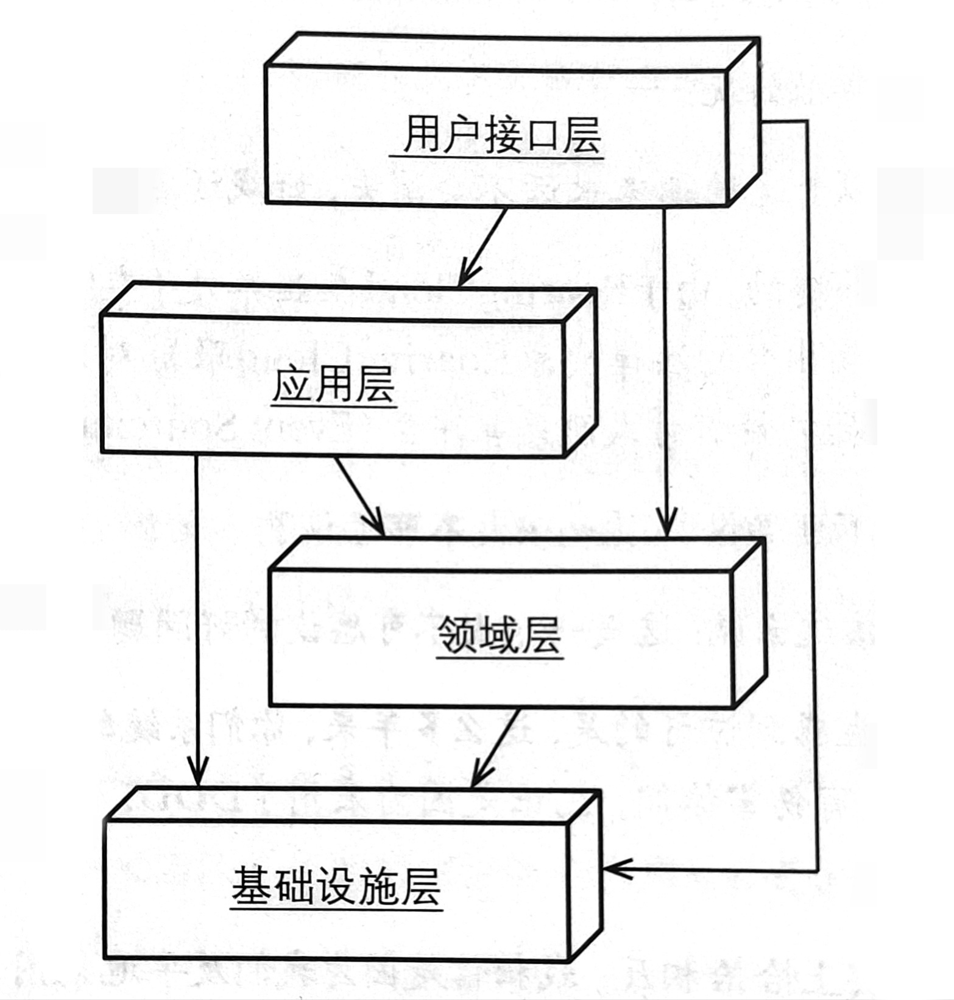
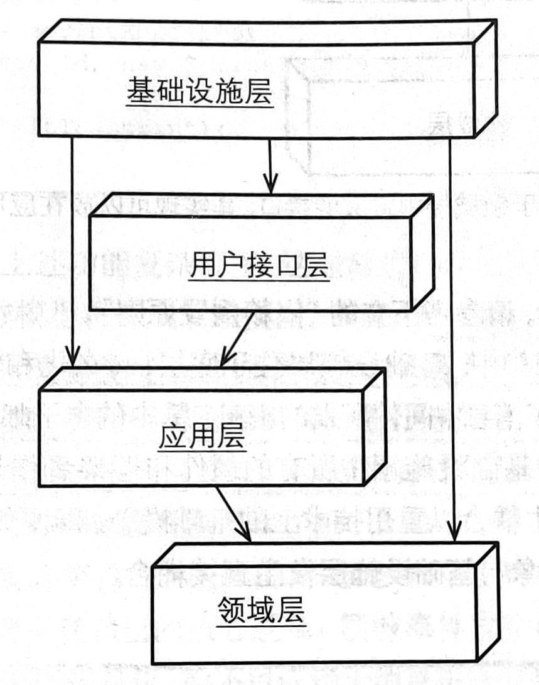
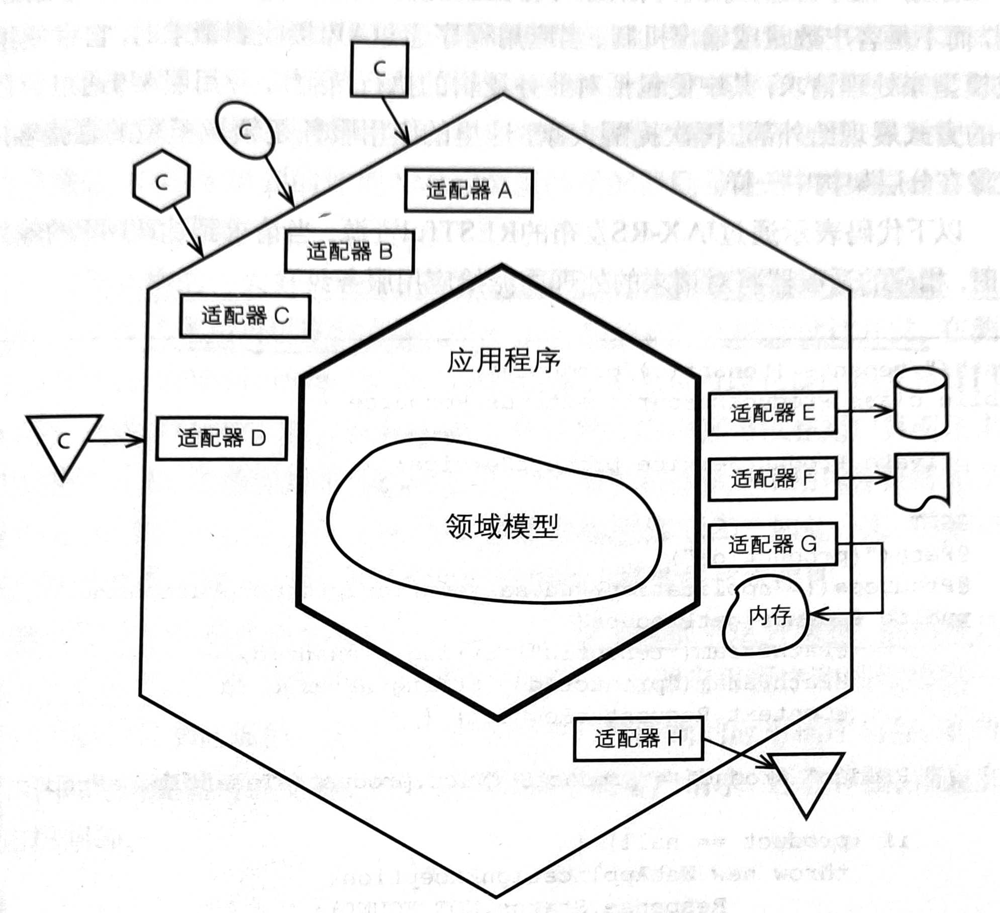
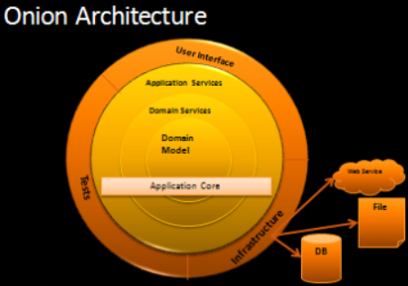
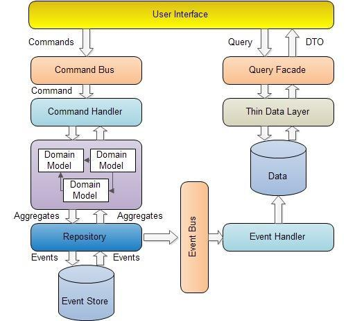

# 领域驱动设计中的架构

领域驱动设计（Domain-Driven Design, DDD）是一种对代码语言、结构和组织方式的设计方法。DDD 一大好处就是它并不需要使用特定的架构，DDD 中核心逻辑被划分为不同的领域，每个领域都被包裹在限界上下文中，对于我们可以对不同领域使用多种多样的架构风格。对架构风格和模式的选择受到功能需求的限制，或者说在没有功能需求的情况下，我们是无法对软件质量做出评价的，也无法选择合适的架构。

> 建筑应该反映时代特征和地理特征，同时追求永恒。
>
> —— Frank Gehry

## 分层架构

分层架构几乎是所有架构的始祖，被广泛应用在各种规模的软件中。分层架构的重要原则是每层只能与其下方的层发生耦合，如果只允许相邻的两层间发生耦合，被称为严格分层架构，而如果允许任意上层与任意下层发生耦合，则称为松散分层架构。一个典型的 DDD 系统所采用的松散分层架构如下图所示。

分层架构中领域层包含了系统中大部分业务逻辑，其他层都是为了将技术细节与领域层分离，使使业务逻辑的建模更加纯粹。应用层是很薄的一层，包裹领域层向外提供无状态的应用服务。用户接口层对外提供接口，如 REST、gRPC 甚至于事件驱动的服务接口。基础设施层则提供了持久化、消息队列等技术实现。

领域层（Domain layer）是所有领域驱动设计中的核心，业务逻辑被组织成被限界上下文包裹的具有清晰边界的领域，每个领域向外暴露一个聚合根（Aggregate root），并通过聚合根暴露业务逻辑的调用。实际上在 DDD 中的各种架构，都是通过某种架构或者风格包裹领域层，向外提供某种方式来访问领域层。

应用层（Application layer）对外提供控制持久化事务和安全认证等服务，或者向其他系统发送基于事件的消息通知。不同于领域服务，应用服务可能同时消费多个领域模型，例如安全认证的服务通常会被独立成为一个支撑域，避免污染业务逻辑。事务也是应用层经常处理的问题，事务的实现由基础设施层提供，应用层则负责组织事务。应用层的服务的第一步通常是通过资源库（Repository）获取聚合，可以使用工厂模式来创建聚合，或者是通过聚合的构造函数来获取聚合。应用服务是轻量的、不处理业务逻辑的，但它是领域模型的直接客户，因此它通常的用途是：接受用户的输入，通过资源库获取聚合实例，然后执行相应操作。

用户接口层（User interface layer）也是领域的消费者，它将领域模型组织成下游服务期待的形式，例如 RESTful、GraphQL、gRPC。用户接口层可以避免用户的不正确调用，也可以隔离领域模型。用户接口层通常定义了立面（Facade）并且尽可能保持其不变，使领域模型的变化不会直接传染到下游服务。

基础设施层（Infrastructure layer）通常是一组技术实现，诸如持久化、消息队列、事务、缓存等等的牵扯复杂的技术细节的内容都应该放在基础设施层中，使领域层只包含业务逻辑。基础设施中的 API 命名要趋于中性，避免与实现强耦合，例如持久化的插入（Insert）和更新（Update）操作可以合并为保存（Save），因为在非关系型数据库中它们通常是一个操作，即使在关系型数据库中，也可以通过 Upsert 方法合并这两个操作。

不难发现，分层架构的核心是领域层，基础设施层为领域层提供了底层服务，我们应该避免领域模型对象与基础设施层发生直接耦合。依赖倒置原则（Dependency Inversion Principle, DIP）可以改变不同层之间的依赖关系达到目的。

> 抽象不应该依赖于细节，细节应该依赖于抽象。
>
> —— Robert C. Martin

使用依赖倒置原则调整后的分层架构如下图所示：

调整后的领域层位于最底层，并且只依赖于抽象。基础设施层通过依赖注入（Dependency Injection）、服务工厂（Service Factory）和插件（Plug In）的形式在运行时为领域层提供服务。通常还会创建防腐层（Anti-corruption layer）来屏蔽外部系统的变化。

## 六边形架构

六边形架构（Hexagon Architecture）又称为端口与适配器架构，其核心理念在于使用适配器隔离外界。对于每种外界的访问端口，都有一个适配器与之相应。例如在一个 Web 应用中，HTTP 就是端口，REST 请求处理类就是适配器。典型的六边形架构如下图所示。

六边形架构分为两个六边形，内部六边形包裹领域模型形成应用程序，外部六边形由一组适配器组成。外部六边形的左侧由驱动适配器（Driver adapter）组成，用于处理输入并访问领域模型，而右侧的被驱动适配器（Driven adapter）用于处理领域层输出（依赖）。六边形架构彻底的剥离了基础设施，资源库、消息队列等基础设施也以适配器形式实现领域层定义的接口，与数据库建模的开发方法是完全不同的，六边形架构中涉及技术的实现都被置于外部。

不难发现，六边形架构本质上也是一个严格分层的三层架构，最下层的依然是核心的领域层，中间是一层应用层，最上层由一系列的适配器组成。这样的严格分层使得领域层的开发人员无需关心领域与外部系统的交互，同时领域层没有任何依赖，便于测试。而外层的适配器可以灵敏的适应外部系统的访问需求，新的需求都可以通过添加适配器来轻松解决。

### 洋葱模型

[洋葱架构](https://jeffreypalermo.com/2008/07/the-onion-architecture-part-1/)
（Onion Architecture）是 Jeffrey Palermo 在 2008 年提出的一种架构，个人认为洋葱模型依然属于一种六边形架构，但是细化了层次和职责。洋葱架构将最外层的适配器划分为用户接口、基础设施和测试三大类，同样使用依赖反转原则来使每一层从外向内单向依赖。

### 干净架构

[干净架构](https://blog.cleancoder.com/uncle-bob/2012/08/13/the-clean-architecture.html)是 Robert C. Martin 在 2012 年提出的一种六边形架构的变体。干净架构的基本定义为四层，它将应用层命名为用例层（Use Cases），将一部分适配器和领域层工作移动到用例层实现，使其不再是单薄的一层过程调用。再外一层同样是接口适配器层，提供对外接口。

## CQRS

CQRS（命令查询职责分离，Command Query Responsibility Segregation）是一种应对超大规模业务流量的模式，将其与架构放在一起讲不太合适，但是 CQRS 的应用确实深刻改变了其整个架构。注意，CQRS 对绝大多数的应用来说只是徒增复杂度。

CQRS 的核心是一个方法只有具有参考透明性（referentially transparent）时才能返回数据。也就是说，一个用户请求要么是一个改变系统状态但不返回值的命令，要么是一个返回值但不改变系统状态的查询。两种操作截然不同，系统甚至分别定义命令模型（Command Model）和查询模型（Query Model）分别处理命令和查询。一个命令进入命令处理器后，会穿过复杂的领域层执行业务逻辑，更新命令模型并持久化，但是不直接更新查询模型，而是发布一个事件（Event），并通过事件溯源模式（Event Sourcing）更新查询模型。而一个查询进入系统后，会直接穿透到查询模型，充分利用 SQL 等数据库执行复杂查询优势，一个命令模型可以存在多个查询模型，并且查询模型允许数据冗余等方法进一步加快查询速度。

## References

- 实现领域驱动设计, Vaughn Vernon
- [Clean Architecture](https://blog.cleancoder.com/uncle-bob/2012/08/13/the-clean-architecture.html)
- [Onion Architecture](https://jeffreypalermo.com/2008/07/the-onion-architecture-part-1/)
- [CQRS](https://martinfowler.com/bliki/CQRS.html)
- [DDD 分层架构的三种模式](https://www.jianshu.com/p/a775836c7e25)
- [DDD 领域驱动设计四、分层架构和代码模型](https://blog.csdn.net/w1lgy/article/details/111566243)
