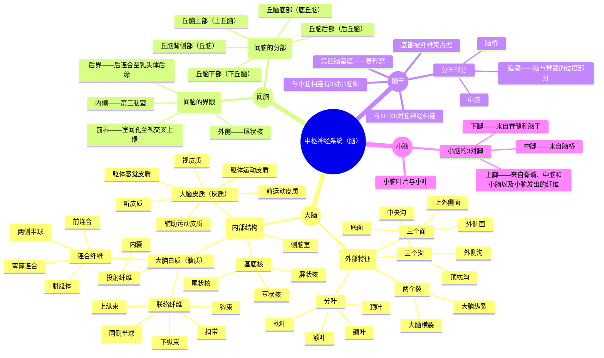
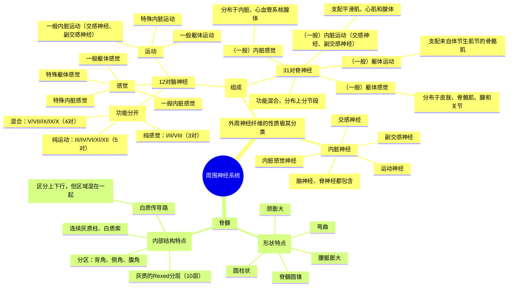

# 神经系统组成

神经科学课程第一讲，讲者：李云庆教授（空军军医大学），主持人：朱筱娟教授（东北师范大学）。

神经组织分为神经细胞和神经胶质细胞，神经的基本活动由反射组成。神经系统可以分为中枢神经系统和周围神经系统。

<!-- end -->

下一讲: [神经系统的细胞组成](../09/neuron.md)

## 中枢神经系统各部的外形与内部结构简介

### 脑干与脊髓的比较

|          | 脊髓           | 脑干                 |
| -------- | -------------- | -------------------- |
| 外形     | 规则           | 不规则               |
| 性质     | 低级中枢       | 低级中枢             |
| 功能     | 联系中枢和外周 | 联系中枢和外周       |
| 节段性   | 连续           | 不连续               |
| 网状结构 | 发达           | 发达                 |
| 白质     | 上下行传导路   | 上下行传导路、新束路 |
| 灰质     | 连续的灰质柱   | 神经核团             |
| 特殊感觉 | 无             | 有                   |

### 皮质运动区和感觉区功能特点

> 通常运动用红色，感觉用蓝色表示

- 上行
- 上下颠倒
- 左右交叉
- 占据的大小与功能的复杂度密切相关

### 大脑构造的特点

- 凹凸不平：脑回、裂沟
- 半球分叶：额叶、顶叶、枕叶、颞叶、岛叶
- 内部结构：基底核、纤维束、侧脑室

## 周围神经系统各部的结构特点

### 脊神经与脑神经的区别

|        | 脊神经                    | 脑神经                      |
| ------ | ------------------------- | --------------------------- |
| 性质   | 混合性                    | 感觉性、运动性和混合性      |
| 感觉性 | 一般躯体感觉+一般内脏感觉 | 2+特殊躯体感觉+特殊内脏感觉 |
| 运动性 | 一般躯体运动+一般内脏运动 | 2+特殊内脏运动              |
| 节段性 | 有                        | 无                          |
