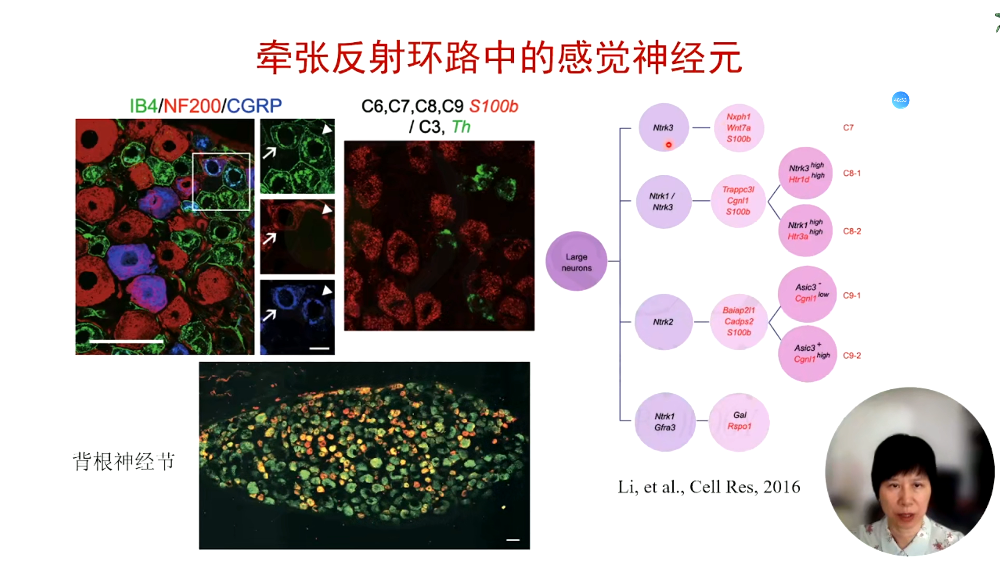
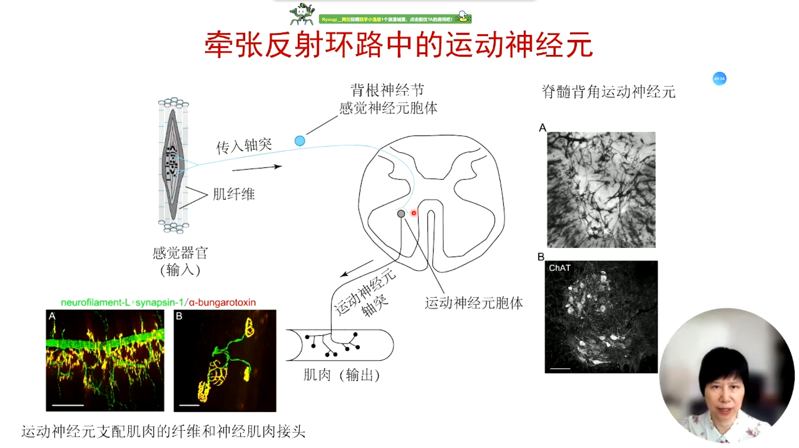

# 神经系统的细胞组成

神经科学课程第一讲，讲者：鲍岚研究员（中科院分子细胞科学卓越创新中心），主持人：朱筱娟教授（东北师范大学）。

神经组织主要分为神经细胞和神经胶质细胞，还包含免疫细胞、血管细胞等。

<!-- end -->

上一讲: [神经系统组成](../08/nervous-system.md)，下一讲: [神经元活动的基本原理](../13/neuron-activity-principle.md)

## 神经元的基本结构和功能

神经元在结构上高度的极性化，在细胞功能上具有可兴奋性。

神经元的细胞体是其代谢活动中心，神经元的胞体是**突触传入**的重要位置，相对于其他细胞分布了更多的离子通道。

神经元树突是神经元**信号传入**的主要部位。树突上存在树突棘（spine），在生理状态和病理状态下的树突棘会发生改变。

神经元的轴突是**信号传出**的主要部位，轴突在延生过程中很少有分支，但在到达支配细胞或效应器后会发出大量细小的终末分支，一根轴突可以与一千多个神经元构建链接。信号在有髓纤维上主要通过郎飞式节呈跳跃式传递，传递速度快。轴突始段是神经冲动（即动作电位）的起始部分。

突触是实现神经元间或神经元与效应器间信息传递的部位。突触通常分为化学类突触、电突触和混合性突触，哺乳动物中以释放神经递质的化学类突触为主。

神经细胞与上皮细胞都有明显的极性和分子选择性分布。

## 神经元的细胞器及其功能

神经元的细胞核内转录更多的编码蛋白质合成信息。神经元内的**蛋白质合成**：1. 依靠游离核糖体在胞浆内合成蛋白质；2. 在粗面内质网内合成分泌蛋白、囊泡装置和膜蛋白。蛋白质在内质网腔内合成的蛋白质进行了广泛的修饰，蛋白质的糖基化：成熟的标志；更容易插入到膜上；防止被蛋白酶水解；结构和功能多样化。

分泌蛋白在高尔基复合体的加工：糖基化、磷酸化核硫酸盐化等修饰；水解和剪切。不同的分泌泡介导蛋白质向外周输出，因此神经元可以将蛋白质从胞体附近沿着轴突长距离运输到突触释放。**分泌**途径可以分为持续分泌途径和可调节分泌途径。神经元内还存在另一类重要的囊泡：突触小泡，它负责神经递质的释放。

神经元通过**内吞**将细胞膜核细胞外物质摄取到细胞内。内吞与分泌是并行的，它可以保持细胞膜面积的相对稳定，清除细胞膜上的一些无用的物质，降低细胞膜上的受体等分子的活性。

### 细胞骨架

**细胞骨架**影响神经元形状并决定细胞器和蛋白质的不均匀分布，它主要作为 1. 细胞的结构和轨道；2. 胞内运输；3. 收缩和运动；4. 胞内空间组织。细胞骨架由微管、神经丝和微丝，细胞骨架和相关蛋白在神经元的总蛋白中占到了 25% 左右。

**微管**可以延伸到整个神经元，具有高度动态性，外径25mm-28mm。轴突内正向朝向末梢，而细胞体和树突中是双向的。在神经元中有特定的微管结合蛋白行使功能。

**神经丝**是三种中最丰富、最坚硬的纤维成分，直径 10mm，并且几乎呈现聚合的稳定形态。它有一些神经丝只存在于神经元中。

**微丝**在神经元的分泌和生长中起关键作用，直径 7-9mm。微丝分布在细胞膜下，生长锥、树突棘的前沿也主要是微丝。微丝可以作为细胞膜下短距离运输膜性细胞器的轨道。

## 神经元的轴浆运输

神经元轴突中细胞器的**快速顺行轴浆运输**以每天 200~400mm（每秒 2~5um）速度运送膜性细胞器，主要依赖动力蛋白 kinesin 将膜性细胞器从微管的负端运输到正端。神经元的**快速逆行运输**以每天 200~300mm 运输内吞体、溶酶体、线粒体和内质网的成份，是依赖动力蛋白 dynein 家族将膜性细胞器从微管的正端运输到负端，逆行运输“信号内吞体”调控基因表达和神经元生长。利用神经元轴浆运输的原理进行神经束路追踪，即在神经元胞体附近注射荧光蛋白或病毒，等被神经元吞噬后随着轴浆运输到末梢，有些物质还可以运输到突触连接的下一级神经元。

胞内蛋白质和细胞骨架通过**慢速轴浆运输**方式转运。慢速运输成分a（SCa）的速度是每天 0.2~1mm，主要携带制造细胞骨架的蛋白质。慢速运输成分b（SCb）的速度为每天 2~8mm，携带的蛋白质包括笼形蛋白、微丝和微丝结合蛋白，还有各种胞浆酶和蛋白质。

## 不同神经元的结构和功能

分类原则：

1. 以形态为依据的分类；
2. 以功能和神经递质为依据的分类；
3. 以神经电特征为依据的分类；
4. 以分子特性微依据的分类；
5. 组合分类方式。

### 以形态为依据的分类

- 根据轴突特征的最古老神经元分类方式
- 根据树突形状的锥体神经元分类

但是，具体同样形态的神经元在不同环路中也具有不同的功能。

### 以功能和神经递质为依据的分类

功能：感觉神经元、运动神经元

神经递质：单胺能神经元、乙酰胆碱能神经元、伽马氨基丁酸（GABA）能神经元、谷氨酸能神经元

### 以分子特性为依据的分类

神经元的形态和功能是与其基因表达的不同决定的。特别是近年来高通量单细胞测序技术的广泛应用，使得以单细胞转录组数据的分子为依据的分类。

### 组合分类方式

以单一分子的分类依然没法满足特定神经元在特定环路的分类，因此现在还通过组合方式来分类，例如细胞大小、对刺激的反应、电生理特征

## 不同神经元的结构和功能

在神经系统中，各类神经元和环路都具有较大的差距。以牵张放射环路为例。

## 小结

- 神经元由四个不同的部分组成：从其他神经元接受信息输入的树突、神经元蛋白质和 RNA 合成和代谢的细胞体、长距离投射到靶细胞的轴突和释放神经递质的轴突终末；
- 神经元具有与其他细胞类似的细胞器，其蛋白质合成也遵循一些公共的规律；
- 神经元的细胞骨架由微管、神经丝和微丝组成，不仅维持了神经元的基本形状，而且在细胞内细胞器和蛋白质的分布和运输中承担了重要的角色；
- 根据神经元形态、功能和所表达的神经递质、神经元电生理特征、分子特征的差异，可以把神经元分成不同类别，也可以综合这些方面进行组合分类；
- 不同神经元既有相同处，又有不同处。感觉神经元和运动神经元形态学和分子组成上的差异与其功能相关。
