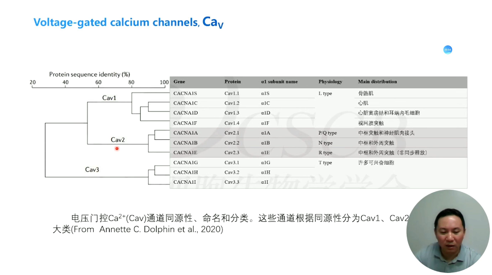

# 神经元活动的基本原理

课程：神经科学

主持人：朱筱娟教授（东北师范大学）

讲者：石云研究员（广东省智能科学与技术研究院）、舒友生（复旦大学）

## 神经元的离子通道与膜电位

神经元的电信号是由于细胞膜内外的离子分布情况与离子通道的动态活性产生的。

| 离子           | 胞内浓度(mM) | 胞外浓度(mM) | 内外浓度差 | 膜对离子的通透性 | 备注 |
| -------------- | ------------ | ------------ | ---------- | ---------------- | ---- |
| $\rm{Na}^+$    | 12           | 145          | 1:12       | 很小             | -    |
| $\rm{K}^+$     | 140          | 5            | 30:1       | 大               | -    |
| $\rm{Cl}^+$    | 9            | 120          | 1:14       | 较大             | -    |
| $\rm{A}^-$     | 60           | 15           | 4:1        | 不通透           | 次要 |
| $\rm{Ca}^{2+}$ | <100nM       | 1.3          | 1:10000    | -                | 次要 |
| $\rm{Mg}^{2+}$ | 0.8          | 1.2          | 1:1        | -                | 次要 |

### 离子浓度差和静息电位

神经元通常具有 -60~70mV 的静息膜电位。

神经元细胞由绝缘脂质双分子层构成的细胞膜包裹，膜上存在各类蛋白分布。一些跨膜的水性通道，离子可以通过这些蛋白，被称为离子通道。因此细胞膜具有半透膜特性。

离子流动的驱动力由跨膜电位和浓度差（平衡电位）产生：

$$
F = V_m - E_s
$$

离子电流可以使用驱动力计算：

$$
i_S = g_S (V_m - E_s)
$$

静息状态下各种离子电流之和为 0:

$$
i_{Na} + i_K + i_{Cl} + \cdots = 0 \\
V_m = (g_K E_K + g_{Na} E_{Na} + g_{Cl} E_{Cl}) / (g_K + g_{Na} + g_{Cl})
$$

因此静息膜电位的值为：

$$
\begin{align*}
V_m &= (1*E_K + 0.04 * E_{Na}) / (1 + 0.04) \\
&= (-84 + 0.04 * 65) / 1.04 \\
&= -78 (\rm{mV})
\end{align*}
$$

| 离子           | 胞内浓度(mM) | 胞外浓度(mM) | 平衡电位(mV) |
| -------------- | ------------ | ------------ | ------------ |
| $\rm{Na}^+$    | 12           | 145          | +65          |
| $\rm{K}^+$     | 140          | 5            | -84          |
| $\rm{Cl}^+$    | 9            | 120          | -67          |
| $\rm{Ca}^{2+}$ | <100nM       | 1.3          | +125         |

由于离子间自由移动，静息膜电位是无法维持的，因此细胞上需要通过钠钾泵消耗 ATP 交换 3 个钠离子和 2 个钾离子来维持静息电位。

### 离子通道的分类

离子通道具有离子选择性和门控机制，按这两种特性可以将离子通道分类。

离子通透性(ion selectivity)：

- $\rm{K}^+$
- $\rm{Na}^+$
- $\rm{Ca}^{2+}$
- $\rm{H}^{+}$
- $\rm{Cl}^{-}$
- 非选择性阳离子通道
- 阴离子通道

Gating:

- 电压门控
- 配体门控
- 机械门控
- 温度门控
- 本底活性通道

离子通道也可以按孔道构成分类：

- 三聚体中心孔道
- 四聚体中心孔道（最多）：$\rm{Ca}_v$, $\rm{Na}_v$, $K_v$, $K_{ir}$, $\rm{K2P}$, $\rm{TRP}$, $\rm{GluR}$, $\rm{IP_3R}$, $\rm RYR$
- 五聚体中心孔道：$\rm{GABA_A R}$, $\rm{CHR}$, $\rm{GlyR}$
- 六聚体中心孔道：$\rm{ORAI}$, $\rm{Gap Junction}$
- 非中心孔道

离子通道还可以按定位分类：

- 细胞膜
- 内质网
- 线粒体
- 溶酶体
- 穿梭
- 跨细胞器

从遗传角度看，离子通道具有同源性。$\rm{NA^+}$ Channel, $\rm{Ca}^{2+}$ Channel, $\rm{K}^+$ Channel 组成了电压门控通道超家族。TMEM16, TMC, OSCA/TMM63 组成了TMEM16 超家族。

通道命名较乱，存在历史命名、国际药理学联合会命名、人类基因组机构命名。

### 钾离子通道

24 次跨膜

电压门控钾通道参与神经元动作电位的复极化和超极化，$\rm{Ca^{2+}}$ 激活钾通道受电压和 $\rm{Ca^{2+}}$ 共同门控。

钾离子通道的选择性：

钾离子通道的门控：

钾离子通道的电压传感器由 S1~S4 实现：

### 电压门控离子和钙离子通道

$\rm{Na_v}$ 的主要功能是介导动作电位。$\rm{Na_v}$ 离子门控通道具有三种状态: 关闭（Closed）, 开放（Opened）和失活态（Inactivated）

得益于冷冻电镜技术的发展，我们可以从原子水平观察 $Na_v$ 通道和天然毒素或临床药物所形成的复合体的结构。

$\rm{Ca_v}$ 的主要功能是介导动作电位和介导 $Ca^{2+}$ 内流。 $Ca^{2+}$ 离子是启动许多生理过程的信号，例如兴奋-收缩耦联，兴奋-分泌耦联，兴奋-转录耦联，因此 $Ca^{2+}$ 离子通道是将神经元的电信号转换为细胞内生理功能的重要通道。

### 氯离子通道

已知氯离子通道包括五大类：

1. 囊性纤维化跨膜传导调节因子（CFTR）是一种 PKA/PKC 激活的 ATP 门控氯离子通道，表达于气道、消化道和生殖道上皮细胞的顶部质膜中。突变主要导致病人肺纤维化。
2. 钙激活氯通道（CaCCs-TMEM16）
3. 电压门控氯通道（ClCs）
4. 配体门控氯通道（GABA 受体和甘氨酸受体）
5. 细胞容积调控氯通道（Swell1）

其余略

### 配体门控离子通道

略

### 温度敏感 TRP 通道

略

### 机械门控离子通道

Piezo2 Channel, OSCA/TMEM63

略

### 总结

离子通道（ion channel）是细胞膜上大分子蛋白质围成的含有水分子的孔道（pore）。在细胞膜两侧电化学梯度的驱动下，离子通道以超高速率（$10^{7-8}$ 离子/秒）高选择性地转运离子。

离子通道存在于所有的细胞膜上，并发挥者多种生物学功能，是神经元、心肌细胞、骨骼肌细胞等兴奋性细胞电活动的物质基础。建立细胞膜静息电位；产生电信号；调节钙离子信号和多种离子流动以及控制细胞容量等。

离子通道功能异常可导致多种疾病，且其是重要的临床药物靶点。

离子通道根据它们不同的门控机制，即离子通道的开放和关闭，大致可分为三大类：
- 电压敏感（voltage-sensitive）离子通道。这是一类有众多成员的超大家族。它们的开启和关闭受膜电位变化的调节和控制。根据选择通过的离子，可分为 $\rm K^+$, $\rm Na^+$, $\rm Ca^{2+}$ 和 $\rm Cl^-$ 四种主要类型通道，而且各型又分为若干亚型。
- 配体门控（ligand-gated）离子通道。多为非选择性离子通道。化学配体和通道结合后，可导致通道的开放  $\rm K^+$, $\rm Na^+$, $\rm Ca^{2+}$ 或 $\rm Cl^-$ 通过。
- 机械门控（mechano-gated）离子通道。该类通道的开放和关闭受细胞膜或细胞骨架机械力的变化的调控，是实现机械信号向细胞电化学信号转换的通道。

## 神经元的被动膜特性及动作电位的发生与传播

神经元种类繁多、点活动模式多样。神经元和神经环路的点活动是实现脑功能的重要前提。神经元的电活动有细胞的被动和主动膜特性所决定的。

### 神经元的被动电学特性
