# 神经元的被动膜特性及动作电位的发生与传播

神经科学第二讲，讲者：舒友生（复旦大学），主持人：朱筱娟教授（东北师范大学）。

神经元种类繁多、电活动模式多样。神经元和神经环路的电活动是实现脑功能的重要前提。神经元的电活动由细胞的被动和主动膜特性所决定的。

<!-- end -->

上一讲: [神经元活动的基本原理](../../11/13/neuron-activity-principle.md)，下一讲：[神经递质及受体](../11/neurotransmitters-receptors.md)

## 神经元的被动电学特性

细胞膜上存在离子通道，它是一种膜蛋白。离子通道就是一个个的电阻（电导），多个离子通道形成了并联电路，且细胞膜的脂质双分子层可以等效于电容，因此细胞膜可以等效于电容与电阻的并联电路。

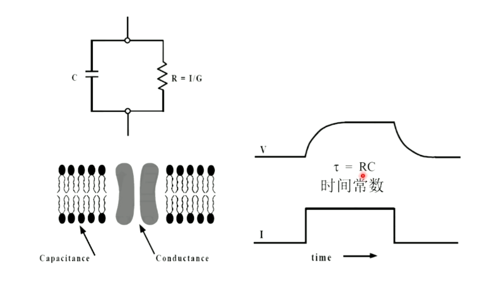

细胞的输入阻抗由静息离子通道密度 (specific membrane resistance at rest) 和细胞大小决定。细胞的膜电容延长膜电位反应的时程：

$$
\tau = R_{in} \times C_{in} \\
C_{m} = 1 \mu F / cm^{2} \\
C_{in} = C_m (4 \pi r^2)
$$

由于神经元分支细且存在轴浆，因此膜阻抗和轴向阻抗影响电信号的传导，分支的等效电路可以被视为多个电路并联而成：

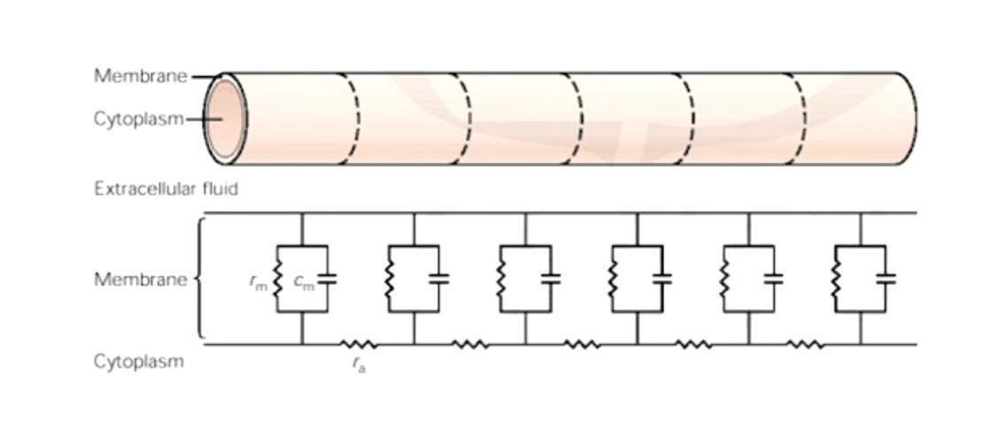

电信号在膜上传播时，会不断衰减，这一性质常用长度常数 $\lambda$ 表示：

$$
\lambda = \sqrt{r_m / r_a}
$$

其中，$r_m$ 是膜的绝缘性，$r_a$ 是 thicker process（轴向阻抗）。

因此，细胞膜有三种被动电性质：

- Resting membrane resistance $R_m$
- Membrane capacitance $C_m$
- Intracellular axial resistance along axons and dendrites $R_a$

这些性质控制了：

- 电位变化的时程和幅度
- 突触电位是否会引起动作电位的产生
- 动作电位的传导速度

## 动作电位

神经元的静息膜电位在 -60 ~ -70 mV，当动作电位产生时候，细胞膜会快速去极化 (Depolarizing)，然后复极化 (Repolarizing)，这段时间被称为绝对不应期，这段时间内细胞膜不会再响应刺激。然后会进入后超极化 (AHP)，随后慢慢回到静息电位，这段时间被称为相对不应期。

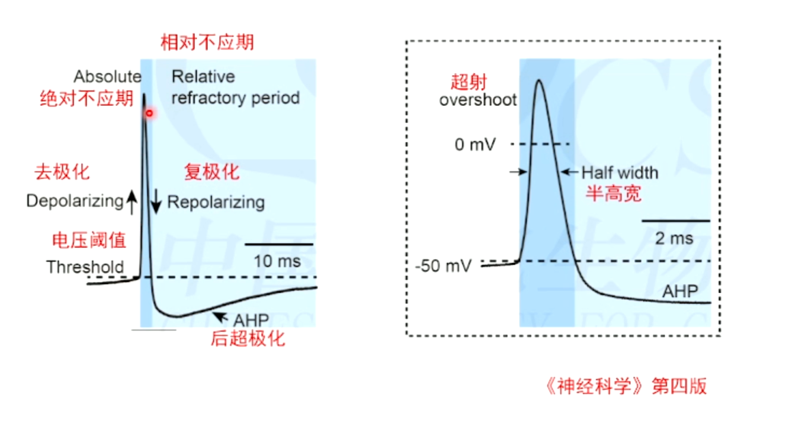

动作电位产生时，细胞膜钠通道打开，钠离子进入细胞内，因此细胞外和细胞内会产生相反的电位波形。

受到刺激时，神经元可以产生单个或多个动作电位，神经元具有多样的发放模式。

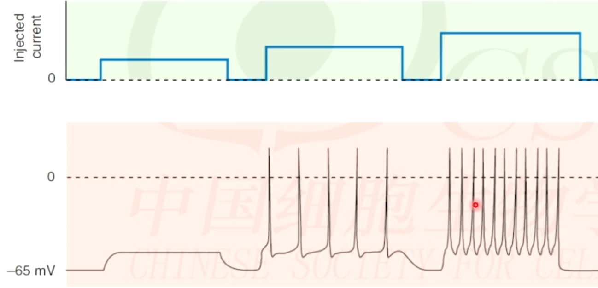

## 电压门控钠通道和钾离子通道在动作电位产生的作用

动作电位产生时，钠离子通道和钾离子通道相继打开。去极化导致钠通道的开放和关闭（失活）。

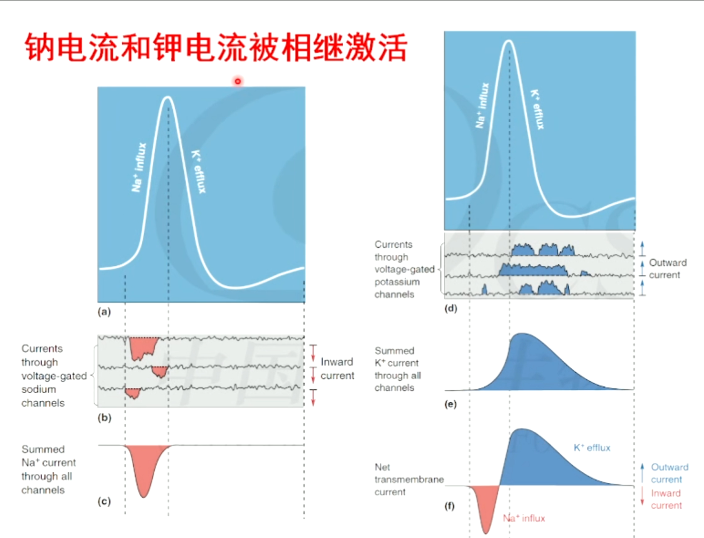

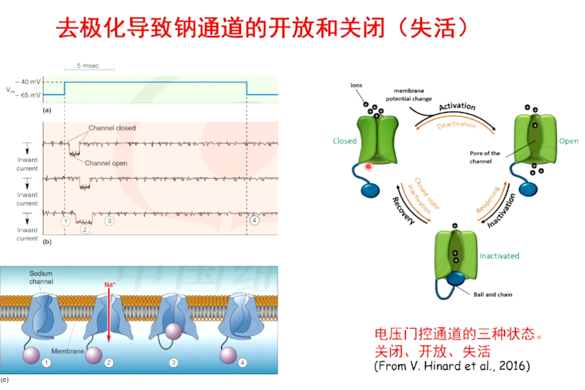

### 电压门控钠离子通道

电压门控钠离子通道由四个 repeating domain (四聚体)组成，每个 domain 由六次跨膜组成，其中 S4 带有阳离子的膜电压敏感的 sensor。

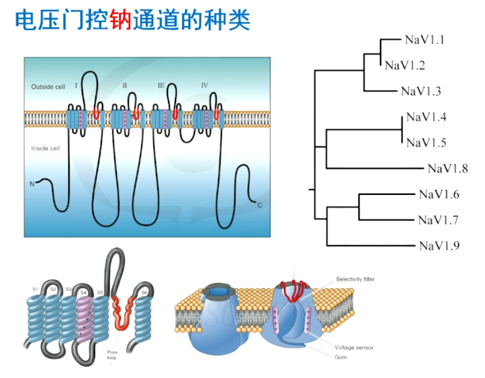

测量细胞膜上的钠离子通道密度、电压依赖的生物物理等特点，通常使用膜片钳技术。该技术首先将膜电位钳制到极化状态（例如 -100 mV）一段时间，使所有的钠离子通道就绪，然后给予一个指令电压的方波刺激。重复实验并改变指令电压，可以得到激活曲线。改变极化电压，则可以得到稳态失活曲线。还可以改变时间间隔，测量失活时间。

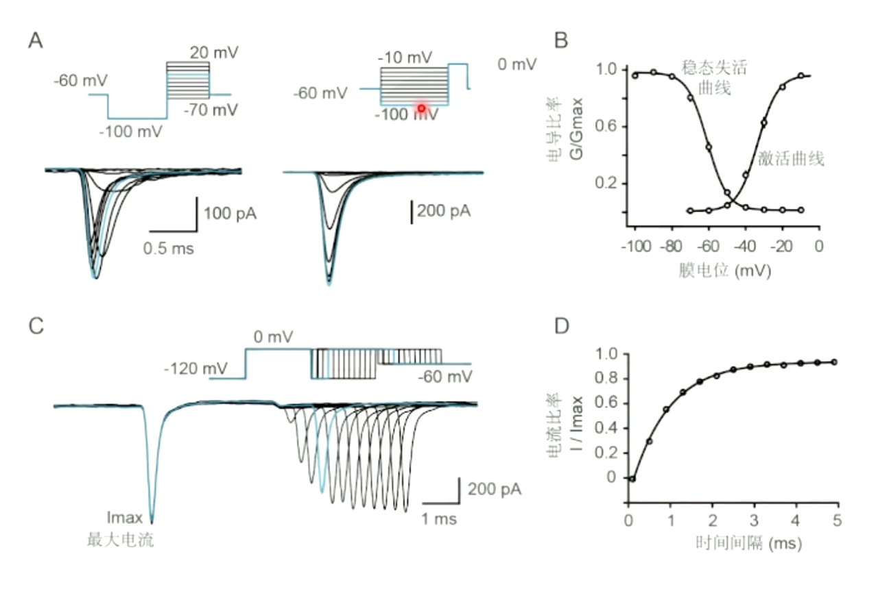

### 电压门控钾离子通道

哺乳动物神经元通常表达至少五个电压门控钾通道家族的成员，包括 Kv1 ~ 4 和 Kv7。每个家族存在多种基因产物，如 Kv1 家族拥有 Kv1.1 ~ 1.8 共八个密切相关基因编码的成员。

其他类型的电压门控钾通道，如由 Kv10 ~ 12 三个亚家族组成的 KCNH 基因家族，这些通道同样影响静息膜电位、动作电位阈值、发放频率和发放模式。另外，钙激活钾通道（如 KCa1.1、KCa2.1 ~ 2.3）参与动作电位的复极化和后超极化过程。

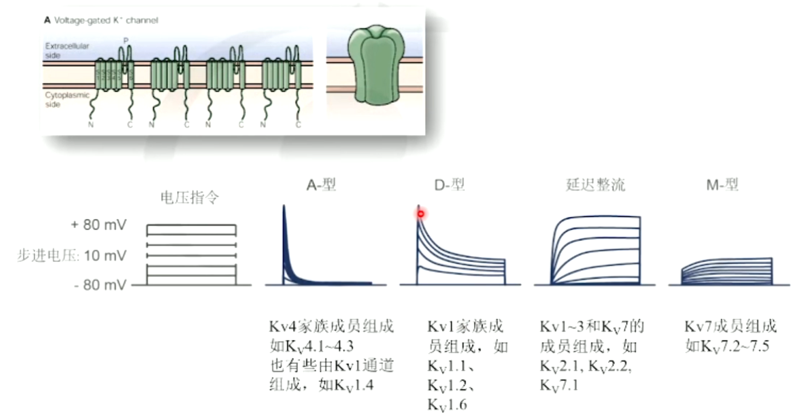

## 动作电位的发放

### 神经元的发放模式

神经元表达的“一套”离子通道决定了其特征性的发放模式。

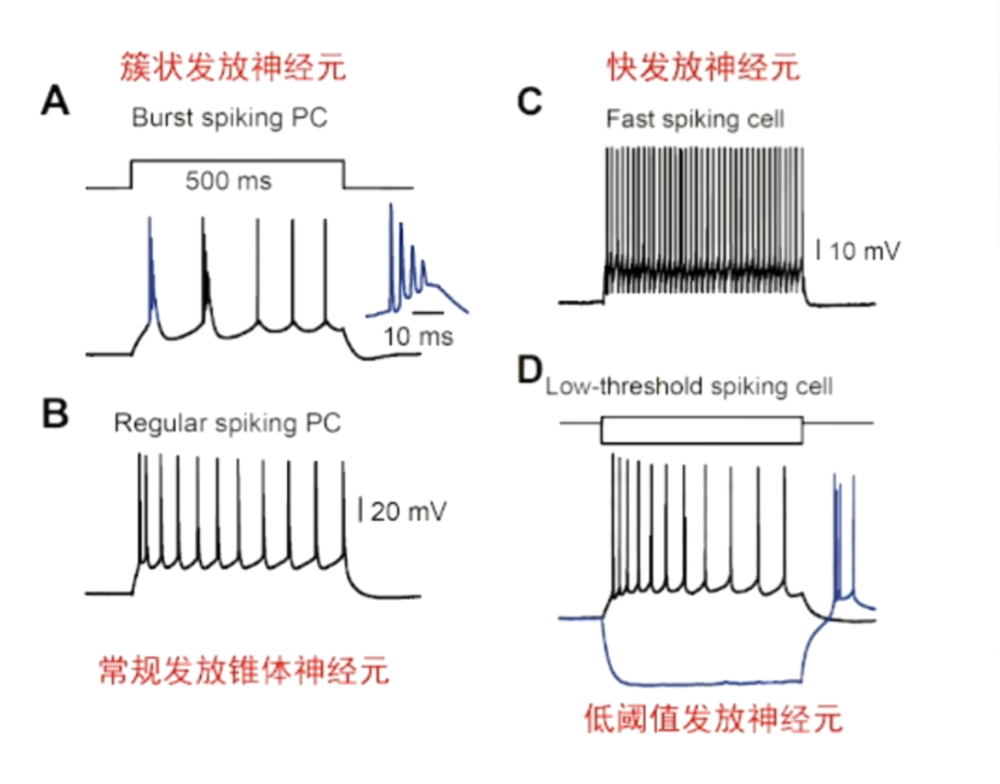

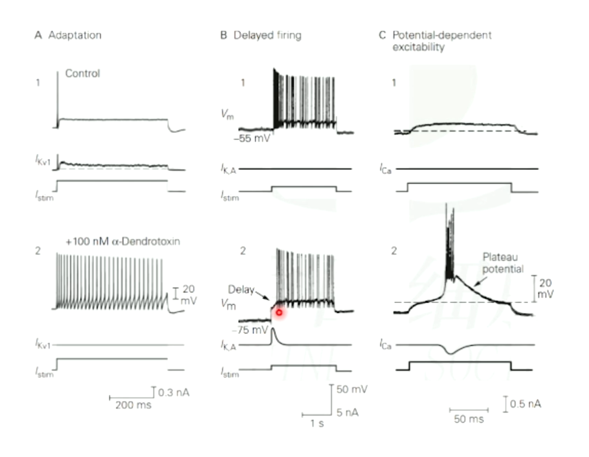

Resting channel（静息通道，静息状态开放）决定 Resting potential（静息膜电位），Voltage-gated channel（电压门控通道）决定 Action potential（动作电位）。

### 动作电位的爆发位点

动作电位的爆发位点由钠通道密度和通道亚型的生物物理特性所决定。

轴突上的电压门控钠离子通道密度最高。在中枢神经系统中，通常是Axon Initial Segment（轴突始段）的电压门控钠离子通道密度高，动作电位容易在这里产生。在外周神经系统中，电压门控钠离子通道则通常在外周段段轴突末梢产生，通过脊髓往中枢传递。

动作电位在轴突始段产生时，会向轴突和树突两个方向传播，但在传播过程中是单向传播。

### 动作电位的传播

动作电位在传导过程是单向的，不会反向传播，因为已经激活的离子通道会进入一段时间的失活状态，无法再次激活。

有髓鞘包裹的轴突，动作电位可以呈现跳跃式传播（狼烟式传播）。髓鞘是一段段绝缘的物质包裹轴突，每段间有一个郎飞氏结，约一微米。动作电位在郎飞氏结之间跳跃式的传递，就像烽火狼烟一样。郎飞氏结上有高密度的钠离子通道和钾离子通道。脱髓鞘会导致动作电位传导失败，可能是郎飞氏结上离子通道扩散到整个膜表面后不足以支撑动作电位的产生。也有些轴突没有髓鞘。

向树突反向传播的动作电位，可导致突触可塑性 spike-timing dependent plasticity (STDP)。树突的去极化可驱除 Mg 对 NMDA 受体的阻塞，激活 NMDA 受体。

## 总结

1. 细胞膜的被动特性：膜电阻、膜电容、突起的电缆性质
2. 神经元的兴奋性是膜的被动特性和主动特性的综合反应，一种特性的变化如果使得膜电位接近动作电位的阈值接近表面这种变化使得兴奋性增强，反之则减弱
3. 动作电位最先在轴突始段爆发，沿无髓或有髓轴突进行顺行传导，至轴突终末介导突触传递；也反向传导至胞体和树突，参与输入突触的可塑性等生理过程
4. 动作电位的离子机制：相继激活的电压门控钠通道和钾通道形成了动作电位的上升相和下降相，通道的生物物理特性决定动作电位的频率和方法模式（regular，burst 等）
5. 动作电位的传导过程（有髓、无髓轴突/纤维）及其机制
