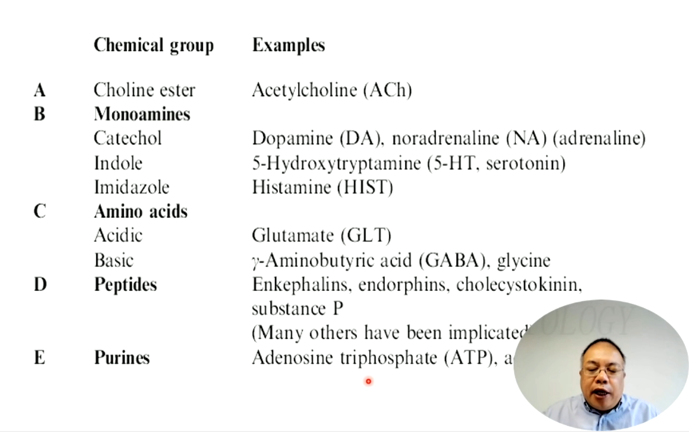
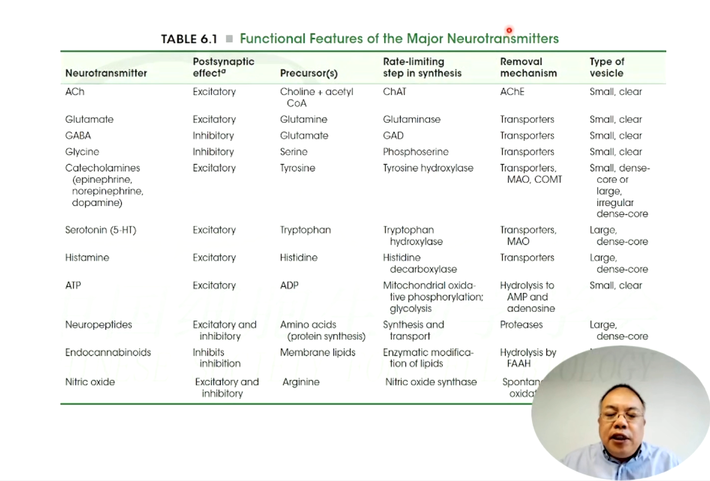
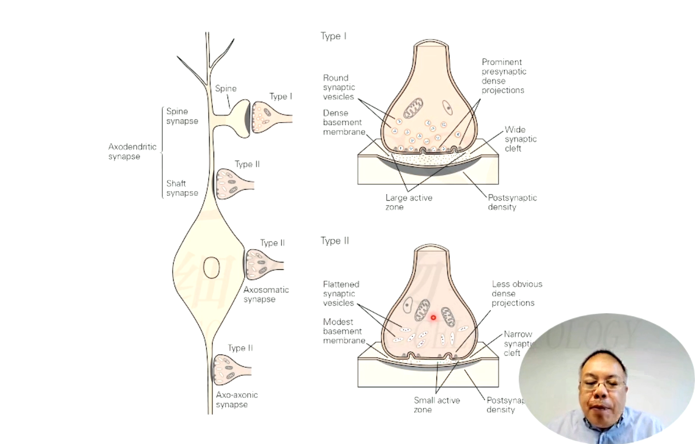
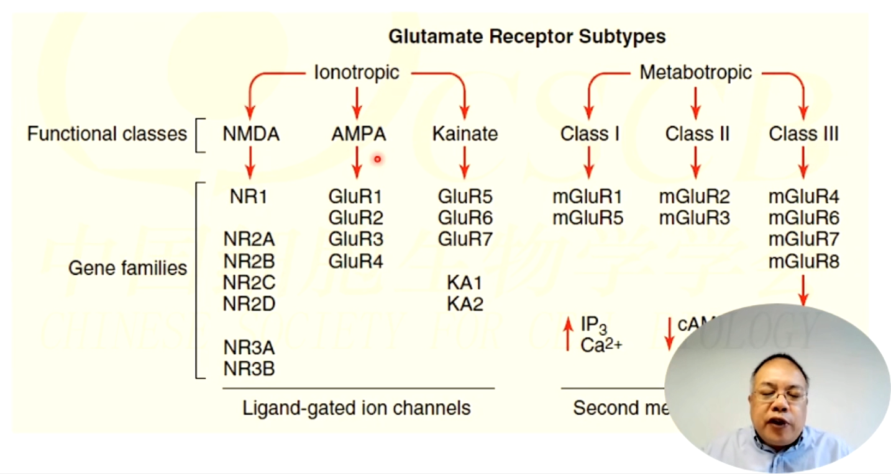
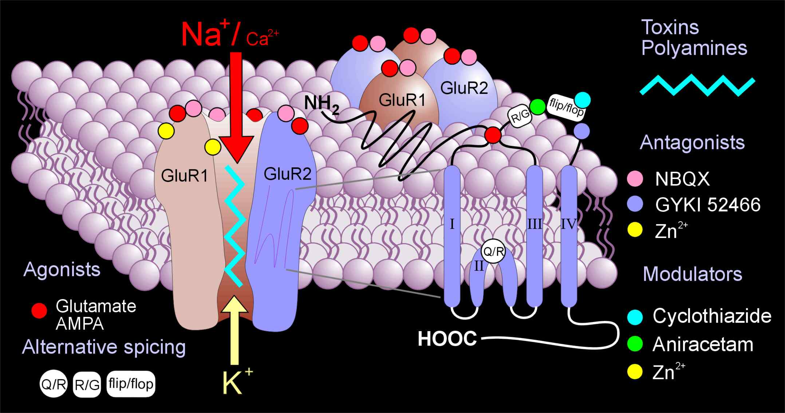
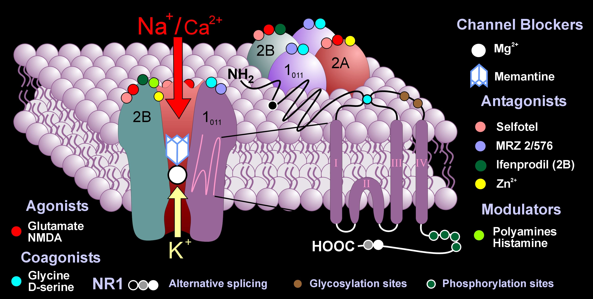
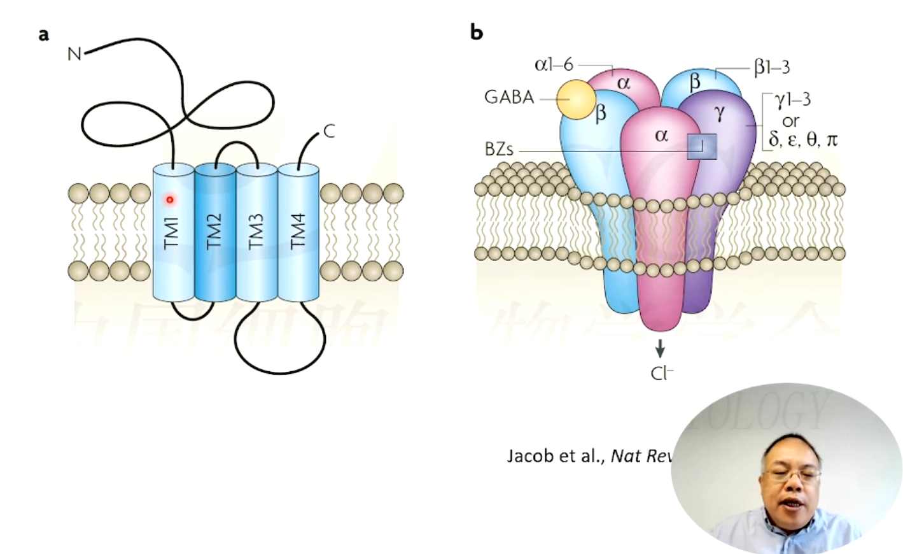
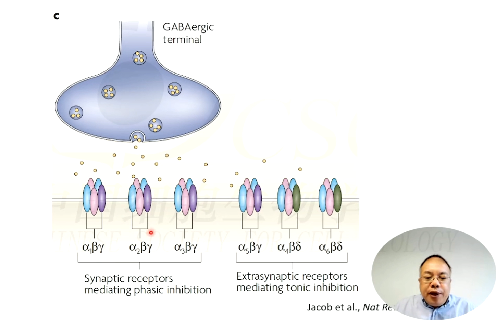

# 神经递质及受体

神经科学第三讲，讲者：陆巍（复旦大学），主持人：朱筱娟教授（东北师范大学）。

信号在神经元间传递主要依赖于神经递质，神经递质在突触前通过囊泡形式释放，并在突触后与受体结合，从而传播信号。

<!-- end -->

上一讲: [神经元的被动膜特性及动作电位的发生与传播](../10/neuron-electrical-activity.md)，下一讲：[神经递质及受体（二）](../21/neurotransmitters-receptors-2.md)

## 神经递质与受体的分类

神经递质可以分为电突触和化学突触，电突触在神经元的突触前和突触后的间隙间之间建立离子通道实现信号传递。但是更常见的是化学突触，通常情况下，突触指的是化学突触。

信号在突触间依靠神经递质传递，突触前递质释放与囊泡的循环包括生成、募集、锚定、激活、融合、胞吞与循环各个步骤。神经递质需要满足四个条件：

1. 突触前神经元释放；
2. 能够与突触后神经元受体或效应器官结合产生特定效应；
3. 通过外源方式给予能够与内源的产生同样的效果；
4. 释放后有特定的从局部环境移除的机制。

神经递质的分类：

神经递质的功能特征：

神经递质在突触后与受体结合，通常分为离子型受体（ionotropic receptors）和代谢型受体（metabotropic receptors）。离子型受体本身就是离子通道，接受神经递质后通道打开。代谢型受体接受到神经递质后，需要通过与其他蛋白结合间接打开离子通道。突触后膜除了受体外，还有很多辅助蛋白组成的复合物。

兴奋性突触（Type I）主要投射到树突棘（spine）上，而抑制性突触（Type II）往往投射到树突主干，也有少部分直接投射到胞体上。

## 谷氨酸受体与 GABA 受体

### 谷氨酸受体

谷氨酸受体是一类重要的突触组成的大家族，分为离子型谷氨酸受体和代谢型谷氨酸受体。

[AMPA 受体 - 生物百科](https://wiki.bioguider.com/doc-view-8296.html)

NMDA 受体。NMDA 开放需要突触前释放的递质结合，还需要突触后同步的去极化，还需要甘氨酸促进开放，因此 NMDA 突触信号传递的耦合检测器，不常开放。

### GABA 受体

GABA（γ-胺基丁酸）受体主要有 $GABA_A$ （门控 Cl- 通道）、$GABA_B$（门控 K+ 通道）、$GABA_C$（含有 σ 亚基）三类亚型。

抑制性受体和兴奋性受体保持动态平衡，达到调控作用。抑制性神经元的作用与其投射位置有关。

## 突触可塑性

突触可塑性（Synaptic Plasticity）指突触形态、构成、数目及生物物理特性等改变引起的突触传递效能的变化。突触可塑性的产生与神经递质密切相关，且大脑中大量现象，如感知、认知、运动等，都与突触可塑性相关。

Hebb 假说 (Hebb, 1949)，当一条通路被反复刺激，会使得这条通路的强度被增强。在过去几十年的研究中，大量的实验受到 Hebb 假说的启发，并进一步证明了该假说的正确性。

### 长时程增强

长时程增强 (Long-Term Potentiation, LTP) 指突触传递的长时程改变，是研究突触可塑性的重要细胞模型。最早被 Bliss 和 Lomo 在挪威奥斯陆大学 Per Anderson 实验室发现。由于记忆也是由突触强度的变化所编码，LTP 被广泛认为是学习记忆的重要细胞机制。

Long-Term Potentiation is a long-lasting enhancement in signal transmission between two neurons that results from stimulating them synchronously. It is one of several phenomena underlying synaptic plasticity, the ability of chemical synapses to change their strength. 

Long-Term Depression (LTD) is a lasting decrease in synaptic effectiveness that follows some types of electrical stimulation in the hippocampus.

### NMDA 受体活动依赖 LTP 的基本特征

NMDA 受体活动依赖 LTP 是基于 Hebb 假说，研究最广泛、经典的突触可塑性。具有以下基本特征：

- 协同性 (Cooperativity)：单个弱传入不足以诱导 LTP，多个弱传入通过协同可诱导出 LTP；
- 关联性 (Associativity)：单个弱传入不足以诱导 LTP，但伴有另一通路强传入可诱导出 LTP；
- 输入特异性 (Input Specificity)：仅在受到刺激的突触产生 LTP，不会扩散到其他突触；
- 持久性 (Persistence)：一旦产生具有持久性，区别于其他类型突触可塑性。

LTP 可以伴有突触形态或数目的改变。

### LTP 的阶段与机制

LTP 可以被分为各个阶段，通常分为三个阶段：

1. Induction (诱导阶段): a short-lived signal triggers LTP to begin;
2. Expression (表达阶段): entails the long-lasting cellular changes that result from activation of the maintenance signal;
3. Maintenance (维持阶段): persistent biochemical changes that occur in response to the induction.

LTP 的 Presynaptic Mechanisms (突触前机制)：

- Probability of release (囊泡释放概率)
- Filling of vesicle (囊泡的填充)
- Diffusion of transmitters in synaptic cleft (递质在突触间隙的扩散)
- Retrograde signal (突触后反馈信息)

LTP 的 Postsynaptic Mechanisms (突触后机制)，突触后通常更重要：

- Insertion of new receptor (新受体插入到突触后膜)
- Gating of existing receptor (原有后膜受体门控变化)

### Spike Timing Dependent Plasticity

脉冲时序依赖可塑性 (Spike Timing Dependent Plasticity, STDP) 是一种调整大脑中神经连结强度的生理过程，强调动作电位与 EPSP 时序的重要性。

- Markram et al., Science, 1997
- Bo and Poo, J. Neurosci., 1998
- L.I. Zhang et al., 1998, Nature
