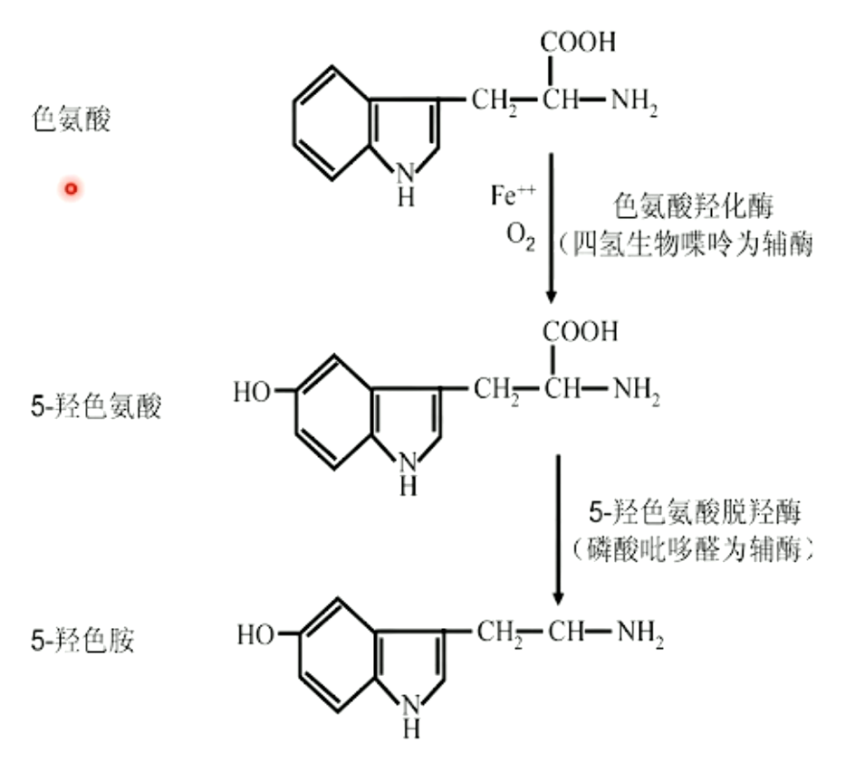

# 神经递质及受体（二）

神经科学第三讲，讲者：高永静（南通大学），主持人：朱筱娟教授（东北师范大学）。

<!-- end -->

上一讲: [神经递质及受体](../11/neurotransmitters-receptors.md)

## 乙酰胆碱

乙酰胆碱在生物界分布广泛，不但存在于动物体内，也是一些植物、细菌的代谢产物，还是昆虫的生物毒素。乙酰胆碱是胆碱和乙酰辅酶A (AcCoA) 在胆碱乙酰化酶 (ChAT) 的作用下合成的。其中乙酰辅酶A来源多样，但胆碱不能由神经细胞合成，需要靠分解胆碱酯类获得，因此胆碱是乙酰胆碱合成的限制性因素。

### 合成

ChAT 主要在胞体部分的粗面内质网合成，然后运输到轴突末梢。ChAT 经常用于乙酰胆碱能细胞的标记。

### 囊泡转运

乙酰胆碱在神经末梢的包浆合成后，通过囊泡乙酰胆碱转运体 (VAChT) 转运。每个乙酰胆碱进入囊泡，会有两个氢离子逆向进入胞浆。为了维持内部高浓度的氢离子，囊泡膜上需要有氢离子泵将氢离子泵入胞浆，同时还有 ATP 转运体。

### 释放

囊泡根据位置不同分为储存囊泡和活动囊泡，储存囊泡分布在前膜较远位置，而活动囊泡在前膜附近。当兴奋到达突触末梢位置时，钙离子浓度升高，使囊泡与突触前膜融合。囊泡通过饱吐方式释放乙酰胆碱能后，会返回胞浆，或者与突触前膜融合后，通过内吞方式回到胞浆。

### 失活

释放到突触间隙的乙酰胆碱和突触后膜的受体结合发生作用后，会很快被酶解清除（失活）。乙酰胆碱在乙酰胆碱酯酶 (AChE) 的作用下分解为乙酸和胆碱

### 胆碱能神经元的中枢分布

- 局部神经元：纹状体、伏隔核等
- 投射神经元
    - 基底前脑胆碱能收系统：隔内侧核、斜角带、Meynert 基底核；投射到海马、杏仁核、大脑皮层、内侧僵核等
    - 脑干胆碱能系统：脚桥被盖核、背外侧被盖；投射到丘脑、下丘脑、纹状体

### 乙酰胆碱受体

乙酰胆碱的受体分为两类：烟碱受体 (nicotinic receptor, N-AChR) 和毒蕈碱型受体 (muscarinic receptor, M-AChR)。

烟碱受体进一步分为 N1 和 N2 两类。骨骼肌和电器官烟碱受体 (N1)，分布在骨骼肌神经-肌肉接头，α-银环蛇毒素敏感 (α-BGT)，通透 Na+, K+, Ca2+, Mg2+ 离子。神经元烟碱受体 (N2)，分布在脑、神经节、嗜铬细胞等，α-银环蛇毒素不敏感，通透 Na+, K+, Ca2+ 离子，调节 ACh、NE、DA 释放。

毒蕈碱型受体分为五类 M1~M5。

M型受体的分布：

- M1: 脑（大脑皮质、海马、纹状体、丘脑等），突触后，占 50%~80%
- M2: 心脏、丘脑和脑干；突触牵自身受体
- M3: 平滑肌（肠道）、腺体。大脑皮质、海马
- M4: 脑（纹状体）
- M5: 脑（中脑腹侧被盖区、黑质）

### 乙酰胆碱系统的生理和病例功能

- 学习与记忆
- 感觉、运动
- 觉醒与睡眠
- 摄氏、饮水
- 体温调节
- 情感、精神

## 儿茶酚胺

去甲肾上腺素、肾上腺素、多巴胺统称为儿茶酚胺，他们合成依赖一系列的酶，其中酪氨酸羟化酶 (TH) 活性低、且底物专一性强，是合成环境的限制性因素。

儿茶酚胺通过致密中心囊泡转运，它的释放与乙酰胆碱能相似。

儿茶酚胺的失活主要有重摄取和酶降解两种。重摄取在去甲肾上腺素转运体 (NET) 的作用下通过囊泡单胺转运体 (VAMT2) 转运到胞浆中。酶降解主要在单胺氧化酶 (MAO) 和儿茶酚胺氧位甲基转移酶 (COMT) 的作用下分解。突触间隙中的肾上腺素也可以被非神经物质摄取或者进入血液循环中。

### 去甲肾上腺素

去甲肾上腺素主要分布：外周肾上腺素能神经纤维（绝大多数交感神经节后纤维）。中枢肾上腺素神经元（低位脑干：中脑网状结构、脑桥的蓝斑、延髓网状结构腹外侧部分）。

去甲肾上腺素虽然在脑内分布不多，但是纤维投射广泛。上行：背侧，A6 -— 大脑皮层、边缘前脑和下丘脑；小脑；腹侧，A1, A2, A5, A7 —— 下丘脑、第三脑室周围、中脑网状结构。下行：A1, A2, A5, A7 —— 延髓、脊髓

### 肾上腺素

脑内肾上腺素分布比去甲肾上腺素分布更低，约为 0.5% ~ 1%。

上行：丘脑、下丘脑。下行：脊髓。

肾上腺素在外周的作用：

肾上腺素在中枢的作用：

- 调节心血管、体温、摄食活动
- 感觉信号处理：痛觉、痒觉、视觉、听觉、嗅觉
- 调节觉醒、情感、认知（脑干网状结构上行激动系统的重要）
- 神经保护作用

### 多巴胺

左旋多巴和芳香族氨基酸在多巴脱羧酶作用下合成的，也通过囊泡转运和运输，其失活与去甲肾上腺素和肾上腺素相似。

多巴胺转运体 (DAT) 每转运一个多巴胺分子需要同向转运两个 Na+ 和一个 Cl-。而囊泡单胺转运体 (VMAT-2) 从胞浆内向囊泡内转运一个多巴胺分子，需要反向向外转运两个氢离子。

多巴胺在脑内分为 A8 ~ A17 十个群，根据多巴胺能神经纤维支配的脑区分为四类：

- 长轴上行：A8 ~ A10
- 长轴下行：A11
- 短轴：A12 ~ A15
- 超短轴：A16 ~ A17

多巴胺受体有五种亚型，都是 G 蛋白耦联受体。

多巴胺能在脑内存在广泛的通路，归纳为四种：

- 黑质-纹状体通路：高级认知功能和情绪调节
- 中脑-边缘系统通路
    - 中脑-伏隔核通路：奖赏机制
    - 中脑-海马通路：学习记忆
    - 中脑-杏仁核通路：条件性恐惧
- 中脑-皮质通路
- 结节-漏斗通路

多巴胺能神经元与帕金森病有关

多巴胺能与成瘾：

- 可卡因：阻断 DAT，抑制 DA 重摄取
- 安非他命（苯丙胺）：阻断 VMAT2
- 尼古丁：激活 DA 神经元上 α4β2 N型受体
- 鸦片等：降低 GABA 神经元兴奋性

多巴胺与痒觉信息的奖赏有关

## 5-羟色胺

5-羟色胺又名血清素，不能透过血脑屏障。

5-羟色胺的合成：

5-羟色胺主要通过突触分泌。

5-羟色胺的分解与肾上腺素和多巴胺类似，有酶解和重摄取两种方式。酶解主要在单胺氧化酶和醛脱氢酶的作用下形成5-羟基吲哚乙酸，在松果体内会继续在 5-羟基吲哚-氧位甲基转移酶的作用下形成与睡眠密切相关的褪黑素。

脑内5-羟色胺的神经元主要分布在中缝核区。在脑内的分布可以分为 B1 ~ B9 九类。

5-羟色胺受体有七个亚家族，分为离子通道型和G蛋白偶联受体。

## 小结

| 递质 | 受体                                   | 前体                  | 限速酶                | 清除机制               | 功能                                                  | 相关疾病                                                   |
| ---- | -------------------------------------- | --------------------- | --------------------- | ---------------------- | ----------------------------------------------------- | ---------------------------------------------------------- |
| Ach  | 离子型 (N), GPCR (M1~M5)               | Acethyl CoA + Choline | ChAT                  | AchE                   | Excite skeletal muscles; Inhibit heart action; Memory | Alzheimer's disease                                        |
| NE/E | GPCR (α1, α2, β)                       | Tyrosine              | TH                    | Transporter, MAO, COMT | Sleep; Arousal; Modd                                  | Depression                                                 |
| DA   | CPCR (D1~D5)                           | Tyrosine              | TH                    | Transporter, MAO, COMT | Movement; Learning; Attention; Motivation and Reward  | PD, Schizophrenia; Substance abuse                         |
| 5-HT | 离子型 (5-HT3), GPCR (5-HT1,2,4,5,6,7) | Tryptophan            | Tryptohan hydroxylase | Transporter, MAO       | Sleep, Arousal; Mood; Eating; Pain perception         | Depression; Obsessive Compulsive disorer; Eating disorder; |

## 未介绍的相关内容

- 神经递质受体、转运体、代谢酶的激活剂、抑制剂、拮抗剂
- 神经递质分泌的检测方法
- 神经递质和受体在不同疾病中的作用机制
- 神经肽和受体、逆行信号分子的功能
