# 神经系统的发生与分化

神经科学第四讲，讲者：赵春杰（东南大学），主持人：朱筱娟教授（东北师范大学）。

神经系统的发育中，有两个基本问题：胚胎发育过程中，神经组织是如何衍化而来的？神经组织是如何进一步发育为脑和脊髓及其不同功能区域的？

<!-- end -->

上一讲：[神经递质及受体（二）](../../../2023/12/21/neurotransmitters-receptors-2.md)，下一讲：[神经元的生成与发育](../14/neurogenesis-1.md)

## 神经系统的早期发育

受精卵的发育过程中形成卵裂-囊胚-三胚层，神经系统由外胚层发育而来。另外一个与神经发育直接相关的是体轴的形成，即头尾轴-背腹轴-内外轴的形成。

### 人类个体发生至胎儿成熟

胚前期 (pre-embryonic) 通常为受精到 2 周末，包括受精、卵裂、胚泡形成、二胚层胚盘的出现。

胚期 (embryonic period) 通常为 3 周到 8 周末，包括三胚层的形成和分化，神经胚形成、各主要器官原基的建立，初具人形。神经诱导与体轴决定主要在胚期。

胎期 (fetal period) 通常为 9 周到出生，包括胎儿逐渐长大，各器官、系统进一步发育，功能建立。

### 原肠胚形成

#### 两栖类动物的原肠胚形成

囊胚细胞通过高度协调一致的细胞运动使得胚胎细胞重新排布的过程，称为原肠胚形成 (gastrulation)。胚胎发育为具有内胚层、中胚层和外胚层三个胚层的原肠胚。

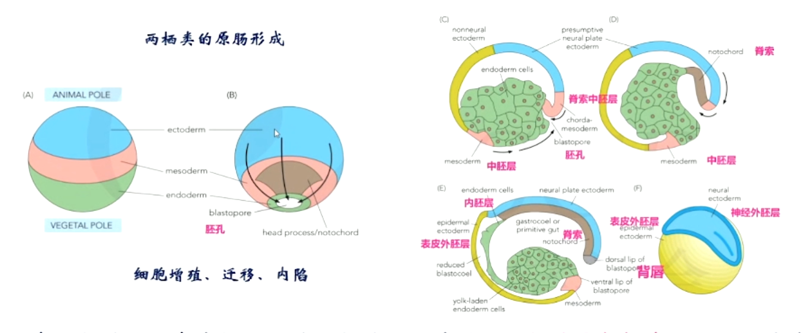

#### 鸟类和哺乳类动物的原肠胚形成

鸟类和哺乳类动物的受精卵首先在输卵管内发育形成全能干细胞。

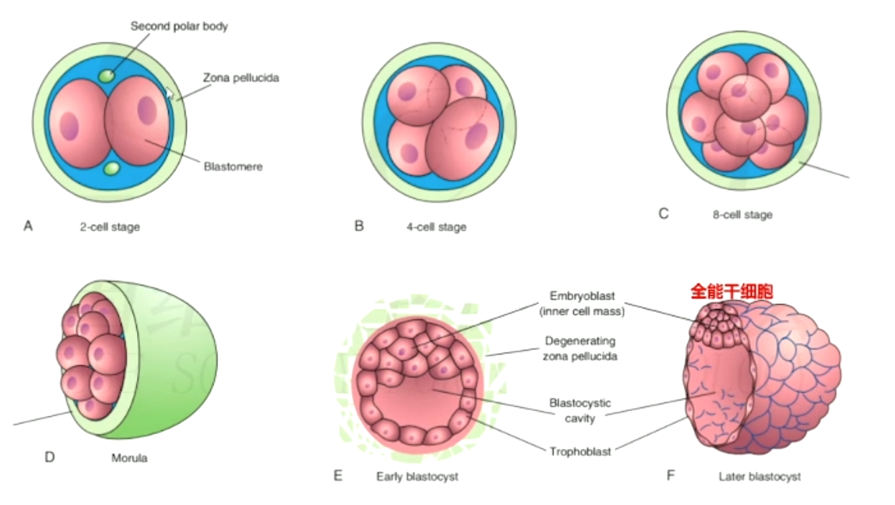

发育到这一阶段后，受精卵从输卵管移动到子宫开始着床并逐渐形成三胚层。

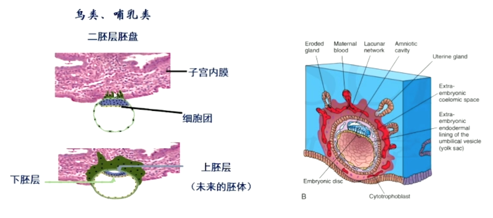

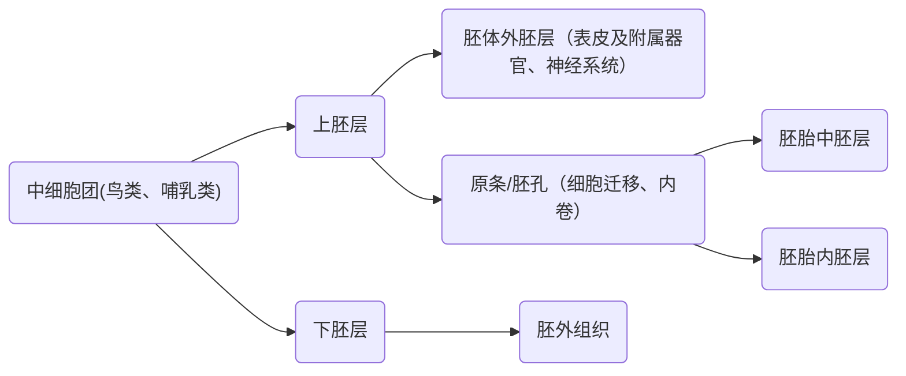

### 神经发育

神经管：为中枢神经系统的原基将分化为脑和脊髓以及松果体、神经垂体、视网膜、内耳、嗅上皮和味觉上皮等。

神经嵴形成：神经管外侧的神经上皮细胞不进入神经管壁，而形成位于神经管背侧的细胞索，该细胞索很快分为左右两条，分列于神经管的背外侧，称为神经嵴。

神经嵴分化为：

1. 周围神经系统的神经节及周围神经；
2. 肾上腺髓质细胞，黑素细胞、甲状腺滤泡旁细胞、颈动脉体的 I 型细胞；
3. 头面部分骨、软骨、肌肉及大动脉根部。

外胚层表面的细胞将分化为皮肤的表皮及其附属器、牙釉质、角膜上皮、晶状体、内耳膜迷路、腺垂体、口腔、鼻腔与肛门的上皮。

## 神经诱导和体轴决定

### 神经诱导

神经诱导是神经组织从外胚层衍化的分子机制。

两栖类的背唇可以诱导形成神经系统（蝾螈背唇移植实验），类似的鸟类中有 Henson's node，哺乳类有 node。

### 两栖类背唇

背唇—--组织者（Spemann's organizer）：

1. 可诱导改变受体腹侧细胞的分化命运；
2. 可组织受体和供体的组织形成具有前-后和背-腹轴向的胚胎，因此，背唇又被称为组织者（organizer）；
3. 背唇组织者本质上是中胚层细胞。

背唇功能：

1. 具有形成背方中胚层的功能，脊索前板、脊索
2. 启动原肠形成的细胞迁移
3. 使背方外胚层神经化
4. 神经板的基本定型和使神经板成为神经管

#### 背唇如何诱导成为神经组织？

**神经诱导的双重抑制假说**：外胚层具有形成神经组织的潜能，但是潜能被某些因子（BMP等）所抑制，当这些因子的抑制作用被阻断后，外胚层细胞产生神经组织的潜能得以发挥，进而形成神经组织。

背唇分泌 NOGGIN、CHORDIN、FOLLISTATIN 等蛋白，可阻断BMP信号通路，使背侧外胚层发育形成神经板。

### 神经系统的发育

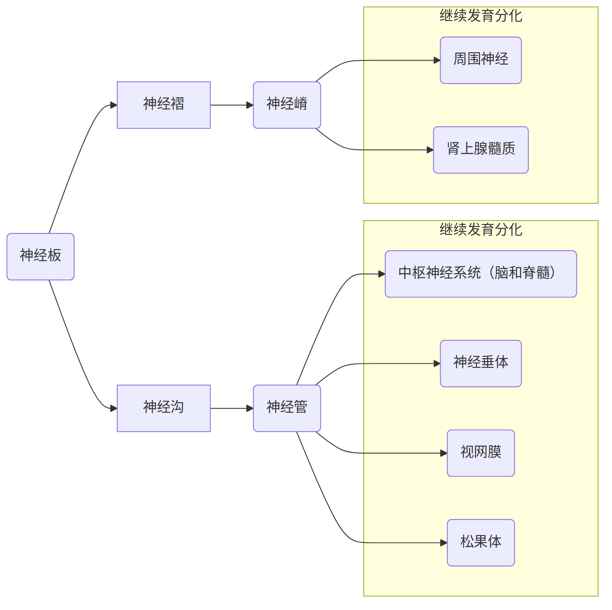

神经管继续发育分化形成中枢神经系统：

- 形态：形状发生急剧变化，神经管各部位或膨胀、或压缩，最终形成大脑（brain）、脊髓（spinal cord）的各部位及各个腔室。
- 解剖结构：神经管壁的神经上皮细胞（神经干细胞）经过不断的增殖、迁移发育形成大脑和脊髓各个不同区域的组织
- 细胞水平：神经上皮细胞分化产生种类繁多的神经元和神经胶质细胞

### 神经管发育形成脑和脊髓及其不同功能区

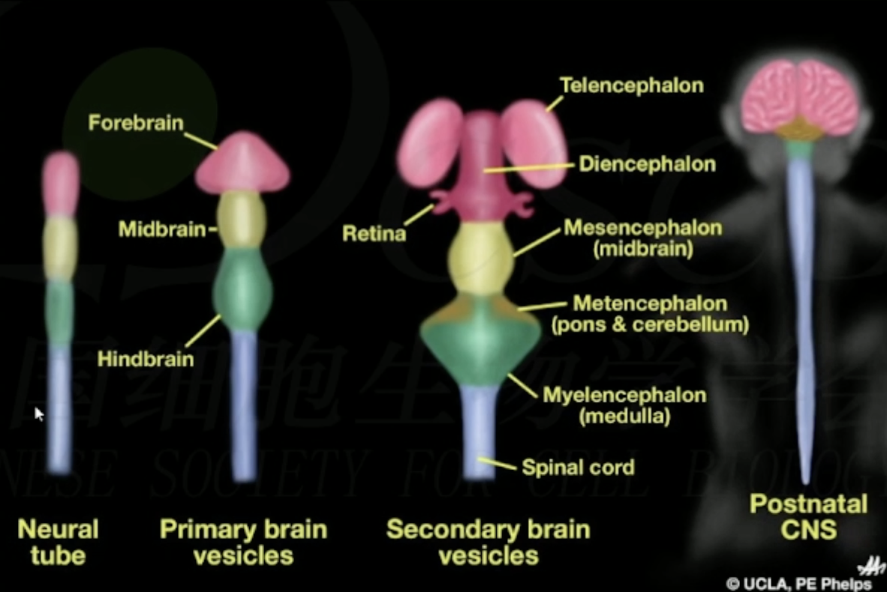

### 体轴的形成

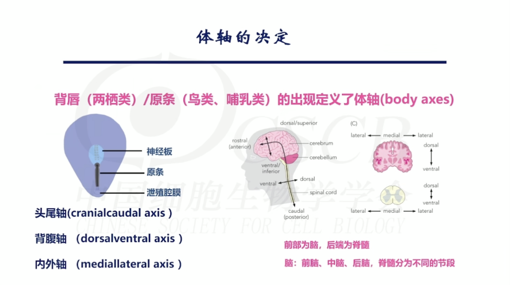

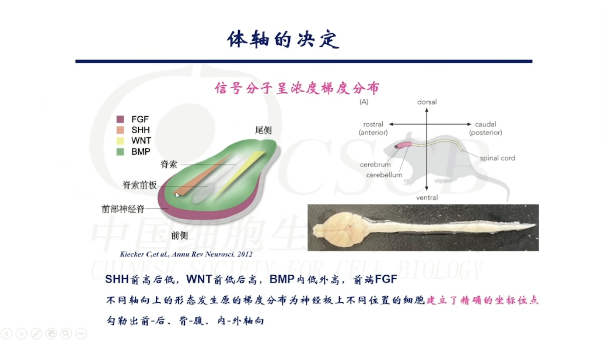

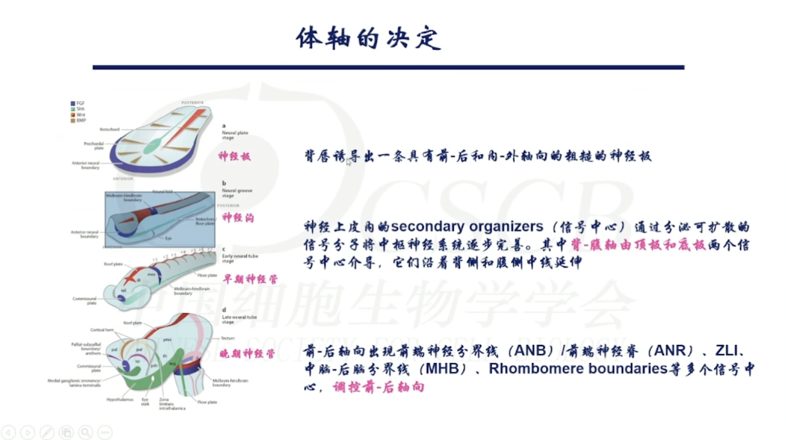

前后轴：**信号分子**与**转录因子**协同作用调控模式形成。转录因子的特异性表达，与信号中心分泌的信号分于共同发挥作用。

背腹轴：脊索诱导产生底板和脊髓前角运动神经。在腹侧，不同浓度的形态发生原调控不同的细胞命运

胞外信号和细胞内在遗传机制协同作用精准调控各类细胞命运。

- 胞外信号：SHH.BMP.WNT.FGF．RA等
- 内在机制：转录因子、非编码RNA以及DNA甲基化、组蛋白修饰、染色质重塑等表现遗传机制

形态发生原：以**浓度梯度**方式分布、决定形态发生和细胞命运的信号分于称为形态发生原（morphogen）

#### 转录因子

- 同源盒基因（Hox gene）：含有保守的同源盒结构域（homeodomain，一般60个氨基酸组成）的转录因子家族，在胚胎发育中至关重要，该家族分为 Antennapedia（ANTP），Paired（PRD，PAXG），LIM（如LHX6）以及 NK 等亚家族。
- bHLH 转录因子：指含有碱性区域（basic region）和螺旋-环-螺旋（HLH）结构域的转录因子超家族，包含Hes、Id、Ngn和Oligo 等家族。
- 叉头蛋白（Fork head）：“螺旋-转角-螺旋”类蛋白，也称为翼状螺旋结构域，分为从A到S的19个亚家族

### 信号中心与级联诱导

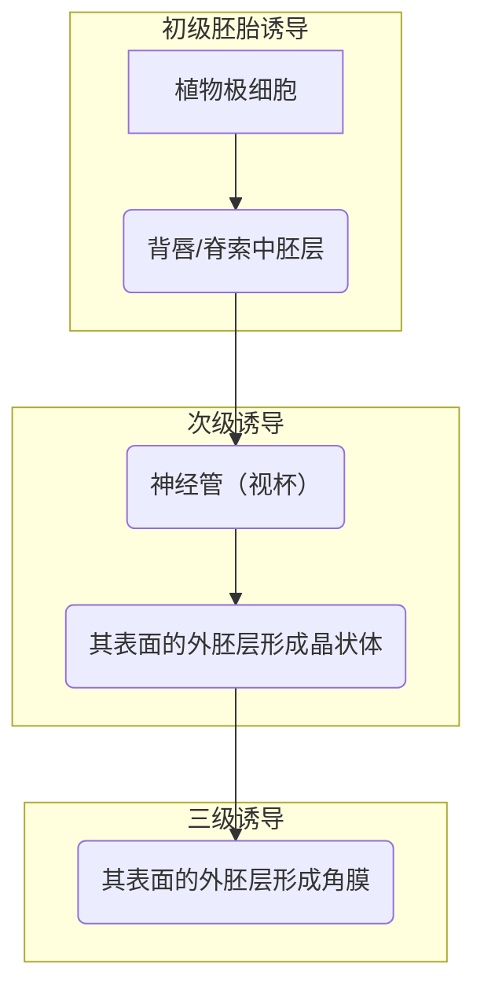

### Neural Tube Patterning

三个原始脑泡是脑的原基

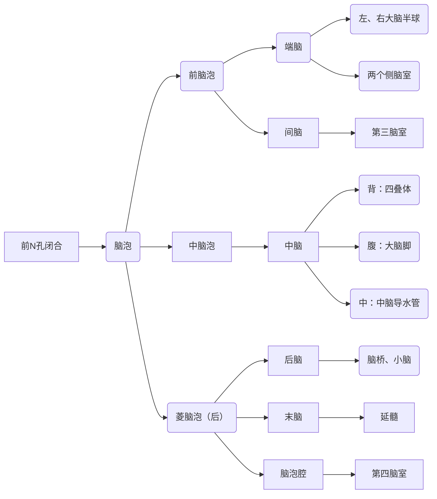

1. 前-后、背-腹和内外轴向的确立使得 Neural tube 初步被划分为不同的特定区域，也即神经管上皮细胞（神经干细胞）在发育早期虽然是多潜能的（multipotent），但是已经具有了特定的位置属性（positional identity）
2. 每个特定的区域将进一步细化

## 模式形成与功能区域化

### 端脑的模式形成

模式形成（Pattern formation of Telencephalon），功能区域化（arealization，regionalization）

神经发育过程中严密调控的两个过程：
1. 在将定脑区产生**数量恰当**的神经细胞
2. 产生**正确类型**的神经细胞（不同类型的神经元和胶质细胞）

启动细胞分化使之成为特定类型的神经元，发育形成结构复杂并高度组织化的神经系统的特定结构和功能区。

神经干细脆进一步获得位置信息，其机制与体轴决定时信号与转录因子的调控一致。

### 功能区域的形成

输入信息和神经元活动对功能区域的精化。

## 总结

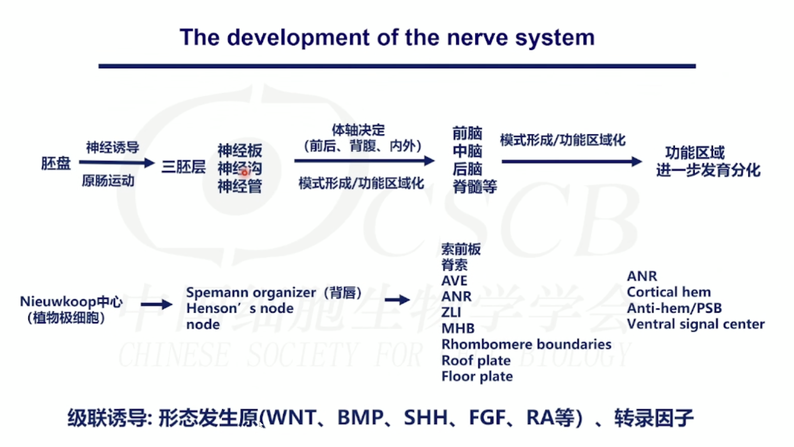

## References

- 神经科学课程
- 神经科学，韩济生主编
- 发育神经生物学，蔡文琴主编
- NEUROSCIENCE Edited by DALE PURVAES et al.
- PRICIPLES of NEURAL SCIENCE Edited by ERIC R. KANDEL et al
- DEVELOPMENTAL NEUROBIOLOGY Edited by ERIC MAHENDRA S. RAO and MARCUS JACOBSON
- THE DEVELOPING HUMAN-CLINNICALLY ORIENTED EMBRYOLOGY Edited BY Keith L., Moore, et al.
- LARSEN'S HUMAN EMBRYOLOGY Edited BY GARY C. SCHOENWOLF et al.
- LANGMAN's MEDICAL EMBRYOLOGY Edited by T.W.SADLER
