# 神经元的生成

神经科学第五讲，讲者：禹永春（复旦大学），主持人：朱筱娟教授（东北师范大学）。

大脑皮层 ~2500$cm^2$ 的面积下，约有 160 亿个神经元，形成了高度有序化的结构（ 六层结构、皮质功能柱、皮层区域化），其中约有 80% 兴奋性神经元、20% 中间神经元以及多种类的胶质细胞，神经元/胶质细胞是如何精确发育形成神经环路来执行我们的感知、运动、语言、情感、认知等脑功能仍是一个需要进一步探索的问题。

<!-- end -->

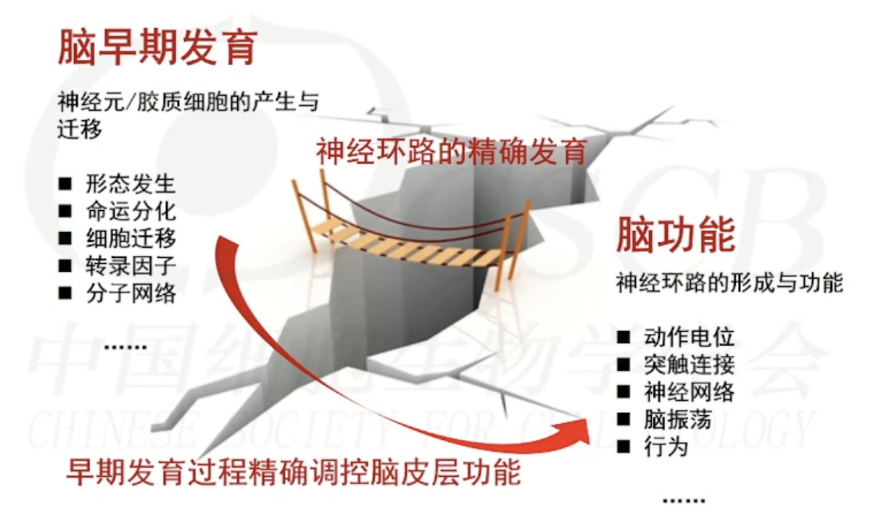

上一讲：[神经系统的发生与分化](../11/development-of-nerve-system.md)，下一讲：[神经元的发育](../17/neurogenesis-2.md)

## 大脑皮层发育是一个高度调控的过程

在适当的时间产生相应数量和类型的神经细胞，并迁移到适当的位置，逐步分化成熟形成复杂而精确的局部和远程神经连接。

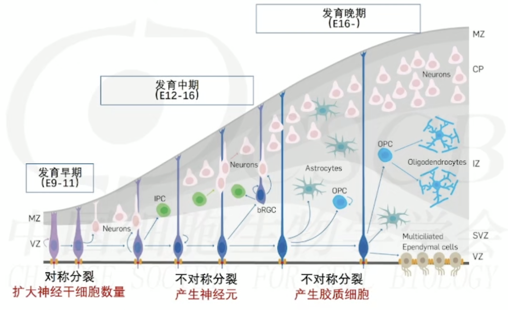

对一个早期发育中的脑切片，可以看见脑室区（Ventricular zone, VZ）、中间带（Intermediate zone, IZ）和皮层板（Cortical plate, CP），脑室区中存在大量神经干细胞，它们分裂产生不成熟的神经元，这些神经元随之向皮层板迁移。

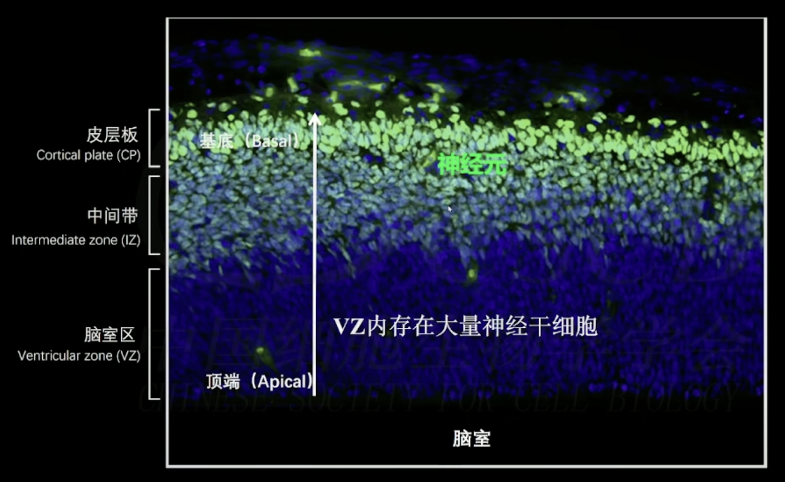

## 神经干细胞

### 神经上皮细胞

神经上皮细胞（Neuroepithelial cells, NECs），特征：

1. 出现在发育早期（小鼠E9-11），不产生神经元；
2. 高度极化；
3. 增殖的对称分裂（分裂后产生相似的细胞），区间动态核迁移增殖；
4. 扩充神经前体细胞池。

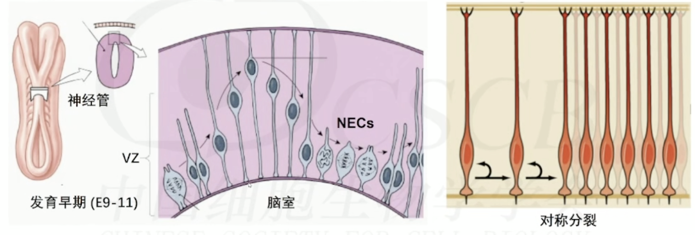

### 放射状胶质细胞

放射状胶质细胞（Radial glial cells, RGCs），特征：

1. 负责产生皮层几乎所有的神经元和神经胶质细胞；
2. 高度极化：“顶天立地”；
3. 仍保留了一部分NECs的特性，如还会进行对称分裂；
4. 不对称分裂：直接产生神经元或其他神经前体细胞；
5. 顶端纤维：神经元迁移的“脚手架”；
6. 具有高度区域特异性：产生区域特异性（脑区）的细胞和数量；
7. 发育晚期，少部分RGCs进入到神经胶质细胞发生阶段，产生神经胶质细胞。RGCs逐渐消失，只有少部分转化为成体神经干细胞和室管膜细胞。

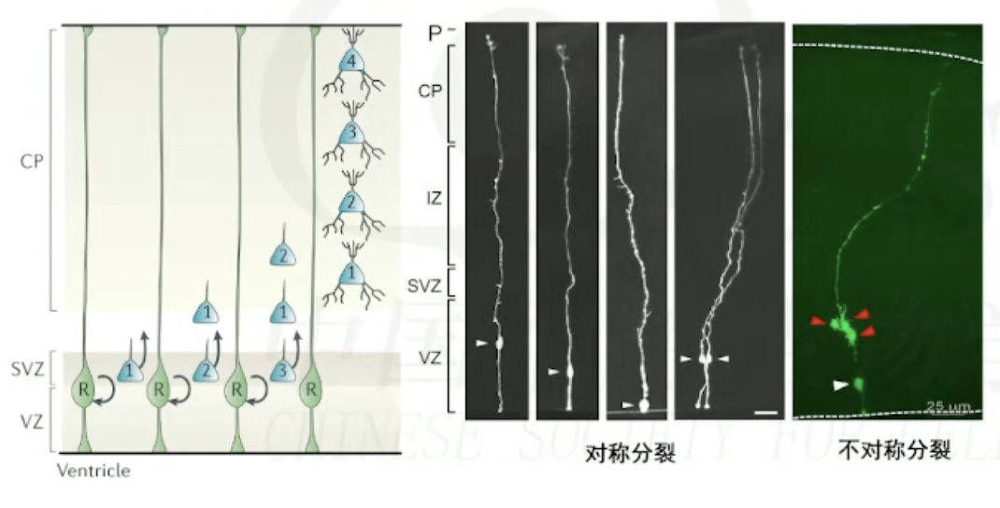

1. RGCs在有丝分裂周期中，细胞核沿着细胞的顶-基轴径向移动，该过程称为**区间动态核迁移**。
2. 在M期，细胞核迁移到VZ表面进行细胞质分裂。
3. 形成典型的假复层（pseudostratified）结构，有助于在有限的空间内容纳更多的神经干细胞。

#### 放射单元假说

放射单元假说（radial unit hypothesis）认为在皮层发育过程中，由克隆相关神经细胞沿着相同放射状胶质纤维的迁移形成的个体发育，是成体皮层的功能性基础元件。这一假说的结构与皮层功能柱存在相似，但二者的关联尚未完全清晰。

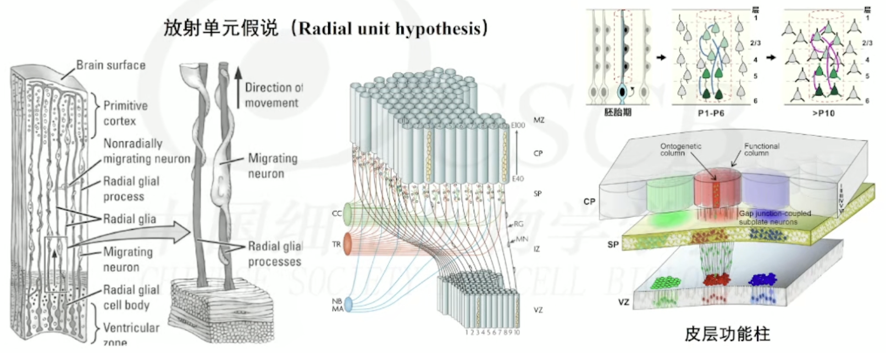

### 中间前体细胞

中间前体细胞 （Intermediate progenitors, IPs），特征：

1. 由RGCs非对称分裂产生；
2. 主要存在于SVZ（表达Tbr2）；
3. 间接神经发生；
4. 主要呈双极（vIP）和多极（olP）形态；
5. 贡献皮层~80%神经元（啮齿动物）；
6. 啮齿类动物大部分IPs只进行一次对称分裂产生两个神经元，而灵长类动物IPs可进行多次对称分裂并产生更多的神经元。

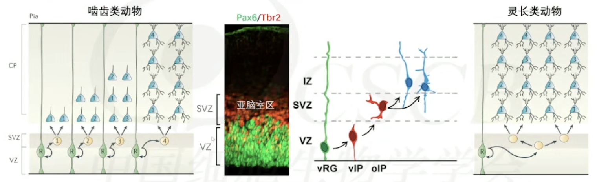

### 基底放射状胶质细胞

基底放射状胶质细胞 （basal radial glial cells, bRGCs），特征：

1. 由RGCs非对称分裂产生；
2. 间接神经发生；
3. 主要存在于OSVZ；
4. 可增殖性对称分裂；
5. 主要呈单极形态；
6. 可间接产生神经元或IPS；
7. 具有沟回皮层结构动物（包括雪貂、灵长类动物等）产生神经元的主要方式。啮齿类动物有极少的bRGCs。

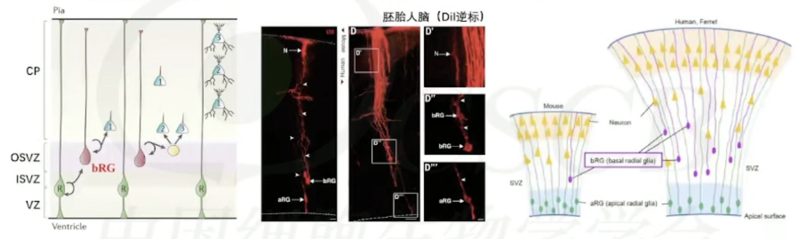

bRGCs 细胞将 SVZ 分为 OSVZ 和 ISVZ 两个区域。

## 大脑皮层的进化

### 为什么人类拥有更高等智力？

大脑的容量大不等于聪明，例如大象没有人聪明。更可能的是直接与神经元的数量相关，据实验估计小鼠约 7000 万个神经元，人类约 860 亿个神经元。

大脑重量仅为体重的~2%。却消耗了身体25%的能量：500kCal/天，即10亿神经元=6kCal/天！如果小鼠拥有和人一样多的神经细胞（~860亿），那么小鼠的大脑重量将达到36Kg！那么进化的一个问题就是如何在有限的颅腔里容纳更多的神经细胞以及摄取更多的能量！

假设非人灵长类动物平均每天进食8个小时，那么据推算 530 亿神经元的动物可以到 25Kg 体重，450 亿神经元的动物可以达到 50Kg 体重，300亿神经元的动物最大可以达到 75Kg 体重，120 亿神经元的动物可以达到 100Kg 体重，而人类 860 亿神经元却可以达到 75Kg 的体重。

人类在进化过程中通过大规模劳动获取更多的能量，因此人类进化的本质是大脑的进化。

### 大脑沟回产生促进更高智力的形成

大脑皮层沟回形成是逻辑、思维、认知、情感、精细运动、语言、意识等脑高级功能基础。在进化上具有极其重要的意义。

如果出现无脑回/巨脑回畸形，会导致智力低下、癫痫等。这是一类遗传疾病，诊断简单（MRI），存在高风险治病基因，但仍然大量治病基因目前不清楚。

沟回结构在进化分支中独立出现，大脑沟回结构具有保守性和差异性。一级沟回 （Primary folds），物种间保守。二级沟回（Secondary folds），物种间存在差异，物种内保守。三级沟回（Tertiary folds），物种内个体间存在差异。

#### 沟回的形成

##### 牵张力学说与皮层扩张学说

早期有科学家猜测沟回形成是由于生长过程中的轴突形成后张力纤维在不同区域间的产生不同的牵张力形成的。但是经过外科医生实验，在切断张力纤维后，沟回结构仍然可以形成，因此牵张力不是沟回形成的唯一的原因。

另一种说法是皮质扩张机制，即在有限容积内，皮质的扩张必然导致折叠。但是在外科实验中，在去除颅骨束缚后，仍会产生沟回结构。

##### 皮层沟回发育的细胞学机制

人类皮层有沟回，而小鼠没有沟回，二者差距主要有三个方面：

- 发育时间：小鼠妊娠18天，人妊娠40周；
- 干细胞类型：灵长类特异存在OSVZ（oRGs）；
- 神经元迁移：小鼠垂直径向迁移，灵长类径向发散迁移。

##### 基因调控机制

沟回脑具有皮质折叠的遗传基因地图（The genetic protomaps），在皮层沟回形成之前以模块模式表达，调控沟回形成。

## 兴奋性神经元产生

### 神经元迁移

兴奋性神经元迁移主要有三种形式：早期主要依赖于细胞体移动，中期主要通过胶质细胞的顶端突起介导移动（主要是分化该神经元的干细胞），还有通过依赖顶端突起与软脑膜的牵拉力的终端胞体移动。

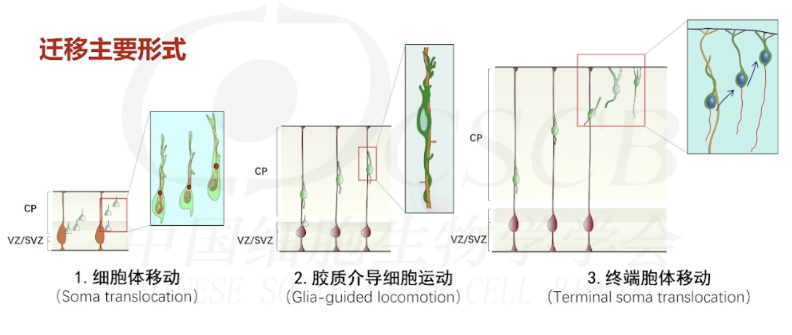

神经元的迁移与定位遵循“出生时间依赖性的由内到外”的规则(birthdate-dependent inside-out)

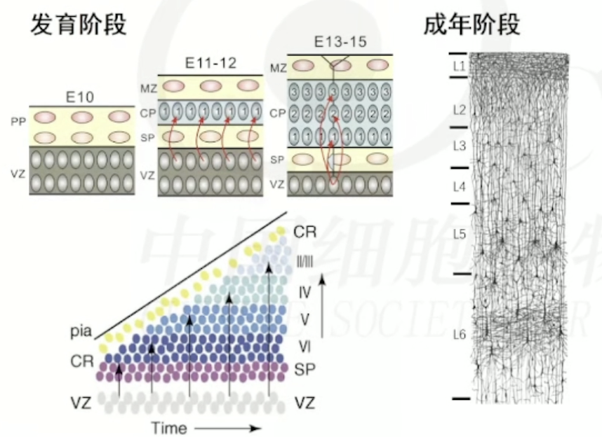

### 神经元命运

神经元的迁移未知

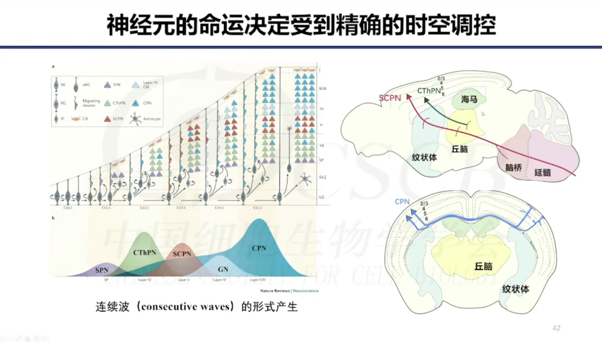

#### 预先决定的命运限制假说

预先决定的命运限制 （pre-determined fate restriction）即神经干细胞具有异质性，不同亚型的神经干细胞产生特定亚型的神经细胞，因此神经细胞的命运在发育早期就已确定。

#### 命运逐渐受限假说

命运逐渐受限 （temporally progressive fate restriction）即神经干细胞在发育早期具有多能性，但随着发育的进行，其分化潜力逐渐受限，因此在发育的不同时间点产生不同亚型的神经细胞。

## 抑制性神经元的产生与迁移

### 抑制性神经元的产生

对大脑做水平面切片，可以看见腹侧有三个隆起区域，

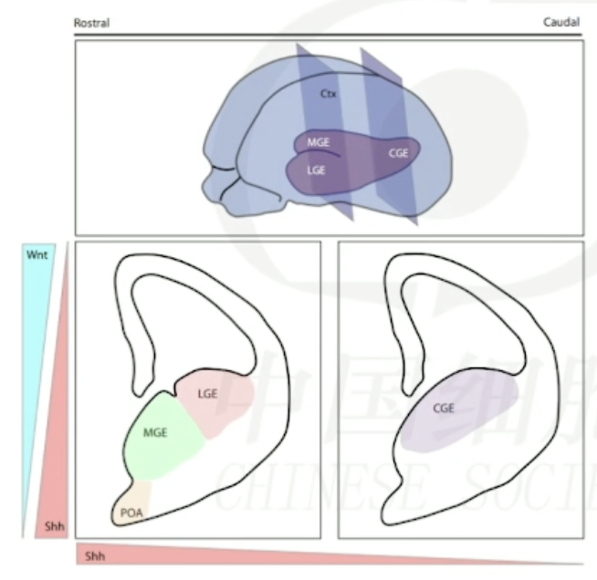

抑制性（中间）神经元主要从抑制性神经元的起源内侧神经节隆起（medial ganglionic eminence, MGE）、尾侧神经节隆起（caudal ganglionic eminence, CGE）、视前区（preoptic area, PoA）产生。而外侧神经节隆起（lateral ganglionic eminence, LGE）主要是嗅球中间神经元及纹状体投射神经元。

#### 腹侧隆起区的神经前体细胞

腹侧隆起区的神经前体细胞，特征：

1. 存在大量bRGCS；
2. 随着发育，aRGCs数量显著减少，SVZ则显著扩增，包含大量的IPs；
3. IPs可进行多次对称分裂；
4. 存在两类aRGCs；
5. 随着发育，投射至软脑膜表面的aRGCs数量减少，血管锚定的RGCs数量增多。

### 抑制性神经元的迁移

与兴奋性神经元在皮层产生不同，抑制性神经元的产生位置在腹侧隆起产生，多数需要经过一段较长的迁移后到达皮层。

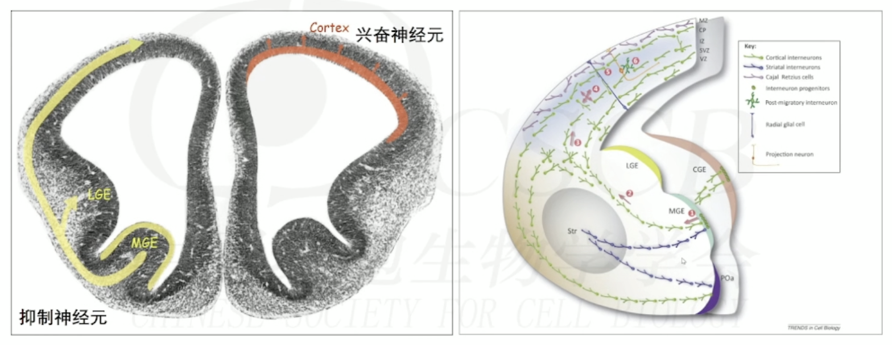

抑制性神经元的迁移大致分为四步，但其中许多细节仍未清楚。

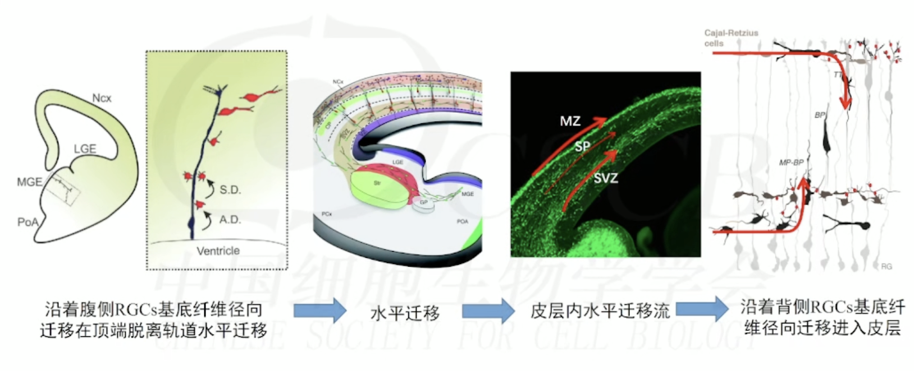

抑制性神经元在迁移过程中会形成不同的迁移流，主要是由于铆钉在软脑膜的干细胞生成的中间神经元会沿着边缘区水平迁移，而锚定在血管上的干细胞生成的神经元则会沿着侧脑室区（SVZ）迁移。切向迁移路线的选择与中间神经元的起源地、出生时间和类型等相关。小鼠大脑皮层中的中间神经元在出生后两周内有大约30-40%发生凋亡。

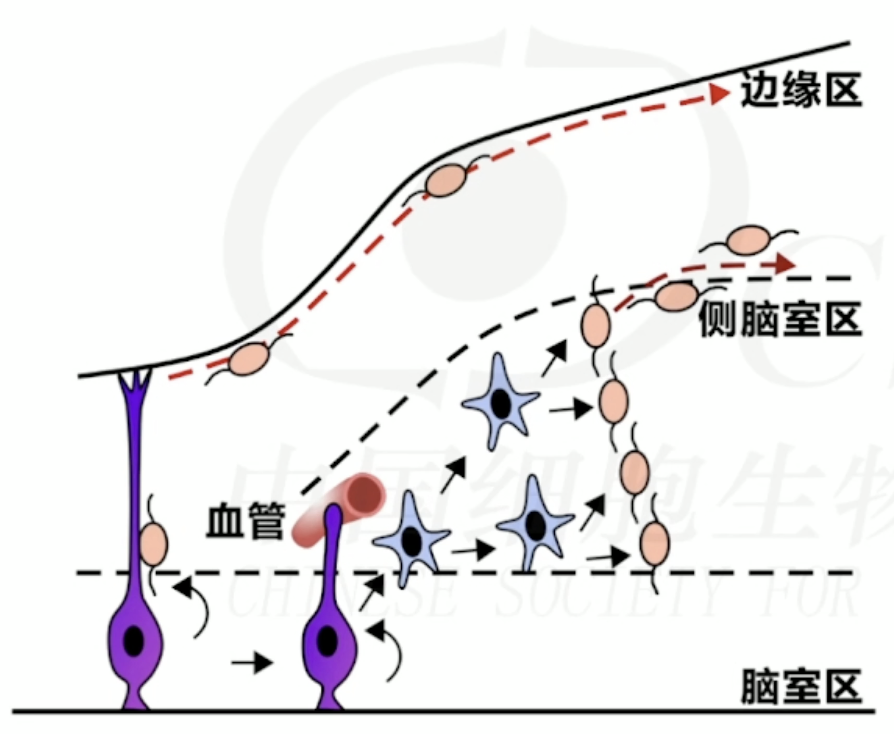

### 抑制性神经元的命运

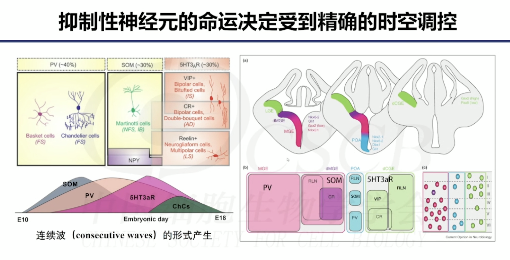

## 神经胶质细胞的产生

在神经细胞生成后，大脑会进一步分化产生神经胶质细胞。

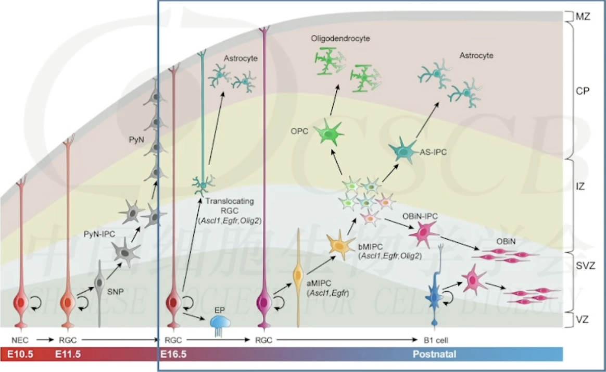

神经胶质细胞的分化比例：

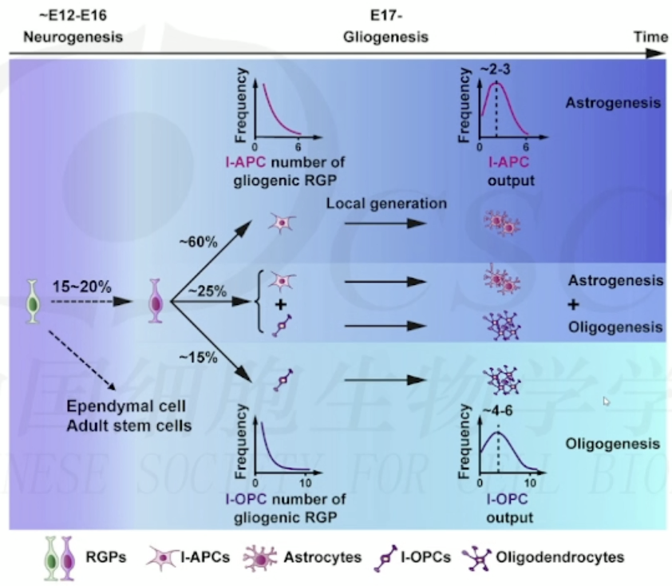

少突胶质细胞（oligodendrocytes, OLs）呈现三波产生的时空特征，第一波从 MGE/PoA(E12.5)产生，第二波从 LGE/CGE(E15.5) 产生，第三波从背侧 RGCs(E16.5)产生。值得注意的是，第三波产生时第一波产生的OLs大量凋亡，因此在成年时的 OLs 主要来源于第二和第三波，并且保留大量具有分裂能力少突胶质细胞的前体细胞（OPCS）。

## References

1. 《神经科学》韩济生主编（第4版）
2. "Principles of Neural Science", E.R. Kandel主编（第六版）
3. «Principles of Neurobiology» ,Liqun Luo主编（第二版）
4. 《现代医学神经生物学》，段树民/徐天乐主编
5. Kohwi M, Doe CQ. Temporal fate specification and neural progenitor competence during development. Nat Rev Neurosci. 2013, 14(12): 823-38.
6. Wurst W, Bally-Cuif L. Neural plate patterning: upstream and downstream of the isthmic organizer. Nat Rev Neurosci. 2001, 2(2): 99-108.
7. Gao P, Postiglione MPet al. Deterministic progenitor behavior and unitary production of neurons in the neocortex. Cell. 2014, 159(4): 775-88.
8. Wang X, Tsai JW, et al. Asymmetric centrosome inheritance maintains neural progenitors in the neocortex. Nature. 2009, 461(7266): 947-55.
9. Shao W, Yang J, He M, et al. Centrosome anchoring regulates progenitor properties and cortical formation. Nature. 2020, 580(7801): 106-12.
10. Shen Z, Lin Y, et al. Distinct progenitor behavior underlying neocortical gliogenesis related to tumorigenesis. Cell Rep. 2021, 34(11): 108853.
11. Koo B, Lee KH, Ming GL, et al. Setting the clock of neural progenitor cells during mammalian corticogenesis. Semin Cell Dev Biol. 2023, 142: 43-53.
12. Lui JH, Hansen DV, Kriegstein AR. Development and evolution of the human neocortex. Cell, 2011, 146: 18-36.
