# 神经元的发育

神经科学第五讲，讲者：禹永春（复旦大学），主持人：朱筱娟教授（东北师范大学）。

在脑的发育过程中大量神经元的产生，它们不仅会定位到正确的位置，同时会形成不同功能、类型的神经元，让我们拥有了无与伦比的大脑结构。它不仅在早期时候时候产生了神经元，也指导我们在发育过程中形成了精巧的神经环路。尽管我们对它们的形成有一定的了解，但是仍然十分有限，有待进一步探索。

<!-- end -->

上一讲：[神经元的生成](../14/neurogenesis-1.md)

## 大脑皮层功能区域特化

大脑皮层功能区的形成过程称为大脑皮层功能区域特化；每个区域都有其**特异的**细胞组成、数量、密度、分层结构、连接方式以及信号输入和输出模式；大脑皮层的区域化受到**多种内外机制的协同调控**，包括发育早期的信号分子或形态素、神经干细胞和新生神经元中转录因子的表达、以及皮层外部的信息输入等。

形态素（morphogens）对大脑区域特化发育起到了至关重要的作用。形态素从形态发生原开始形成浓度梯度。多种形态素协同作用，熟知的形态素有纤维细胞生长因子 （FGFs）、无翅因子（Wnt）、音猬因子（SHH）、骨形成蛋白（BMP）、视黄酸（RA）、生长分化因子（GDF）等。

转录因子（transcription factors, TFs）是能够结合到DNA特定区域并调控基因转录的一类蛋白质，是调节基因表达的主要机制之一。转录因子对大脑区域特化发育起到了关键作用，例如有 EMX2、PAX6、COUP-TFI 和 SP8 等。转录因子的表达受到多种因素的影响（包括形态素）。转录因子的表达受到多种因素的影响（包括形态素）。

除了信号分子和转录因子等内在调控机制外，外源功能输入（包括视觉、听觉、嗅觉、触觉、运动以及学习等）对大脑皮层功能区域化的形成也起到了至关重要的作用。丘脑皮层投射（thalamocortical afferents, TCA）是多数功能输入的输入通道，发育过程中，各种TCA之间可相互影响。TCA在胚胎发育期就开始投射至大脑皮层，对神经前体细胞区域特性的形成产生重要影响。大脑皮层功能区域特化是由分子信号/转录因子和TCA之间的复杂相互作用调控的。

### 形成机理的假说

**原图假说**（protomap）认为发育早期的信号分子（形态素）和转录因子等内在调控机制，决定了神经元的类型和功能连接等特性，从而调控皮层的区域化形

**原皮层假说**（protocortex）认为大脑皮层最初是均质的，具有相同潜能，发育后期的外部信号输入调控皮层区域化形成，尤其是丘脑的轴突输入。

结合上述两个假说，有学者提出了**系列同源精细化模型**（Serial homology and refinement model），认为内在区域特异性基因表达驱动了皮层区域化的初始形成（即原图假说），发育后期的外部功能输入（即原皮层假说）则进一步完善区域功能连接和清晰区域边界的形成。

## 轴突发生

### 神经元特化

神经元是高度特化（即高度分化）的细胞，在发育过程中神经元分化的过程称为神经元特化。

神经元轴突的发生首先是形成板状伪足，然后形成多个突起，其中一个突起会特化成轴突，其他形成树突，轴突于树突会进一步生长，然后在树突上形成树突棘。新生神经元打破对称性，形成轴突和树突这种不对称性结构的过程称为神经元极化。神经元一般只会生成一根轴突。

有意思的是，轴突的地位并非“不可动摇”。如果在发育过程中在靠近远端的位置剪断轴突，轴突可以继续生长，而如果在靠近胞体的位置剪断轴突，树突也可以再次发育成轴突。在发育过程中具有很强的可塑性。

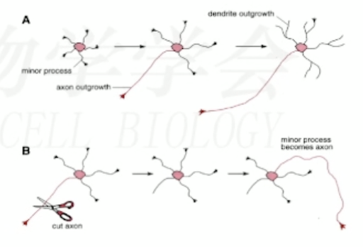

轴突发生受到细胞内信号转导和细胞外因子的调控。细胞内信号传导有PI3K/GSK-3信号通路、小GTP酶家族/Par家族以及细胞骨架蛋白等多个因素的共同参与。细胞外因子有Netrin-1、Wnt、Laminin、BDNF、Sema3A等。

### 轴突生长

神经元轴突的生长依赖于其顶端特化的生长锥结构，生长锥结构内包含板状伪足和丝状伪足。

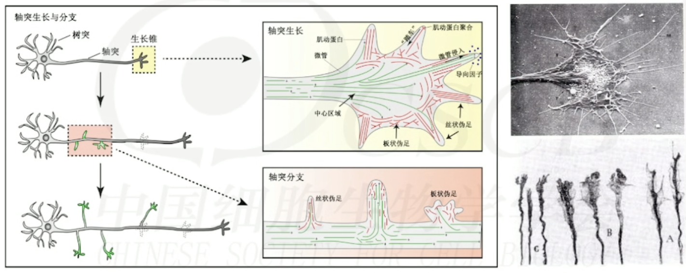

生长锥的主要由微丝肌动蛋白（F-actin）和微管蛋白形成的微丝和微管组成。这两种结构可以通过解聚和聚合来收缩和生长。

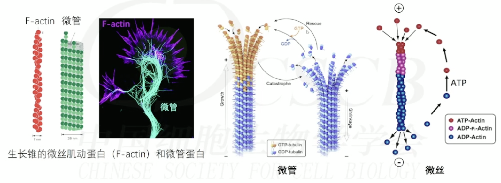

### 轴突运输

轴突的生长依赖于各种物质的不断补充才能继续，神经元沿着轴突微管双向运输不同的物质称为轴突运输。轴突运输依赖于ATP。微管是轴突运输的基础，为运输提供了道路和方向。

轴突运输是双向移动物质：

- 顺向：从胞体到轴突末端，主要有马达蛋白kinesin，运送囊泡、细胞器、蛋白质和RNA颗粒等；
- 逆向：从轴突末端到胞体，主要有马达蛋白dynein和dynactin，运送自噬小体、线粒体等。

轴突运输对不同物质运输速率相差多达上千倍

* 快速转运：顺行转运200-400毫米/天（2-10微米/秒），主要运送膜结构相关（包括囊泡和含膜细胞器）、线粒体和维持轴突代谢所需蛋白质；
* 慢速转运：0.2-1毫米/天，主要运送细胞骨架元件和中间代谢的可溶性酶；
* 逆行运输：溶酶体系统进行降解，或进入核内调节基因表达，或到高尔基复合体进行重新包装，这些因素确保了神经元的存活并调节神经元基因表达。

### 轴突导向

轴突存在远距离导向的寻路（pathfinding）过程。

轴突寻路中受到轴突导向因子的影响，不同区域有多样的轴突导向因子。可以通过实验确定某种物质是否为轴突导向因子。

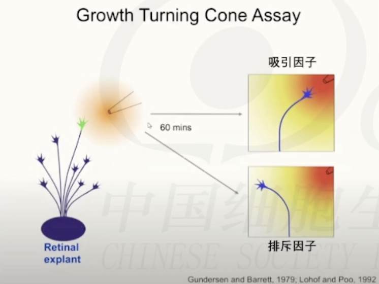

轴突导向涉及四种类型因子的协调作用：短程吸引因子、短程排斥因子、远程吸引因子和远程排斥因子，其中远程指的是轴突在较远位置感受到其存在。同时轴突导向过程中可以感受到浓度，并向着浓度高（低）的方向生长。

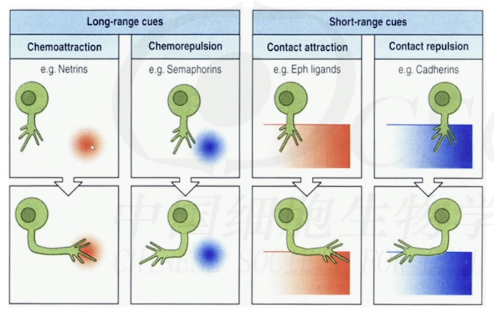

### 轴突修剪

轴突到达目标区域后，会进行轴突修剪，有大小规模两种。

**小规模短轴突末端的分支修剪**：以肌纤维为例，发育过程中神经元会与许多的肌纤维建立连接，但在经过修剪后，每个肌纤维会只接受一个神经元的输入。

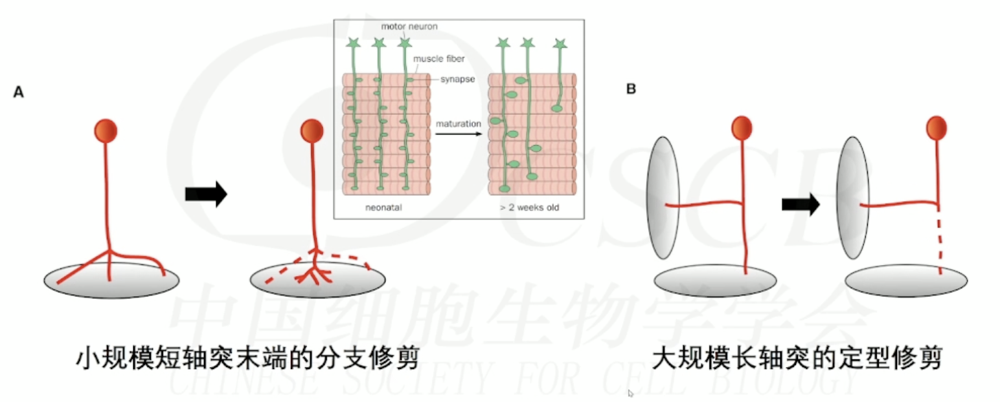

**大规模长轴突的定型修剪**：

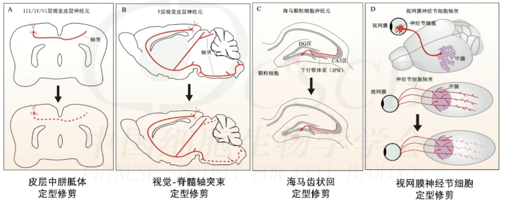

## 树突发生

树突的发生分为三个阶段，其中第二阶段树突会大量发生。树突在生长过程中存在自我回避，也存在细胞间的回避。

树突的分级生长，树突的生长与修剪，越早产生的树突越稳定（优先修剪层次高的树突）

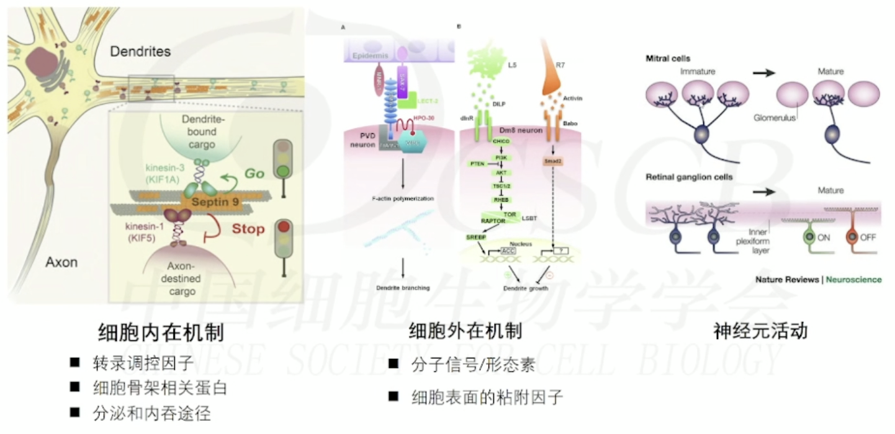

### 树突棘

树突棘（dendritic spine）树突棘有类别，已知的有蘑菇型（Mushroom）、短粗型（Stubby）、细长型（Thin）、分叉型（Cup）、伪足（Filopodium），其中前两种为成熟/稳定状态，后三者为不成熟/不稳定状态。

Penzes, et al., Molecular and Cellular Neuroscience, 2011

树突棘的发育有特异识别、微管蛋白的招募和装配、修剪和成熟与稳定阶段。

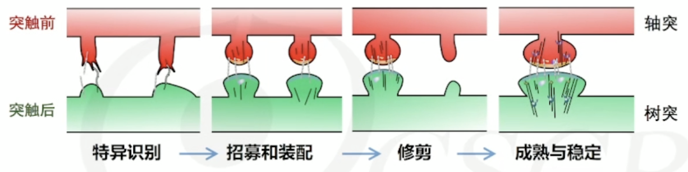

幼年时期树突发育大量的树突棘，8月～1.5岁达到高峰。青少年时期树突棘被大量修剪，到成年时期稳定，树突棘密度仅为幼年期的50~60%。树突棘修剪的主要机制是学习！

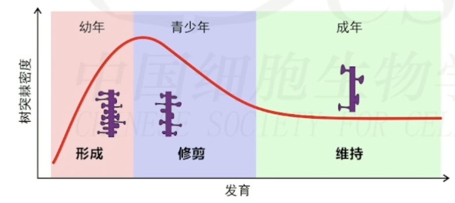

### 树突棘发育模型

树突棘发育主要有三种模型，分别是 Sotelo 模型、Miller/Peters 模型和 Filopodial 模型。Sotelo 模型认为树突棘的形成与轴突无关，只有当树突棘发育到一点程度后，才会与轴突建立连接并进一步发育。Miller/Peters 模型认为树突棘的发育首先要树突与轴突接触，然后树突长出树突棘并发育。Filopodial 模型则认为树突在发育过程中会长出丝状伪足，只有当丝状伪足接触到轴突后，才会形成树突棘。

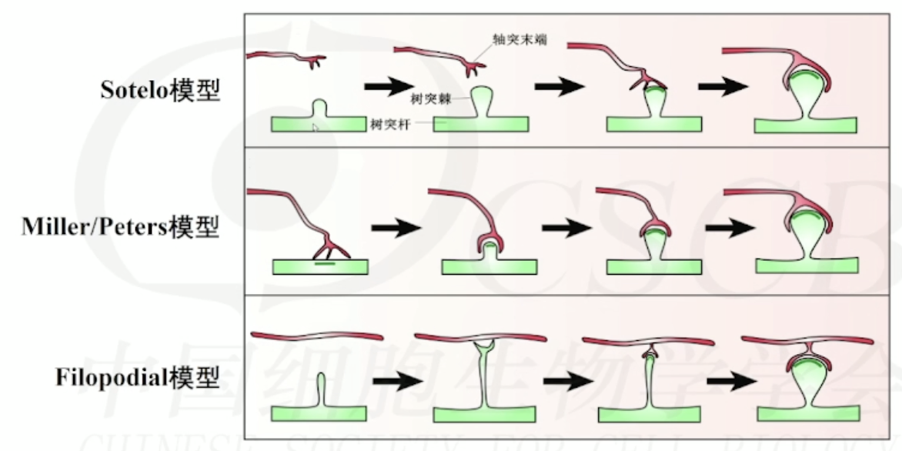

实际上，在不同的脑区内树突棘连接的建立是多样的。因此有学者提出了统一模型：神经元根据不同的情况采取其中一种或多种策略来促进树突棘的形成，保证环路的正确连接以实现大脑功能。

## References

1. 《神经科学》韩济生主编（第4版）
2. "Principles of Neural Science", E.R. Kandel主编（第六版）
3. «Principles of Neurobiology» ,Liqun Luo主编（第二版）
4. 《现代医学神经生物学》，段树民/徐天乐主编
5. Kohwi M, Doe CQ. Temporal fate specification and neural progenitor competence during development. Nat Rev Neurosci. 2013, 14(12): 823-38.
6. Wurst W, Bally-Cuif L. Neural plate patterning: upstream and downstream of the isthmic organizer. Nat Rev Neurosci. 2001, 2(2): 99-108.
7. Gao P, Postiglione MPet al. Deterministic progenitor behavior and unitary production of neurons in the neocortex. Cell. 2014, 159(4): 775-88.
8. Wang X, Tsai JW, et al. Asymmetric centrosome inheritance maintains neural progenitors in the neocortex. Nature. 2009, 461(7266): 947-55.
9. Shao W, Yang J, He M, et al. Centrosome anchoring regulates progenitor properties and cortical formation. Nature. 2020, 580(7801): 106-12.
10. Shen Z, Lin Y, et al. Distinct progenitor behavior underlying neocortical gliogenesis related to tumorigenesis. Cell Rep. 2021, 34(11): 108853.
11. Koo B, Lee KH, Ming GL, et al. Setting the clock of neural progenitor cells during mammalian corticogenesis. Semin Cell Dev Biol. 2023, 142: 43-53.
12. Lui JH, Hansen DV, Kriegstein AR. Development and evolution of the human neocortex. Cell, 2011, 146: 18-36.
