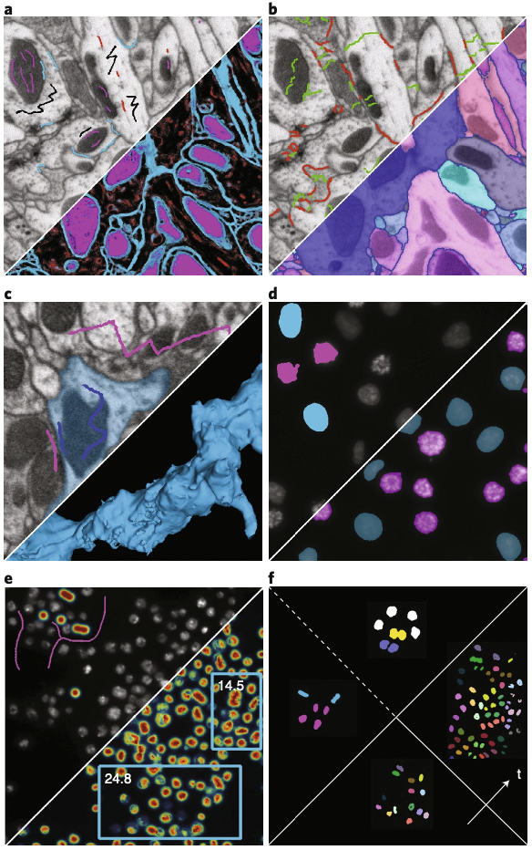

# ilastik 论文分享

ilastik (Berg et al., Nature Methods, 2019) 是一个交互式的生物图像分析软件，主要使用机器学习方法，但其核心卖点却是**无需机器学习经验**。软件开发时间已经无从考证，最早发表在 2011 年 ISBI (CCF-C) 会议上，2016 年在 Springer 出版的书上发表了一篇教程。令人惊讶的是，到了 2019 年，尽管分割任务已经是机器学习的天下，本研究依然能够发表于 Nature Methods 上。

> 1. Sommer, C., Straehle, C., Kothe, U. & Hamprecht, F. A. Ilastik: Interactive learning and segmentation toolkit. in 2011 IEEE International Symposium on Biomedical Imaging: From Nano to Macro 230–233 (IEEE, Chicago, IL, USA, 2011). doi:10.1109/ISBI.2011.5872394.
> 2. Haubold, C. et al. Segmenting and tracking multiple dividing targets using ilastik. In Focus on Bio-Image Informatics. 199–229 (Springer, 2016).
> 3. Berg, S. et al. ilastik: interactive machine learning for (bio)image analysis. Nat Methods 16, 1226–1232 (2019).

**Fig. 1 | User labels provided to various ilastik workflows and the corresponding ilastik output. Workflows and output are shown at the
top and bottom of each panel, respectively.**
a, Pixel classification. Brush stroke labels are used to predict which class a pixel belongs to for all
pixels (magenta, mitochondria; blue, membranes; black, cytoplasm; red, microtubuli).
b, Multicut. Click labels on edges between superpixels (green, false edges; red, true edges) are used to find a non-contradicting set of true edges and the corresponding segmentation.
c, Carving. Object (blue) and background (magenta) brush stroke labels are used to segment one object in 3D.
d, Object classification. Click labels are used to predict which class an object belongs to (blue or magenta).
e, Counting. Clicks for objects and brush strokes for background (magenta) are used to predict how many objects can be found in user-defined rectangular regions and the whole image. 
f, Tracking. Clicks for dividing (cyan) and non-dividing (magenta) objects, clicks for merged (yellow) and single (blue) objects are used to track dividing objects through time (objects of same lineage are shown in the same color). 
Data from the FlyEM team (a–c), Daniel Gerlich Lab (d), the Broad Bioimage Benchmark Collection32 (e) and the Mitocheck project39 (f). Detailed video tutorials can be found on our YouTube channel (https:// www.youtube.com/playlist?list=PL1RliBnTmcHzQTGogF9fw59rbf1c7hFse).

## 写作结构

本文写作结构比较奇特，共 7 页篇幅，首先花了一页介绍 Motivation，然后三页半依次介绍 Workflows，一页半篇幅讨论软件使用、Limitation、兼容性及与其他方法比较，最后一页参考文献。在介绍 Workflows 的过程中，掺杂了三个 Case study、四张 figure、两个 box 和一张表格。

Case study 是一种特殊的写法，主要介绍了三篇使用 ilastik 中某个 workflow 做分析的生物文章（PNAS, 2014; eLife, 2017; Science, 2016)。文章的 fig.1 是示意软件的输入输出，fig. 2-4 则分别在 case study 中引用，并从对应文章的图中 adapting 得到。两个 box 分别介绍如何使用 ilastik 和如何向 ilastik 贡献代码。表格对比了文章的多种 workflows。

个人认为这种特殊的写作结构是很难的，它要求软件已经被社区验证能够解决一些被广泛关注的问题。

## Workflows

ilastik 软件整体以 Workflow 为单位，针对 bioimage 几类主要的需求提供了交互式的分析流程。文章中所谓交互式，指的是用户对图像进行标注后可以实时的看见结果（通常是分割结果）。为了实现这个目标，软件主要选用随机森林来作为分割。

| Workflow name                       | Input data            | Annotation mode                             | Result                                                                              |
|-------------------------------------|-----------------------|---------------------------------------------|-------------------------------------------------------------------------------------|
| Pixel classification or autocontext | Up to 5D              | Brush Strokes                               | Semantic segmentation: assignment of pixels to user-defined semantic classes such as “foreground” or “cell membrane” |
| Multicut                            | 2D/3D + channels      | Mouse clicks on fragment edges              | Instance Segmentation: partitioning of an image into individual objects (instances) |
| Carving                             | 2D/3D                 | Brush strokes inside and outside the object | Single segmented object                                                            |
| Object classification               | Up to 5D              | Mouse clicks on objects                     | Objects categorized in user-defined classes                                         |
| Counting                            | 2D + time + channnels | Brush strokes and clicks on single objects  | Object counts in images and ROIs                                                    |
| Tracking                            | Up to 5D              | Mouse clicks on dividing or merged objects  | Object assignment to tracks through divisions                                       |
| Tracking with learning              | Up to 5D              | Short tracklets                             | Object assignment to tracks through divisons                                        |

### Pixel classification and autocontext

Pixel classification 以像素为单位进行分类，是最常用的流程。使用时，用户需要选择一些颜色、边、纹理（奇异值）作为特征，然后在部分区域画线标注（如前景/背景），软件使用随机森林算法通过对周围像素的特征对每个像素实时分类并可视化，用户可以进一步标注直到取得满意的效果。

*Case study Streichan et al. 用 Pixel classification 分割细胞进而探索细胞增殖与空间约束之间的关系，发了 PNAS (fig. 2)。*

Autocontext 是使用 Pixel classification 两次，第一次使用 N 种特征，第二次时加上先前的结果共 N+1 种特征，文章中称结果 less noisy, smoother and more consistent。

### Segmentation

#### Object classification

Object classification 在 Pixel classifiction 得到的概率图上进一步依照特定特征提取物体形态，例如使用密度统计、convel-hull- or skeleton based shape descriptor。

*Raote et al. 用 Object classification 从荧光显微图像中分割蛋白质聚集体，研究了参与 TANGO-1 蛋白的功能，发了 eLife (fig. 3)。*

#### Carving workflow

Carving 指的是以边界识别算法和分水岭算法为基础的半自动分割方法，从用户提供的种子点出发逐步分割，用户操作就是涂抹不同类别的区域。算法分别发表了 MICCAI, 2011 (CCF-B) 和 CVPR, 2012 (CCF-A)。

*Nixon-Abell et al. 用 Carving 功能分割电镜图像中的细胞，揭示了外周内质网（ER）中高度动态的密集管状基质，发了 Science (fig. 4)。*

#### Boundary-based segmentation with multicut

Multicut 同样是提供图像分割，区别在于用户在自动识别的边界上点击操作，算法发表于 CVPR 2015 (CCF-A)。

### Counting workflow

Counting 是一类常见需求，例如数细胞数量、数分支点个数。用户交互主要是打点标记物体和画线标记背景。算法发在了 ICPR 2012 (CCF-C, 模式识别顶会)。

### Tracking workflow

Tracking 指的是在多个时间的图像上追踪一个可能会分裂的物体（细胞），算法部分被发在了 ICML 2012 (CCF-A) 和 ECCV 2016 (CCF-B)。

## 软件

软件使用 Python 3.7 开发，GUI 使用 PyQt，整体架构较为老旧，看起来目前也没有动力进一步升级。软件开发还算活跃，目前还在添加 Neural Network 的相关模块。软件没有提供图像处理功能，而是选择提供一个 Fiji 插件来提供数据的导入导出，这也是由于目标用户通常都会使用 Fiji，而且开发图像处理功能也有些吃力不讨好。

扩展性方面，软件没有开发插件系统，但是文章声称 workflows 中一些步骤是可替换的（如随机森林、特征选择）。另外软件后续暴露了一些 API，但是多年过去了还处于实验性质。

软件可以直接从 <https://www.ilastik.org/download> 下载打开，软件中打开一张图片，选择一些特征，用户划线标记类别并实时查看结果，得到满意的模型后即可批量处理。得益于这种流程化的设计，软件使用非常简单友好，只有特征选择令人有些摸不着头脑。

## 思考

这类软件设计的关键是面向需求，且这个需求要受众广泛。本文从中找到了一个很好的点：面向生物学家的分割计数等需求、基于机器学习方法开发、交互式的图像可视化分析软件。
这类软件文章也并不容易发，ilastik 从会议论文走到 Nature Methods 经历了 8 年时间，截止 2024 年 7 月 1 日共有 13,502 commits。而同期还有一篇做 Deep Learning platform 的 ImJoy 只发到了 Nature Methods Correspondence。

从时间上看，这篇文章站在了传统机器学习算法成熟的时间节点上，同一个实验室针对不同任务的多篇算法文章共同推动了软件的开发。同时，以"交互式"软件为切入点思考，也让这些算法本身有不错的应用场景。个人认为针对一个领域的软件开发会是一个不错的大目标，但是想要短平快地推向一篇文章可能是存在上限的。

进入神经网络时代后，网络性能有了大幅提高，但另一方面软件训练或微调的难度和时间都明显增长，如何设计一个无需专业知识即可使用的软件是一个潜在的机会。另一方面，LLMs 能否帮助用户组织工具？模型如何感知图像的信息？Foundation model, SAM 等模型如何使用少量标记 tuning，并且尽可能加速（甚至实时）？
