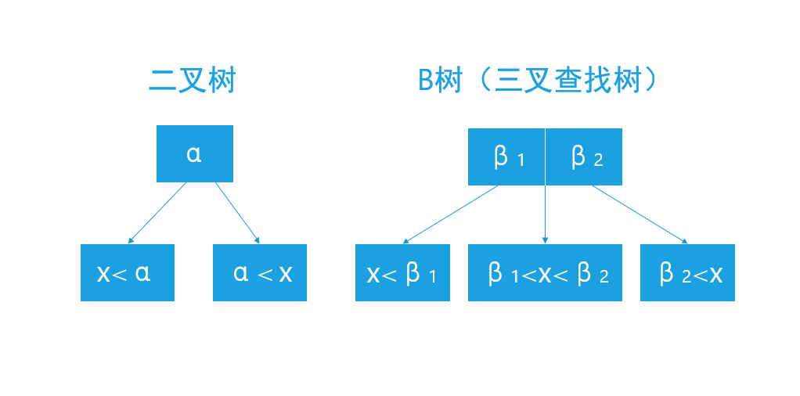
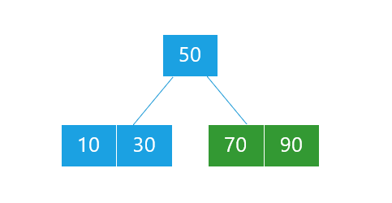
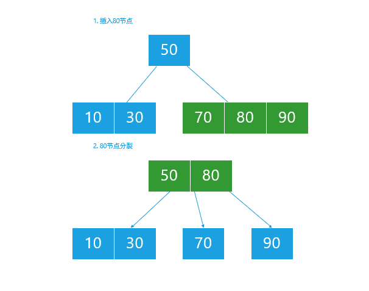
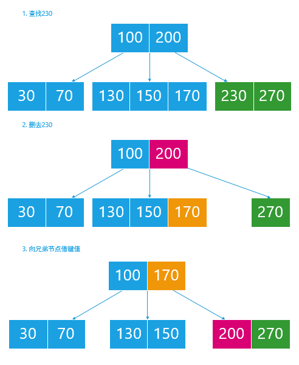
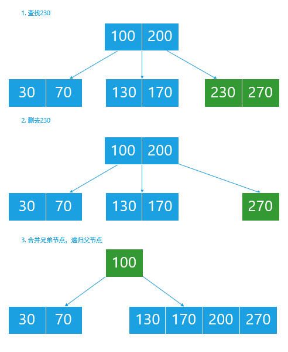

B树是一种自平衡树，能够保持数据的有序，且拥有良好的查找性能和更少的读盘次数，因此其常用于文件系统和数据库的设计实现中。

<!--more-->

平衡二叉树在查找等性能上已经十分优越，查找次数（树高）达到了对数时间 $log_{2}n$，这一性能指标用于内存查找时十分高效，但是当面对外部硬盘时，$t_{读盘时间}>>t_{查找时间}$，人们希望设计一种能够尽可能减少读盘次数的数据结构。顺着二叉树的思路，人们在二叉树的基础上该进得到了B树（m叉查找树），将树高降到了 $log_{m}n$ 。

## 定义

一个 $m$ 阶的 $B$ 树是有以下属性的树：

1. 每一个节点最多有 $m$ 个子节点；
2. 每一个节点（除根节点）最少有 $\lfloor m/2 \rfloor$ 个子节点；
3. 如果根节点不是叶子节点，那么它至少有两个子节点
4. 有 $k$ 个子节点的非叶子节点拥有 $k − 1$ 个键
5. 所有的叶子节点都在同一层

其中性质2和性质4的约束使 $B$ 树至少为一颗半满的树来保证存储密度；$B$ 树的叶子节点通常指的是额外填充的空节点，当查找操作到达空节点时，即代表查找失败，这一层叶节点可以计入 $B$ 树的高度，也可以不计入。

## 查找

$B$ 树的查找过程与二叉树查找过程十分相似，只是划分区域略有差别，如下图（以3阶B树为例）：

通过递归的查找遍历每一层的B树，必定处于下列三种情况之一：

1. 位于当前节点的数据中，查找成功；
2. 位于当前节点的子节点区间中，向下递归；
3. 当前节点为叶子节点（空节点），查找失败。

## 插入

B树的插入过程与平衡二叉树十分相似，同样分为查找和调整两步。查找过程如上述，找到非叶子的最底层节点将其插入，以下列三阶B树为例（叶子节点省略）：

> 三阶B树指的是子节点数量最多为3，键值数量最多为 $3-2=2$，因此键值数量最少为 $\lfloor3/2\rfloor=1$，子节点数量最少为 $1+1=2$

插入90，先查找插入位置，直到找到最底层节点70（非叶子节点），将90插入到70右侧，当前节点可以容纳该数据，无需调整：

插入80，过程如下：

1. 查找插入位置为70与90之间，将其插入，此时该节点子节点数量为4，需要调整；
2. 将当前节点以80为枢轴分裂为三部分：80左侧（只有70）、80、80右侧（只有90）。将9-提入根节点，70和90分别为其两个子节点，将当前节点设为其父节点，此时满足3阶B树定义，调整结束。

插入100，查找后直接插入，无需调整，得到：

插入85，过程如下：

1. 应插入90所在节点左侧，但是该节点满，需要调整；
2. 将当前节点分裂为三部分，90提到其父节点（根节点），85和100分别为其子节点，当前节点移动到其父节点（根节点），当前节点满，需要调整；
3. 将80提出，成为新的根节点，50和90成为其子节点，树高加一。当前节点移动到其父节点（新根节点80），此时满足三阶B树定义，调整结束。

## 删除

B树的删除同样分为查找和调整两个步骤，查找过程如上述，找到当前节点并删除键值后，可能会违背定义2的限制，此时需要向兄弟节点（一定存在）借键值，此时会出现四种情况：

1. 删去该键值后成为空树；
2. 删去该键值后依然满足定义；
3. 删去该键值后不再满足定义，兄弟节点可以借；
4. 删去该键值后不再满足定义且兄弟节点不够借。

前两种情况时，直接删去即可；

第三种情况时，需要向兄弟节点借一个键值，即可满足定义；

> 说是向兄弟节点借，但实际上是轮转，即父节点键值到当前节点，兄弟节点键值到父节点，详见示例

第四种情况时，需要合并兄弟节点，当前节点移动至父节点，父节点少一个节点，可视为删除父节点一个键值，递归直到成为前三种情况。

### 删除：向兄弟节点借入

删除键值230（五阶B树）：

###删除：兄弟节点不够借

